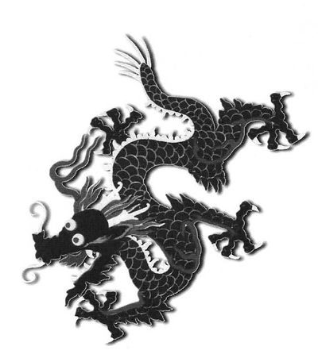
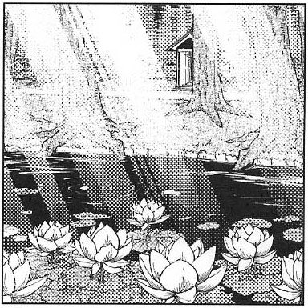

<!-- 是高斯模糊呐~  -->

<!-- # 东方求闻史纪 ～ Perfect Memento in Strict Sense. -->

> 资源
>
> *from* [**THBwiki**](https://thwiki.cc/%E4%B8%9C%E6%96%B9%E6%B1%82%E9%97%BB%E5%8F%B2%E7%BA%AA)

> Markdown 改编
>
> *by* **JavaCoffeePro**
>
> *on* **2021年2月7日**

> **Markdown 文件，请使用 [Typora](https://www.typora.io/) 获取最佳阅读体验**

# 幻想乡缘起

# 序

这是一个没有人类记下历史的封闭世界。妖怪们无法准确记住过去，幻想乡里见不到真实。因为这样，不了解妖怪的实态，人类只有害怕的份儿。 若能更了解妖怪的能力和做出相应对策，回避危险的地方，认识擅长退治妖怪的人类，那就能不用战战兢兢地生活了吧。

我们稗田家，为了保障人类生活安全，每一百二十至一百八十年，对惹人注目的妖怪进行记录。这就是《幻想乡缘起》。从千年之前的阿一开始，传到我已经是第九代了。

幻想乡缘起分为妖怪图鉴、英雄传、危险区域指南、未解决资料和独白，记下了幻想乡的实态。

妖怪图鉴记录了各种妖怪种族的倾向和对策，以及分别记录现存确定的妖怪。这份图鉴，是一项提防幻想乡必需的妖怪，和不要招惹强力妖怪的指针。从妖精、幽灵等容易遇上的妖怪，到天狗、吸血鬼等强力妖怪，这里都会从能力、危险度、遭遇时间、地点和遭遇频度上给予概括和记录。而且全都图文并茂。对村庄的人来说是十分有用的。

英雄传是介绍没有住在人类村庄，而能进行退治妖怪、解决异变等的人的。基本上是人类的同伴，若有被妖怪危害，可以找这些人商量。她们多数有好多谜团，这些谜团总会解开的。

危险区域向导是记述幻想乡的主要地方，有哪些是危险的，怎样危险，要去那些地方需要准备什么。要有所准备，就一定要先读此书。从人类村落里出来的话，那就更要仔细阅读。

未解决资料包括了不完整的资料，和幻想乡不相容的东西，新闻等。这些都是预定要写入书中的。

独白是我——第九代的阿求关于此书的感想，和对于幻想乡的一些想法。看或不看都无妨，当然有人看我会很高兴的。

幻想乡缘起到此本已是第九册了。比起过去的幻想乡缘起，此书采用了新鲜的风格，流行的设计和简易的文字。这是为了让更多人就算不喜欢难读的古书字体和晦涩的文章，也能读懂此书。

那么，请仔细阅读幻想乡缘起，愿您有一个安全美好的幻想乡生活。

第九代阿礼少女　稗田阿求

---

# 目录

[TOC]

> 使用 **Typora** 打开文件
>
> 点击左下角的按钮 "**显示/隐藏侧边栏**" **侧边栏** 上的 "**大纲**" 即是目录

# 妖怪图鉴

## 大自然的具现 ～ 妖精

| **主要危险度**   | **低**       |
|---|---|
| **遭遇频度**     | **极高**     |
| **多样性**       | **高**       |
| **主要遭遇场所** | **任何地点** |
| **主要遭遇时间** | **任何时间** |

**特征**

自然现象的正体。
变寒回暖，下雨起风，草长花开，这些现象都有妖精寄宿当中。他们有各种外表，多数是人类外表加一对蝴蝶或蜻蜓这类昆虫的翅膀。身材一样细小，小型的能放在掌心，大型的则像人类未满十岁的小孩。

他们生活的地方是所有大自然。幻想乡任何地方都能发现。特别喜欢热闹的地方，人类、妖怪聚集的地方也很容易目击到他们。相反阴气重的地方数量则很少。是人类村庄常见的一种妖怪。

活动时间也各种各样，白天、夜晚都能遇到。也就说没有规则性。

另外，妖精个体的生命是很短的（<a id="1-1-1" href=#$1-1-1>×1</a>），不过死后很快就重生出一样外表的生命。就算受了身体破碎的重伤也能很快恢复。严格地来说，妖精是不会死的。所以才会做一些不怕死的行动。看来像是死的概念与人类不同，也有可能仅仅是头脑简单。

妖精其实不用吃东西，他们看见人吃美味的东西，也就模仿着吃。人类吃什么他们也吃什么。特别是喜欢偷吃掉人准备起来的食物。

**危害内容**

- 一时兴起的恶作剧

他们喜欢恶作剧。让人走在路上时迷路。吹散打扫房间时好不容易积攒的灰尘。趁人不留意放盐在茶里面等。
他们不考虑后果，只一心妨碍眼前的人做事。有时也会出现推一把而让人失足掉下崖，背后点火等过激的恶作剧，所以要注意。

**应对方法**

在想事情时迷了路。和朋友说话时行李不翼而飞。多次出现的话，这就有可能是妖精干的。
容易中妖精恶作剧的人，大都是些注意力散漫，容易分散注意的人。
妖精不会接近注意力集中的人。所以，平时多留意周围就不会有事了。

如果身边常有恶作剧，该怎么办？其实妖精虽然乱来，但不怎么喜欢战斗。一旦被人发现了，妖精都会马上逃跑的。

若成功捕获了，那就可以一泄平日之愤了。他们不强，大人能轻易取胜。

但是，也有例外的时候，他们会不做恶作剧而是直接攻击人。这时就得留神了。这可能是某种警告。

当大群妖精集合、吵吵嚷嚷时，要注意其中很可能潜伏有强力的妖怪（<a id="1-1-2" href=#$1-1-2>×2</a>）。这时候乖乖地折回才是良策。
> <a id="$1-1-1" href=#1-1-1>×1</a> 妖精的生命和人的有着天壤之别，短命的说法其实是错误的。

> <a id="$1-1-2" href=#1-1-2>×2</a> 妖精的数量和凶暴程度，能反映出附近区域的危险度。

---

### 冰之妖精 ～ 琪露诺 Cirno

| **能力**         | **操控冷气程度的能力** |
| ---------------- | ---------------------- |
| **危险度**       | **低**                 |
| **人类友好度**   | **普通**               |
| **主要活动场所** | **雾之湖**             |

在雾之湖的附近，即使是夏天也会出现极端低温。这时候常能遇到的妖精就是冰之妖精。
她是湖附近妖精们中的领袖般的存在，力量也比其他妖精强。她是属于好战型的，所以必须留神。
她身高颇低，穿蓝色的衣服，背后有冰之羽翼。

她有操控冷气的能力。能瞬间冻结小东西，比普通的妖精更危险。一直在释放冷气的她周围总是很寒冷。

人们不知道她住在哪里，也无法得知她平时的生活是怎样的。不光是琪露诺，所有的妖精都能溶入大自然之中，所以人类们看不见。

**目击者报告**

- 有次见到她在雾之湖的水面一块冻结了的冰上毫无防范地（<a id="1-1-1-1" href=#$1-1-1-1>×1</a>）睡觉。（彦左卫门）

- 有次见到她在湖边四仰八叉地（<a id="1-1-1-2" href=#$1-1-1-2>×2</a>）睡着。周围的花草都给冻结了。（匿名）

还有好多雾之湖附近的目击报告，我猜测这湖是她的根据地。
这样的话，她的家说不定在水中。

- 在田中发现冻结的青蛙，我想这是妖精干的。（匿名）

令人讨厌的恶作剧。虽然直接受害者很少……

- 我从湖里钓上来的鱼都结了冰。真是吓了我一跳，不过鱼能保存得久些，也更美味了。（吃得正欢的太公望）

没想到雾之湖也有人类在钓鱼……
那附近很容易出现各种妖怪，不熟悉的人可不要模仿。

**对策**

如果突然吹来一阵冷气，那很可能冰之妖精就在附近。那时无论是逃还是寻找妖精的踪影都可以。只要明白对方是妖精稍加留神，一般不会有事。琪露诺很容易被发现，不是注意力太散漫的话，基本上不会有受害者吧。

此外，要通过她在的地方怎么办？
她对火把的火之类热而不可触摸的东西很弱。手持火把她就不会接近了。
她接触的东西能瞬间结成冰，即使是她睡着了，也不要去摸她。冻伤可不好了。

若是万一琪露诺进行攻击，什么都好，冷静地说些话题来吸引她，对方表现出兴趣的话，那就慢慢地提问。
随后，在她考虑答案的时候，趁机逃吧。就算是很简单的问题，她一定也答不上来。

> <a id="$1-1-1-1" href=#1-1-1-1>×1</a> 真的是毫无防范。

> <a id="$1-1-1-2" href=#1-1-1-2>×2</a> 真的是很随意。

---

### 运送春天的妖精 ～ 莉莉霍瓦特 Lily White

| **能力**         | **告知春天已来临程度的能力** |
| ---------------- | ---------------------------- |
| **危险度**       | **极低**                     |
| **人类友好度**   | **高**                       |
| **主要活动场所** | **不定**                     |

无论人类、妖怪还是幽灵，很多都是到了春天就活动起来。
而象征性的妖精，就是带来春天的妖精，莉莉霍瓦特。

莉莉霍瓦特能觉察到普通人未注意到的细节，将春天即将来临的消息传递给还在冬眠的生物（<a id="1-1-2-1" href=#$1-1-2-1>×1</a>）。这妖精通过的地方，会出现春天的暖气。

她身高颇低，有数枚很薄的翅膀（<a id="1-1-2-2" href=#$1-1-2-2>×2</a>）。

她并不好战，就算相遇也没有多大危险。只是，她在传递春天来临的消息的时候不要妨碍她比较好。这妖精也有一定的实力。

和其他妖精一样，不清楚住处。除了春天之外的季节很少见到。
所以，莉莉也被称为春之季语。

**目击者报告**

- 雪正在下　还没有来吗　白色的山　沿路搜寻着　报春的妖精（春之人）

这首歌提到的告知春天的妖精，就是莉莉霍瓦特。

- 常常从西边飞来，到山（<a id="1-1-2-3" href=#$1-1-2-3>×3</a>）那边去了之后，从没见过回来。到底住在哪里呢？（多数报告）

因为她每年进到山里不回来，所以被山里的妖怪吃掉了才停止报春的也说不定呢。

- 被我家孩子抓住了。我叫他赶快放掉便立即放开了，所幸没有造成什么危害。（匿名父母）

虽然这种妖精不是会伤害人类的种类，但对非人的存在，还是不要出手为好。

**对策**

不先攻击的话就不会有危险。不如说见到她的姿影是个吉兆。坦率地，对春天的到来感到喜悦吧。

若是被攻击，那可能是对方太兴奋了，离开就好了。
这妖精在春天完全来临之前是不会离开所在的地方的。如果你主动离开，也不用担心被追赶。

相反地，如果用诱饵吸引她的话会很有意思。
给她花的种子，她会很高兴地让这些花朵盛开。因为这个的关系，她是附近花店很受欢迎的妖精。

> <a id="$1-1-2-1" href=#1-1-2-1>×1</a> 包括幽灵、亡灵等。

> <a id="$1-1-2-2" href=#1-1-2-2>×2</a> 透明看起来有好多对薄翅，实际上只是一对大型翅膀。

> <a id="$1-1-2-3" href=#1-1-2-3>×3</a> 妖怪之山，后述。

---

### 喜欢恶作剧的日之光 ～ 桑尼米尔克 Sunny Milk

| **能力**         | **折射光线程度的能力** |
| ---------------- | ---------------------- |
| **危险度**       | **低**                 |
| **人类友好度**   | **普通**               |
| **主要活动场所** | **魔法森林附近**       |

有时会在并不漫长的道路上迷路。严重时还会返回原点。这时十之八九，是妖精在搞鬼（<a id="1-1-3-1" href=#$1-1-3-1>×1</a>）。

桑尼米尔克就是这种擅长让人迷路的妖精。让光折射，令事物所见产生偏差来欺骗人。还有她能隐藏在折射的背后，要发现她是很困难的。
身高很低，有着昆虫般的薄翼。

属于常常恶作剧，一旦被人发现就马上逃掉的妖精类型。这种妖精无法接近注意力集中的人。不想被缠上的话，平时行动就要留意，常考虑妖精存在的可能性。

还有就是她很少单独行动，通常三只（<a id="1-1-3-2" href=#$1-1-3-2>×2</a>）一起活动。
据说住在魔法森林的某棵大树上，不清楚正确的位置。基本上妖精的住所，人类是看不见的。

**目击者报告**

- 有次见到她在屋顶晒太阳，被人发现后就慌忙逃跑了。（梦太）
- 有次见到她在路上睡大觉。似乎受了伤，被发现后慌忙逃跑了。（匿名）

还有许多报告，也是在晒太阳。
同时受伤的报告也很多，有可能因为是日光妖精，以晒太阳来疗伤。

- 走着走着，突然脚底没了地面，跌下崖去。还以为我死定了呢。（伐竹人）

有时也会出现这种危险的恶作剧，要小心。

- 眼前的雨曲折着下降。（匿名）

下雨的日子容易发现光的折射。雨天遭遇她的恶作剧时相比晴天不容易迷路。

**对策**

总之要集中注意力行路。面前的道路突然变成河流是很危险的。
妖精无法接近注意力集中的人和敏锐的狗。若有急事，可以带狗一起出门。

就算直接撞见，对方也会马上逃跑并不会有危险，就算想惩罚她一下也会被她逃了。若中了恶作剧，先反省一下自己的散漫吧（<a id="1-1-3-3" href=#$1-1-3-3>×3</a>）。

因为她好奇心旺盛（<a id="1-1-3-4" href=#$1-1-3-4>×4</a>），了解这一习性的人甚至可以设陷阱来捉她。
还有就是她十分喜爱美味的食物，常常不想太多而潜入宴会中。若见到正在忘我享受料理的她，就是一个报复平时郁闷的好机会了。

> <a id="$1-1-3-1" href=#1-1-3-1>×1</a> 当做是妖精干的，就不再觉得丢脸。

> <a id="$1-1-3-2" href=#1-1-3-2>×2</a> 另外两只是露娜切露德和斯塔萨菲雅。

> <a id="$1-1-3-3" href=#1-1-3-3>×3</a> 一想到妖精正在哪儿偷偷地笑，心情就郁闷。还是装作若无其事吧。

> <a id="$1-1-3-4" href=#1-1-3-4>×4</a> 妖精共有的特征。

---

### 静谧的月之光 ～ 露娜切露德 Lunar Child

| **能力**         | **消除声音程度的能力** |
| ---------------- | ---------------------- |
| **危险度**       | **极低**               |
| **人类友好度**   | **普通**               |
| **主要活动场所** | **魔法森林附近**       |

在有风的日子，有时会有这种体验，嗖地风的声音就停了，一会后又再次响起。
这时十之八九，是妖精在搞鬼（<a id="1-1-4-1" href=#$1-1-4-1>×1</a>）。

妖精对人类来说，非毒也非药。她们的恶作剧，并不全部是对人们造成直接伤害。

露娜切露德能将身边的声音消去。这种能力并不会造成直接伤害，但常和其她妖精，特别是桑尼米尔克、斯塔萨菲雅一起行动，来进行恶作剧。

身高很低，有着蜻蜓般的翅膀。

红、白、蓝三妖精之中，白色的是露娜切露德（<a id="1-1-4-2" href=#$1-1-4-2>×2</a>）。在三妖精中属迟钝，有时还会因为过于依赖消音能力，而在逃跑时落单。

和桑尼米尔克折射光线的能力合并，能将身影和声音都消去，似乎是很可怕的隐藏，不过终归只是妖精。头脑并不聪明。

**目击者报告**

- 经常见到她跌倒，好迟钝。（西边的樵夫）
- 都没有声音了，还要蹑手蹑脚地走路。（匿名）

从一方面反映出她的愚笨。
老实说，这时想惩罚她的心情也没了吧。

- 夜晚见到她一人悠哉游哉地飞。（星诗人）

常见她在夜晚活动。而且是开始单独行动的样子。
在妖精之中，是少有的类型吧。

- 咖啡豆（<a id="1-1-4-3" href=#$1-1-4-3>×3</a>）常常被盗。没有什么好办法吗？（茶店）

因为接近时无声无息，要防止这种偷窃是很困难的。对策还是有一些的，见后述。

**对策**

直接受害很少，通常三只一起行动。记载于桑尼米尔克的对策这里也有效。

还有就是露娜切露德单人的恶作剧多数是偷盗。
这时最有效的方法就是发出声音。在有声的环境中，若突然无声，那就是这妖精接近了。
当然这时她不使用消音的能力就不会被发现，但毕竟是妖精的智商。在她的想法中，偷盗和必须消去声音是紧紧联系在一起的。

> <a id="$1-1-4-1" href=#1-1-4-1>×1<a> 当作是妖精干的，就不会觉得是耳朵不灵了。

> <a id="$1-1-4-2" href=#1-1-4-2>×2<a> 红色的是桑尼米尔克，蓝色的是斯塔萨菲雅。颜色是指衣服的颜色。

> <a id="$1-1-4-3" href=#1-1-4-3>×3<a> 喜欢咖啡豆的妖精是很少见的，妖精喜欢的东西和人类的小孩差不多。

---

### 倾泻而下的星之光 ～ 斯塔萨菲雅 Star Saphire

| **能力**         | **感应到活动事物程度的能力** |
| ---------------- | ---------------------------- |
| **危险度**       | **极低**                     |
| **人类友好度**   | **普通**                     |
| **主要活动场所** | **魔法森林附近**             |

当见到满天星光，就像被众妖怪妖兽的目光包围时，会让人觉得不安吧。
有妖精能发出降临的星之光，拥有监视广大范围的眼。这只星光的妖精，就是斯塔萨菲雅。

她很少直接攻击和与人类碰面，主要是帮忙其她妖精（<a id="1-1-5-1" href=#$1-1-5-1>×1</a>）来恶作剧。
身高相当矮，有着凤蝶般的大翅膀。

这妖精对活动的事物非常灵敏，一接近就会被她发现。要捕捉是很困难的，也很少看到有单独行动。
一般情况下，她始终和桑尼米尔克与露娜切露德三只一起活动。

**目击者报告**

- 防鸟网捕捉到了一只大型蝴蝶。（野菜一筋）

因为她无法感应到静物吧。她有蝴蝶般的翅膀，能够想像到她被蜘蛛网困住时的情景。

- 之前见到冰之妖精和光之三妖精在打架（<a id="1-1-5-2" href=#$1-1-5-2>×2</a>）。蓝色的只在旁边看着笑。（匿名）

妖精们都很任性，妖精之间也容易发生冲突。
这种场合，因为冰之妖精惯于战斗，即使是一对三，也有可能是前者胜。
就算这样，斯塔萨菲雅并不热衷这种事，也不加入战斗，你无法判断她站在哪一边。

**对策**

直接受害很少，通常三只一起行动。记载于桑尼米尔克‎的对策这里也有效。
但是，在她帮其她妖精监视时是种威胁。是种想避也避不了的能力。

这时对付她最有效的方法是利用其它生物。斯塔萨菲雅的能力无法区分人和大型动物。因此，混在动物群当中移动，就不会被发现了。

甚至，可以利用这点来玩有趣的游戏。
用动物作陷阱，引斯塔萨菲雅她们出来，出来就捕捉。这样就可以玩钓妖精了（<a id="1-1-5-3" href=#$1-1-5-3>×3</a>）。

> <a id="$1-1-5-1" href=#1-1-5-1>×1</a> 日之光和月之光。三只在一起就是带来麻烦的光之妖精。

> <a id="$1-1-5-2" href=#1-1-5-2>×2</a> 妖精一旦开始专注一件事，就不会注意到别的东西。开始打架之后，周围的事情完全不在意。所以，若发现她们在打架，你完全可以一边赌一把谁输谁赢一边在旁边看着。

> <a id="$1-1-5-3" href=#1-1-5-3>×3</a> 钓获放流<a id="-1-1-5-1" href=#$-1-1-5-1>[1]</a>是规矩。

> <a id="$-1-1-5-1" href=#-1-1-5-1>[1]</a> 钓获放流：catch and release，一种保护生态资源的方式。

---

## 气质的具现 ～ 幽灵

**幽灵**

| **主要危险度**   | **低**       |
| ---------------- | ------------ |
| **遭遇频度**     | **高**       |
| **多样性**       | **高**       |
| **主要遭遇场所** | **任何地点** |
| **主要遭遇时间** | **任何时间** |

**特征**

动植物气质的正体。所见所闻，所触所尝都转换成思维，就像感性转换器般的存在。
它们没有肉体，形态就像不定形的空气。可以自由出入任何地方，也能按意志自由变换形状。

人们很容易将死者的具现亡灵和幽灵混为一谈，幽灵并不一定是死者的灵。有的幽灵就这么出现，消失时直接消失。不同于亡灵，从死者处能产生复数的幽灵。这性质类似于妖精，妖精是大自然的具现，幽灵是气质的具现。

生息场所（<a id="1-2-1" href=#$1-2-1>×1</a>）是幻想乡的任何地方。喜欢热闹的幽灵会聚集在繁华的地方，喜欢幽静的幽灵会聚集在阴暗的地方，喜欢温泉的幽灵则聚集在温泉附近。

活动时间多是夜晚。幽灵多数是介于快要消失与未消失之间的存在，是难以在日光下活动的。

还有就是幽灵的体温非常低（<a id="1-2-2" href=#$1-2-2>×2</a>）。贸然触碰，很可能会被冻伤的。
相反，利用这低温进行的活动，就是试胆大会。在炎炎夏夜，前往幽灵聚集的地方探索，无疑是一服令人舒畅的清凉剂（<a id="1-2-3" href=#$1-2-3>×3</a>>）。

**危害内容**

幽灵的可怕在于能够影响附近居民的精神。若附近有好多开朗的幽灵，不知何时起自己也会变得有活力。相反若附近聚集了好多阴气沉沉的幽灵，居民也会变得忧郁。
例如一些常有人自杀的景点，那是因为那里聚集了很多阴气沉沉的幽灵。

精神力不强的人若遇到强力的幽灵，有可能会被精神破坏。

还有就是它们温度低，若一直被直接抱住，会冻伤的。

**应对方法**

想不碰到幽灵是不可能的，唯一的方法就是撞见了也不要受影响。

一般来说，幽灵是幻一般脆弱的存在。正常的人就算被数只幽灵包围，也没什么事。
只是在精神脆弱的状态下（<a id="1-2-4" href=#$1-2-4>×4</a>）被缠上的话，那就有危险了。

应对方法就是拥有一颗坚强的心，不怕幽灵。
不过聚集了大量幽灵的地方（<a id="1-2-5" href=#$1-2-5>×5</a>）还是不要因好奇而接近。可能会被精神破坏。若中招了，只有请专家（<a id="1-2-6" href=#$1-2-6>×6</a>）来祈祝了。

另一方面，现今正在研究驱使附灵的法术来矫正个人的性格。利用这技术，能阻止想自杀的人的意愿，让讨厌吃蔬菜的人克服能吃等等。若能确定捕获幽灵的方法，这技术能进展到实用阶段。

可以说，人类未来丰富的精神社会，是和幽灵紧密相联的，这句话一点也不为过。

> <a id="$1-2-1" href=#1-2-1>×1 不知生息这说法是否正确。

> <a id="$1-2-2" href=#1-2-2>×2 心是冰冷的东西。

> <a id="$1-2-3" href=#1-2-3>×3 冬天的幽灵是受忌讳的。

> <a id="$1-2-4" href=#1-2-4>×4 例如中了妖精恶作剧的时候。

> <a id="$1-2-5" href=#1-2-5>×5 例如墓地。常有幽灵现场大会。

> <a id="$1-2-6" href=#1-2-6>×6 虽说巫女不太可靠……

---

### 半人半灵的园艺师 ～ 魂魄妖梦 Konpaku Youmu

| **能力**         | **使用剑术程度的能力** |
| ---------------- | ---------------------- |
| **危险度**       | **中**                 |
| **人类友好度**   | **高**                 |
| **主要活动场所** | **冥界**               |

幽灵是不定形的，纯粹的幽灵很少会化成特定人形。
魂魄家不是纯粹的幽灵，而是半幽灵半人类的家系。

外表和普通人类无差别。思考方式也和人类一样，据说体温要比普通人低一些。寿命也比人类长很多。可能是因为有一半是无寿命的幽灵。

另外，人类的形态旁边往往跟着一只大型幽灵。这幽灵是半人半灵的特征，是和普通人区别的唯一方法。这幽灵按照半人半灵的意志活动。但是，和通常的幽灵也有不同，体温不那么的冷。

妖梦在冥界的白玉楼（<a id="1-2-1-1" href=#$1-2-1-1>×1</a>）担任园艺师，同时也兼任剑术指导住在那里。最近在现界（<a id="1-2-1-2" href=#$1-2-1-2>×2</a>）也频繁露面。
也就是说，可能是现在（<a id="1-2-1-3" href=#$1-2-1-3>×3</a>）冥界和现界的结界稀薄化了。至于结界稀薄化的原因，虽然作了种种猜测，但实际的原因是境界妖怪的一时兴起。

**武器和能力**

使用剑术程度的能力，是二刀流的高手。
两把剑分别是楼观剑和白楼剑。长的那把是楼观剑。

据传楼观剑是妖怪锻造的，太长不适合普通人类使用。一挥有杀伤十只幽灵的威力。不过幽灵是无法杀伤的（<a id="1-2-1-4" href=#$1-2-1-4>×4</a>），无法判断到底有多少成分是真实的（<a id="1-2-1-5" href=#$1-2-1-5>×5</a>）。

另一把白楼剑是魂魄家的家传宝刀，据说能斩断对象的迷惘。对幽灵使用会成佛，对人类使用时锋利度很糟糕，但是被砍到还是会有点痛的。而且能用此刀的只有魂魄家的人，原因不明。

**日常**

住在冥界的白玉楼。
早上比主人早起，巡视庭园。白天修剪庭园和修行剑术，有事务就出门。夜晚再巡视一遍，在白玉楼的主人就寝后才去睡觉。
若这时发现入侵者，无论是人是妖，一律斩无赦。

**目击者报告**

- 去冥界玩时，她总是先斩了再说。我希望她能看清对方是谁再动手。（博丽灵梦）

还活着的人过去冥界玩，这该说什么好呢。

- 她常来光顾购物，但我总觉得她是来接我过去的，心情变差了。（匿名）

她只是来购物的，就放轻松一些吧……

- 突然来了一只挥舞刀的妖怪，还以为会是什么，谁知却是一名没有威吓力的少女，有些可怜。（匿名）

外表是年幼的少女。

**对策**

说是幽灵，但有一半是人类。能够交流，会说话的能回避冲突。

她不会像其他妖怪那样，为了食物或消遣等目的而袭击人类。如果不主动挑衅或让对方吃亏的话，就不会进入战斗吧。

如果进入了气氛恶劣的场合，没有一定修行的人是战胜不了的，必须全力回避战斗。只要自己没做坏事，一般能用对话回避。
但若明显错在自己的话，好好地道歉说不定会有余地的。

若有万一，对方要进行攻击，那该怎么办？
这个时候，人类能做的就是念佛之类的事情了（<a id="1-2-1-6" href=#$1-2-1-6>×6</a>）。

> <a id="$1-2-1-1" href=#1-2-1-1>×1</a> 读作“はくぎょくろう（Hakugyokurou）”而非“しらたまろう（Shiratamarou）”

> <a id="$1-2-1-2" href=#1-2-1-2>×2</a> 与彼世相对，这里的世界。

> <a id="$1-2-1-3" href=#1-2-1-3>×3</a> 第九代阿礼——阿求的时代。

> <a id="$1-2-1-4" href=#1-2-1-4>×4</a> 幽灵通常是成佛，或者消灭。

> <a id="$1-2-1-5" href=#1-2-1-5>×5</a> 据说斩不断的东西几乎不存在。

> <a id="$1-2-1-6" href=#1-2-1-6>×6</a> 南无阿弥陀佛。

---

### 骚灵小提琴手 ～ 露娜萨·普莉兹姆利巴 Lunasa Prismriver

| **能力**         | **不用手就能演奏乐器程度的能力** |
| ---------------- | -------------------------------- |
| **危险度**       | **低**                           |
| **人类友好度**   | **高**                           |
| **主要活动场所** | **祭典会场等**                   |

正确地说，骚灵并不是幽灵，但没有适合的分类，就归在这里。

普莉兹姆利巴乐团常被邀请去妖怪们的聚会进行演出的，故被称作幽灵乐团（<a id="1-2-2-1" href=#$1-2-2-1>×1</a>）。擅长演奏激昂节奏感强的音乐而闻名，是在幻想乡中唯一知名的乐团。
乐团由三姐妹组成，露娜萨是长女，擅长演奏小提琴。相当于普莉兹姆利巴乐团的领队。

身高和十几岁的人类少女差不多。外表和人类没有区别。
据说她手上的小提琴是连斯特拉迪瓦里都自愧不如的名器幽灵（<a id="1-2-2-2" href=#$1-2-2-2>×2</a>），但真伪无法确定。毕竟是幽灵。

骚灵，别名Poltergeist，简单的说就是吵闹的灵（<a id="1-2-2-3" href=#$1-2-2-3>×3</a>）的意思。骚灵发出的声音，不是普通的声音，而是音之幽灵。这响声不是耳朵听的，而是精神上的回响，没有身体的幽灵等也会喜欢。与此同时，需要注意这对人类也会造成强烈影响。

性格冷静，话不多，有些阴沉。
她所演奏的音乐，会让人情绪低落。受到她的音乐的影响之后，会变得什么事都不想做，心情很忧郁。

据说住在湖附近比红魔馆离湖更远些处的一间废墟似的洋馆里。就算踏入这件废弃的洋馆，也无法看到她们的身影。但是，据说可以听到她们练习的声音。

**目击者报告**

- 偶尔也会撞见妖怪们举行的宴会，听到普莉兹姆利巴乐团的演奏，不禁就参加进去了。（匿名）

妖怪在举行宴会，人类混进去也不会有事。

- 怎样才能邀请普莉兹姆利巴乐团出演？（Fan俱乐部会员No.5）

去废弃洋馆请求，说不定能行。

- 领队的姐姐有些阴沉，不大喜欢。（匿名）

对方毕竟不是人类，要说太多闲话恐怕会招来不幸。

**对策**

无论对方是人类还是妖怪，她都非常友好，不需要害怕。
不过现场演唱会的门票不是由乐团管理的，而是由邀请方管理的，所以买不到门票的话向普莉兹姆利巴乐团请求也没有用。

演奏的音乐混有影响精神的音声，要听的话需保证健康的精神状态。不要让小孩子去听。幽灵之音只有大人才可以听哦。

> <a id="$1-2-2-1" href=#1-2-2-1>×1</a> 这可不是乐团团员常常缺席的意思哦。

> <a id="$1-2-2-2" href=#1-2-2-2>×2</a> 就在议论纷纷中演出开始了。

> <a id="$1-2-2-3" href=#1-2-2-3>×3</a> 说不定并不是那样。骚灵据说是由少女使用的一种大魔法。

---

### 骚灵小号手 ～ 梅露兰·普莉兹姆利巴 Merlin Prismriver

| **能力**         | **不用手就能演奏乐器程度的能力** |
| ---------------- | -------------------------------- |
| **危险度**       | **低**                           |
| **人类友好度**   | **高**                           |
| **主要活动场所** | **祭典会场等**                   |

正确地说，骚灵并不是幽灵，但没有适合的分类，就归在这里。
普莉兹姆利巴乐团（<a id="1-2-3-1" href=#$1-2-3-1>×1</a>）的次女，擅长演奏小号的梅露兰·普莉兹姆利巴。演出中的亮点，最吸引人眼球。Fans也有很多。

外表和人类没有区别。是三姐妹中发色最明亮、身高最高的，演出中往往处于中央位置。
她所手持的小号，据说是吸了很多爵士小号手的血、可怕的小号幽灵（<a id="1-2-3-2" href=#$1-2-3-2>×2</a>），但真伪程度无法确定。要怎样才能去吸活人的血也无从得知。

性格非常开朗，不知道什么叫低落。偶尔也会说些令人无法理解的话。
她所演奏的音乐，是让人激昂的音声。受她的音乐影响，会突然开始手舞足蹈或者没法进行连贯的对话。对心情沮丧的人来说正合适。

一般都是普莉兹姆利巴三姐妹一起行动，但梅露兰也有单独行动的情况。有时也会独奏，不过由于前面提到的理由去听单独的演奏可能会有些危险。

**目击者报告**

- 去湖的途中，有时会听到从远处传来小号声。（匿名）

估计是梅露兰在练习的声音。
不过也有可能是天狗的集结号声。

- 听她独奏时，其中有铜管乐器的和声。怎么想都不像是一个人能演奏出来的……（开朗的地缚灵）

所持的乐器只是象征性的物品，不能认为声音就是从那里发出的。
究竟声音是从哪里发出的无法判断，既然是音之幽灵，应该就是自身附近所发出的吧。

- 咦？梅露兰不是领队吗？（匿名）

对方毕竟不是人类，说太多闲话恐怕会招来不幸。

**对策**

无论对方是人类还是妖怪，她都非常友好，不需要害怕。

不过要和梅露兰单独交流是很困难的，就算遇见了也不要搭话。
和人类相比行动原理有不同之处，虽说不是完全不同，但要进行沟通还是很困难的。冒失搭话的话，如果被对方认为是挑衅，那就麻烦了（<a id="1-2-3-3" href=#$1-2-3-3>×3</a>）。

普莉兹姆利巴三姐妹自身就有较高的能力，再加上普莉兹姆利巴乐团有着众多的Fans，如果与她们为敌的话胜算几乎看不到。

另外，小号的声音很响亮，小号声能够传到很远处，不要过于专注地去听。精神会受到它的影响。

> <a id="$1-2-3-1" href=#1-2-3-1>×1</a> 参见露娜萨·普莉兹姆利巴的部分。

> <a id="$1-2-3-2" href=#1-2-3-2>×2</a> 就在议论纷纷中演出开始了。

> <a id="$1-2-3-3" href=#1-2-3-3>×3</a> 在意思难以传达的情况下，很容易被误解。说赞美的话也会有危险。

---

### 骚灵键盘手 ～ 莉莉卡·普莉兹姆利巴 Lyrica Prismriver

| **能力**         | **不用手就能演奏乐器程度的能力** |
| ---------------- | -------------------------------- |
| **危险度**       | **低**                           |
| **人类友好度**   | **高**                           |
| **主要活动场所** | **祭典会场等**                   |

正确地说，骚灵并不是幽灵，但没有适合的分类，就归在这里。

普莉兹姆利巴乐团（<a id="1-2-4-1" href=#$1-2-4-1>×1</a>）的三女，演奏键盘和打击乐器的莉莉卡·普莉兹姆利巴。体格是其中最小的（<a id="1-2-4-2" href=#$1-2-4-2>×2</a>），乐器却是最有活力的。

外表和人类没有区别。三姐妹中身高最矮的，演出中却异常的活跃。
使用的键盘据说是某著名艺术家使用过的、因为发出的声音过于独特不畅销而消失的合成器的幽灵（<a id="1-2-4-3" href=#$1-2-4-3>×3</a>），但真伪程度无法确定。

性格是在三姐妹之中最像人类的，交谈也比较容易。但是，也有狡猾和世故的一面。
她所演奏的音乐，是现实中不存在的音声。从哪里发出，由于什么原理而发出全都无法想象的那种声音。与其说是音之幽灵，不如说是幻想之音。

与姐姐们对比，她的音乐虽是未听过的种类，但不是在精神上共鸣的，而是普通的用耳朵聆听的声音。不会对精神造成影响，所以可以放心地听。

一般都是普莉兹姆利巴三姐妹一起行动。莉莉卡在独奏的时候，可能是多数是有什么阴谋诡计或和姐姐吵架了的缘故。

**目击者报告**

- 在演出中，由于太矮了常常看不到，加油啊！（匿名）

身高低和乐器大的缘故，真的难看见。
加油。

- 莉莉卡不举办个人演唱会吗？（莉莉卡Fan俱乐部会员No.1）

我也说不上来。
但是从来没有听说过这样的事。

- 其他二人还好理解，但莉莉卡感觉是在骗人。和乐器没什么关系啊！

那个键盘发出奇怪的声音。
无法理解缘由，幽灵所做的就是这么一回事吧。

**对策**

无论对方是人类还是妖怪，她都非常友好，不需要害怕。

基本上不会单独碰到，但是沟通较为容易可以用对话来回避危险。
但是，骚灵在安静的场所不会安分的呆着。所以就算对方突然骚动起来、甚至对你指手画脚，也不要生气，要冷静地应对。

万一，被当作是敌人的情况下，三十六计走为上，拼命地逃吧。

> <a id="$1-2-4-1" href=#1-2-4-1>×1</a> 参见露娜萨·普莉兹姆利巴的部分。

> <a id="$1-2-4-2" href=#1-2-4-2>×2</a> 就算是灵体，身体也是身体。

> <a id="$1-2-4-3" href=#1-2-4-3>×3</a> 就在议论纷纷中演出开始了。

---

## 独立化的妖力暴走 ～ 妖怪

| **主要危险度**   | **各种各样** |
| ---------------- | ------------ |
| **遭遇频度**     | **各种各样** |
| **多样性**       | **极高**     |
| **主要遭遇场所** | **任何地点** |
| **主要遭遇时间** | **任何时间** |

**特征**

妖怪之中，有着某种特征，已确认存在复数个体的，会被归为特有名字的种族，除此之外也有单个个体为种族的存在。无法归入种族的妖怪，不是叫做特殊的种族，而是叫做妖怪。幻想乡多数妖怪就是这种『妖怪（<a id="1-3-1" href=#$1-3-1>×1</a>）』。

外表、能力、性格、危险度、活动时间、活动场所等各不一样，共同特征很少。如果硬要说共同点的话，那就是妖怪会袭击、并且捕食人类的方面了。

有一些特别的例外存在，但多数妖怪之间依然存在如下几个共性。

- 妖怪比人类长命。
- 妖怪的身体比人类更结实，就算身体变得四分五裂的样子，也能很快恢复。
- 妖怪比人类更容易中信念的攻击，精神攻击是他们的致命伤。
- 妖怪不太以群体活动。
- 妖怪只会考虑自己。

人类最大的敌人就是妖怪。但是，因为妖怪的多样性，要退治妖怪，就得认识每种妖怪的特征。

**危害内容**

- 诱拐、捕食、偷盗家畜、偷盗田地作物

对人类而言是真正的敌人。妖怪为了进食而袭击人类。除了必要之外不会袭击人类，除非肚子饿的时候大多数不会袭击。人类太少的话，妖怪们日子也不好过。

但是，不一定只是吃人，妖怪还会吃兽、鸟、鱼、蔬菜、水果、酒等，和人类差不多。只是，除此以外就是还会吃人。

除了人类以外，也有家畜和农作物被带走。这也是个严重的问题。

**应对方法**

没有研究过完善的计划的话，要退治妖怪是很困难的。人类和妖怪的身体能力差异是一目了然的，正面战斗的话会在一瞬间被捕食。

但是，妖怪袭击人类的主要理由也是为了捕食。因此，退治不了的话，交出来代替自己作为食物的东西来比较好。交出一头牛的话，暂时就不会被袭击了。妖怪常常很重情理，对于不反抗的对手会友好对待。

但是，要退治妖怪就是另一回事了。
人类会定期的进行妖怪退治，这是一个从祖先开始代代相传的传统。在幻想乡，人类也必须进行妖怪退治（<a id="1-3-2" href=#$1-3-2>×2</a>）。

有着专门进行妖怪退治的职业存在。比如说博丽的巫女就是最有名的专家之一。

退治妖怪不是给予身体伤害的武器，而是有某种『理由』的武器。妖怪对于名字、传说等精神攻击很脆弱。

> <a id="$1-3-1" href=#1-3-1>×1</a> 容易混淆的是，作为种族的妖怪，在图表中属『其他』类。『其他』类在一些图表中占大多数也是常见的。

> <a id="$1-3-2" href=#1-3-2>×2</a> 不然的话，幻想乡的平衡就会崩溃。

---

### 宵暗的妖怪 ～ 露米娅 Rumia

| **能力**         | **操纵黑暗程度的能力** |
| ---------------- | ---------------------- |
| **危险度**       | **中**                 |
| **人类友好度**   | **低**                 |
| **主要活动场所** | **不明**               |

在妖怪之中属于弱者，拥有让其周围无论昼夜都是一片黑暗这能力的，就是露米娅。
这妖怪产生的黑暗，是让火把都失去作用的魔法之暗，闯入其中的人类的视野会降低得无异于失明。被趁着这种黑暗被袭击的话可能撑不了一时半刻，不过幸好她不会和别的妖怪一同行动。

外表是年幼的少女，赤眼，头发是黄色的并系着一条红色缎带，据说是穿着黑色的衣服目的是为了融入黑暗之中，但是由于通常都处在黑暗之中所以很难确认。
也许是作为黑暗的怪物，通常都会被人害怕，不过在看到她真实姿态的人都因为其年幼少女的外表会有点失望。可能将身形包裹在黑暗之中就是为了隐藏她的外貌。

还有，黑暗的能力只是辅助性的，袭击人类的时候都是凭力量来进行。由于外表只是看起来的样子而已，究竟她有多强仍是疑问，在黑暗中又无法分出胜负。看不到退路的话是令人恐惧的。

**目击者报告**

- 那啥，有个大的黑块往森林的方向过去了。好可怕。（彦左卫门）

那个大黑块可能就是这个妖怪的黑暗了。
绝不要靠近它。

- 就那样，大黑块撞到了树上停下了一会儿，然后向我这边过来了我就马上逃走了。（彦左卫门）

我想一定是撞到树上了。可能，妖怪自己也看不到黑暗之外吧（<a id="1-3-1-1" href=#$1-3-1-1>×1</a>）。

- 有次我逃离不及，撞入了黑暗之中，不过也没碰到妖怪，就这么穿过了黑暗。（匿名）

就算有人类进入了黑暗中，里面的妖怪也无法辨认吗？
这么说，她发出的黑暗，连她自己也看不见吧（<a id="1-3-1-2" href=#$1-3-1-2>×2</a>）。

**对策**

本来力量就与妖怪无法相比的人类，在火把也无法照亮的黑暗中根本毫无胜算吧。

除非有一定对策和对自己的手段有相当的自信，可不要贸然冲入黑暗之中。
还有，如果在夜晚有月光照不到的地方，最好不要过去。说不定露米娅就在那里。
偶尔，也有遇见没有展开黑暗的露米娅本体这类的事发生。出现的条件就是，新月的夜晚。在这天，不知为什么露米娅常常不施展能力，目例报告案例络绎不绝。

很少人和她直接交谈，估计对话也很难成立。和她说话是危险的（<a id="1-3-1-3" href=#$1-3-1-3>×3</a>）。

> <a id="$1-3-1-1" href=#1-3-1-1>×1</a> 这么一想，这种黑块也变得很有意思了。

> <a id="$1-3-1-2" href=#1-3-1-2>×2</a> 该不会，她是相当的单纯吧。

> <a id="$1-3-1-3" href=#1-3-1-3>×3</a> 虽然看来很年幼，她还是会吃人的。

---

### 冬之妖怪 ～ 蕾蒂·霍瓦特洛克 Letty Whiterock

| **能力**         | **操纵寒气程度的能力** |
| ---------------- | ---------------------- |
| **危险度**       | **中**                 |
| **人类友好度**   | **低**                 |
| **主要活动场所** | **不明（限于冬季）**   |

只能在冬天见到的妖怪。喜欢寒冷的地方，能将人冻结陷入战斗不能的可怕妖怪，蕾蒂·霍瓦特洛克。
简单的说，就是雪女的一种。

看起来是个穿着不像是能防寒的轻便衣服的少女形象。

不知是由于她出现缘故，还是和那种特定的天气有关，她出现的时候都是非常寒冷的日子。这种极端的寒冷会使得战意丧失（<a id="1-3-2-1" href=#$1-3-2-1>×1</a>）吧。如果中了她的计策，要说胜负在战斗之前就已分晓也不为过。

她自身并不会带来风雪，而是加强自然中冬天的效果，能发挥出不像单个妖怪所能发挥出的威力。能够左右大自然，这种力量是非常强大的。
在冬天造成大骚动之后，在春天来临之际身影就会瞬间消失。直到下个冬天来临之前都一直隐藏着。

**目击者报告**

- 只能寒冷的日子才能见到啊。（匿名）

也有这样的事，一般人对这妖怪印象不好。

- 外面漫天大雪，想到她不是要出来么，所以没有出门。不过我家是暖房所以没有问题。（香霖堂店主）

尽量在冬天晴朗的日子出门。
不过，长期蜗居的话，要注意屋顶的积雪可能会压坏房子。

**对策**

这种寒气是很麻烦的，不是碰到冷的东西（<a id="1-3-2-2" href=#$1-3-2-2>×2</a>）那样，而是整个空间的温度下降。健康的人也会生病，活跃的人也会变得老实，他们的都丧失了斗志。这样完全回避的方法可能不存在吧。

首先，要穿得暖和一点。这是最重要的。在逃跑的时候，身体能活动就好了。
特别是如果身体的末端觉得冷的话，血液的循环可能会变坏，饮食生活需要多加注意。

如果不留神碰到这个一身轻装的妖怪了，寒气的影响会波及很广的范围，逃跑将极其困难。如果在对抗寒冷方面不强的话，将无法维持多久生命。

不过，就算这个恐怖的妖怪，也只有在冬天的时候出现。春天来临、万物回暖之后就没有需要害怕的了。如果，在夏天的时候发现这个妖怪的话，那将是发泄郁愤的大好机会（<a id="1-3-2-3" href=#$1-3-2-3>×3</a>）。

> <a id="$1-3-2-1" href=#1-3-2-1>×1</a> 早上，不愿意从被窝里出来之类的。

> <a id="$1-3-2-2" href=#1-3-2-2>×2</a> 像某些特别的妖精。

> <a id="$1-3-2-3" href=#1-3-2-3>×3</a> 到目前为止，没有冬季以外出现的报告。

---

### 暗中蠢蠢欲动的光之虫 ～ 莉格露·奈特巴格 Wriggle Nightbug

| **能力**         | **操纵虫子程度的能力** |
| ---------------- | ---------------------- |
| **危险度**       | **中**                 |
| **人类友好度**   | **普通**               |
| **主要活动场所** | **草丛之类的地方**     |

要说令人讨厌的妖怪，还要数这个莉格露·奈特巴格。
要说为什么让人讨厌，她总是伴随着一大群虫子出现并且能够随意地操纵它们。想象一下像是蜈蚣、毛虫、蛾、蜘蛛、灶马等一齐袭来这样的情景。让人毛骨悚然。

这个妖怪的外表和人类小孩相似。幸运的是，她看起来并不完全是虫的外形，除了拥有触角和翼之外，其他的和人类没有区别（<a id="1-3-3-1" href=#$1-3-3-1>×1</a>）。

莉格露是虫之妖怪，正确地说是萤火虫妖怪。
萤火虫是在虫子里面少有的，受人类欢迎的虫类。这种虫很少被人类退治，所以容易成长成为妖怪。除了萤火虫之外，蝴蝶也同样的人气较高，容易变成妖怪。

自古以来，说到虫之妖怪，是和鬼与天狗并列令人恐惧的对象，但现在这种威严已经失去好久了。作为虫子们的领袖的虫之妖怪，却拥有着幼小少女的形态，这也是一种象征。为什么虫类的力量急剧减弱的原因还需要调查。

**目击者报告**

- 搬起一块大石头下面密密麻麻的都是虫。很恶心。（匿名）

应该和这个妖怪没有什么关系，不过都是关于虫子的报告。

- 屋檐下有密密麻麻的蜈蚣。饶了我吧（匿名）

应该和这个妖怪没有什么关系。

- 在厨房的入口有灶马。该死（匿名）

和这个妖怪没有关系的。

**对策**

虫子的恐怖，怎么说都是因为它们的数量。单个一只的力量很低，大量的话就难以对付了。
特别是像马蜂这种退治了一两只的也没有什么意义，却只要一只就能够给人以致命伤的虫存在。

最有效的对策是用火烧、烟熏等能够大范围的驱逐虫的方法（<a id="1-3-3-2" href=#$1-3-3-2>×2</a>）。
而且，他们一般都不耐寒。从春天到秋天都会活动，到冬季基本不会出现。

只有操纵虫子是很恐怖的而已，和莉格露·奈特巴格单个对峙的话并不可怕。如果要进行妖怪退治的话，在冬天，这个妖怪独处的时候是最好的机会。

另外，这个妖怪操作的虫子里面有一种需要特别注意，那就是螨虫。螨虫是人类肉眼无法看到的恶魔之虫，被咬了也无法注意到的。之后，小的黑色刺痕的话就已经为时已晚，会发高烧病倒，而且有很高的致死率。还没有有效的治疗方法。
如果莉格露身边没有带着虫子并且看起来很有自信的话，那时是最危险的。说不定已经有螨虫聚集在周围了（<a id="1-3-3-3" href=#$1-3-3-3>×3</a>）。

> <a id="$1-3-3-1" href=#1-3-3-1>×1</a> 使用人类的外表，是为了减少被人类退治的必要吧。

> <a id="$1-3-3-2" href=#1-3-3-2>×2</a> 最近有种叫做杀虫剂的便利药物。

> <a id="$1-3-3-3" href=#1-3-3-3>×3</a> 说不定是蚤。

---

### 夜雀的妖怪 ～ 米斯蒂娅·萝蕾拉 Mystia Lorelei

| **能力**         | **用歌声迷惑人程度的能力** |
| ---------------- | -------------------------- |
| **危险度**       | **中**                     |
| **人类友好度**   | **恶劣**                   |
| **主要活动场所** | **夜道**                   |

在黑暗的夜道和无人的森林，有很多利用歌声迷惑人类的妖怪。米斯蒂娅·萝蕾拉就是其中之一。

从没有见到过外貌，只有无论从那里都能听到的歌声，被那个歌声迷惑的时候迷路的话，就会被妖怪袭击。
白天的时候接触的目击报告很少，据说是一个拥有大型羽翼的人型妖怪（<a id="1-3-4-1" href=#$1-3-4-1>×1</a>）。

米斯蒂娅的歌是意外地浮华，拥有一种很不像妖怪之曲的优秀拍调。因为这点，在年轻人之中受到欢迎（<a id="1-3-4-2" href=#$1-3-4-2>×2</a>）。
相对的，歌唱妖怪的老一辈都是说：“最近的年轻妖怪就知道吵闹，成天唱些不明所以的歌，很让人困扰。那不就是噪音吗。”这般的话。

同时，为了使得在被歌声引诱时看不清周围，她拥有让人类变得夜盲的能力。仅靠着有限的灯光和歌声在夜道上行走的话，这样下去会被这个妖怪袭击的。

**目击者报告**

- 我还以为普莉兹姆利巴乐团雇佣了歌手，但我靠近了之后也没发生什么好事。（匿名）

和普莉兹姆利巴乐团不同，她对于人类的友好程度是很糟糕的。
就算听到歌声了，也不要因为感兴趣而走近。

- 在兽道上看到一家挂着红灯笼的车摊，疑惑着走过去之后才发现是夜雀的铺子。（蟒蛇六介）

有开始摆摊这样的传言出现。
妖怪也是很闲的吗？

- 那绝对不是夜雀！（匿名）

我也是这么想的。

**对策**

受到这歌声的魔力的影响的，都是一个人单独行走的时候。两人以上一起走的时候，先被歌声诱惑的一个可以被还未受到影响的人唤醒恢复正常，所以基本不会受到袭击。

对策就是，不要独自一人在黑暗的夜道上行走。不仅限于这个妖怪，也是适用于其他妖怪的最基本的对应方法。

那么，夜盲的对策应该怎么做？其实，吃八目鳗是个好办法。每天吃的话，就会逐渐变好的吧。

要退治这个妖怪的话要怎么做才好？因为在夜晚几乎没有得胜的希望，所以退治要在白天进行，但由于在白天往往隐藏起来所以那也不是件容易的事。最有效的退治方法是，傍晚的时候设好陷阱（<a id="1-3-4-3" href=#$1-3-4-3>×3</a>），到早上的时候如果被陷阱抓住了就将其退治。

这种妖怪如果不定期退治的话，就会得意忘形地出现在人类村庄，所以别忘记退治。

> <a id="$1-3-4-1" href=#1-3-4-1>×1</a> 如果一开始就看到这样的外表的话，就不会被叫做夜雀了吧。

> <a id="$1-3-4-2" href=#1-3-4-2>×2</a> 尽管不应该受欢迎的。

> <a id="$1-3-4-3" href=#1-3-4-3>×3</a> 粘鸟胶会很有效。

---

### 华人少女 ～ 红美铃 Hoan Meirin

| **能力**         | **运用气程度的能力** |
| ---------------- | -------------------- |
| **危险度**       | **低**               |
| **人类友好度**   | **普通**             |
| **主要活动场所** | **红魔馆**           |

红美铃是住在红魔馆（<a id="1-3-5-1" href=#$1-3-5-1>×1</a>）的妖怪之一。由于是担任门卫，在红魔馆的妖怪里面是和人类接触率较高的。
擅长武术，妖怪的那种奇特妖术较少使用。

外表和人类没有任何区别。穿着中国风的服装，行动也很轻巧。

和强化某一部分特别的能力的妖怪不同，是万能型的妖怪。因此，在妖怪当中她不算强者，但是在面对人类是没有死角。没有特别的弱点。
可能是看中了这样的能力，就让她来担任门卫。

另外，在妖怪之中也是异常地像人类，在担任门卫的时候去搭话的话，可以闲聊或者听她发牢骚。就算被言语威吓，只要不去无礼地强行闯入的话基本上都不会袭击人。有时会产生是在和人类说话的错觉。

**目击者报告**

- 红魔馆很可怕，不过多亏那个门卫感觉亲近多了。（豆腐店）

就算这样，里面住着的妖怪仍然是很可怕的。

- 早上往红魔馆那边望过去，门卫在跳又怪又慢的舞。（匿名）

那恐怕是太极拳吧。
不要去打扰她。

- 白天往红魔馆那里看了一眼，发现门卫在睡觉。（匿名）

估计是在午休。
不要去打扰她。

**对策**

因为是由红魔馆提供饮食，因此是一个完全不需要害怕的妖怪。只要不去刺激她的话，就不会有危险。

不要强行闯入或者在她睡觉的时候潜入。那个时候会毫不留情的受到攻击。在这种情况下，如果这边立刻道歉并且离开的话，对方也不会深究。
只不过，要退治的话相当的困难。作为武术的高手战斗能力是相当的高，也没有真正的弱点。而且，基本不会离开红魔馆，别的妖怪也有会前来增援的可能性（<a id="1-3-5-2" href=#$1-3-5-2>×2</a>）。
如果要退治的话，得申请有时间限制（<a id="1-3-5-3" href=#$1-3-5-3>×3</a>）的一对一决斗，从正面进攻的话除了用力量取胜没有别的方法。换句话说，这是一个用来测试自己身手的好对手（<a id="1-3-5-4" href=#$1-3-5-4>×4</a>）。

> <a id="$1-3-5-1" href=#1-3-5-1>×1</a> 恶魔栖息之家。后述。

> <a id="$1-3-5-2" href=#1-3-5-2>×2</a> 实际上，妖怪会帮别的妖怪这种事情很少见。大多数只是战斗时在一旁笑着观看。

> <a id="$1-3-5-3" href=#1-3-5-3>×3</a> 人类和妖怪相比体力上是绝对不利的，因此比赛的形式很重要。

> <a id="$1-3-5-4" href=#1-3-5-4>×4</a> 实际上，那样的人络绎不绝。红魔馆的主人似乎也以看那个比赛为乐。

---

### 小小的甜蜜毒药 ～ 梅蒂欣·梅兰可莉 Medicin Melancory<a id="-1-3-6-1" href=#$-1-3-6-1>[1]</a>

| **能力**         | **使用毒药程度的能力** |
| ---------------- | ---------------------- |
| **危险度**       | **高**                 |
| **人类友好度**   | **恶劣**               |
| **主要活动场所** | **无名之丘**           |

尽管妖怪的寿命都很长，但新的妖怪出生也是理所当然的事情。梅蒂欣·梅兰可莉就是其中之一。
被丢弃的人偶，经过了长时间演变成了妖怪。

外表是用作表演腹语术的大型人偶的样子。原本的人偶也被认为是这般大小。

成为妖怪之后身体也还是人偶。操作毒的能力被认为是由于长期被放置在开着铃兰的无名之丘（<a id="1-3-6-1" href=#$1-3-6-1>×1</a>）而掌握的能力。在食物里面下毒。使用毒来操纵人类。对于容易受到毒的影响（<a id="1-3-6-2" href=#$1-3-6-2>×2</a>）的人来说，是一个有威胁的人偶。

只是，她还是一个年轻的妖怪，经验和知识严重地不足。和人类相比更无知。因此，对手不管是妖怪还是人类都不懂得手下留情。也无法了解对方的力量是怎样的。因为这样才可怕。

**目击者报告**

- 以为是个人偶所以摸了一下，结果手烂了。（匿名）

仅仅是接触到就会对身子造成恶劣影响。很可怕。

- 最近，有个小妖怪来到了村里，然后又逃跑了。那个真的是妖怪吗？（匿名）

可能她从来没有看到过这么多人。
但是，绝对不要追过去。说不定会回来往村子里面撒毒雾。

- 在无名之丘看到小人偶很高兴地跳来跳去。可能是被铃兰的毒影响了吧（梦次）

给人毫无防备的印象，是作为妖怪的经验太浅了的缘故吧。
在她成长起来之前还是不要大意地去刺激她比较好。

**对策**

毒的种类完全无从得知。花毒、蛇毒、蜂毒、蜘蛛毒、碰到就会腐烂的毒、只是呆在下风位就会倒下的毒，各种各样。
因此，被毒感染的情况下，没有确定性的治疗方法。

毒真正的恐怖之处，在和这个妖怪对峙的时候就会明白了。而且，只是在附近也会被那种让妖怪都胆怯退后的猛毒所笼罩着。这时根本没有考虑胜负的余地。等到这个妖怪的精神成长起来之前，还是别去退治。

现在的弱点就是，她那浅薄的经验。因为对方很讨厌人，所以如果口齿伶俐的话，可以骗过她。装作是讨厌人类的人就好了。

毒的威力是很可怕的，而且会留下后遗症。长时间潜伏的迟效性毒（<a id="1-3-6-3" href=#$1-3-6-3>×3</a>）也很可怕。必须全力的回避战斗。

> <a id="$1-3-6-1" href=#1-3-6-1>×1</a> 名字就叫无名。后述。

> <a id="$1-3-6-2" href=#1-3-6-2>×2</a> 酒喝得太多对身体也是毒。被劝酒了的话要拒绝是需要勇气的。

> <a id="$1-3-6-3" href=#1-3-6-3>×3</a> 像酒精和尼古丁这种。

> <a id="$-1-3-6-1" href=#-1-3-6-1>[1]</a-7-1> href=#$1-3-7-1 原文如此，根据[东方花映塚附带文档](https://thwiki.cc/附带文档:东方花映塚/角色设定#.E6.A2.85.E8.92.82.E6.AC.A3.C2.B7.E6.A2.85.E5.85.B0.E5.8F.AF.E8.8E.89)应为“Medicine Melancholy”之差误。

---

### 四季的花之主 ～ 风见幽香 Kazami Yuka

| **能力**         | **操纵鲜花程度的能力** |
| ---------------- | ---------------------- |
| **危险度**       | **极高**               |
| **人类友好度**   | **最恶劣**             |
| **主要活动场所** | **太阳花田**           |

一年四季生活在花的围绕之中，人类、妖怪如果闯入打扰的话会被她以强大的力量不问缘由地消灭。与其说是花之妖怪更像是自然的化身，和妖精不同，其危险度要远比到目前为止所有介绍的妖怪的都要高。
平时生活在被自然的花包围的场所，乍一看起来很平和但是对待其他的生物毫不留情。

穿着色彩明亮的服装，外表和人类没有区别。

操纵花的能力也就是说，让花盛开、使向日葵面向太阳、让枯萎的花再度盛开等这类程度的样子。实际上，这种能力只是附属物罢了，其本身就是有纯粹的高等妖力和身体能力优秀的，妖怪中的妖怪。

在同人类或妖怪战斗是丝毫不会有恐惧感，非常喜欢折磨人的精神。

妖怪活的时间久了，就会渐渐地变得不活跃。自己去袭击人的情况很少。这个妖怪也是，据说最近很少离开花田周围活动了。

**战斗能力**

和能力没有关系，使用伞放出飞散的花这般优雅的攻击方式。她所持的伞，据说是能够大幅地削弱紫外线的特质阳伞（<a id="1-3-7-1" href=#$1-3-7-1>×1</a>），也可以用来挡雨。甚至弹幕也可以挡。

比起妖术和魔法这类的精神攻击，更多的会用拥有压倒性力量的物理攻击。成为这种等级的妖怪后，对于我们这种普通人类不会有兴趣，除了同样拥有强大力量的妖怪或者拥有特别能力的人类都不会被看作是对手。

但是，拥有强大力量的两者起冲突的话，双方都明白要分出胜负会变得一发不可收拾。为此，在决胜之前往往都会定下规则和战斗的形式。根据规则决出胜负了，就算仍然能够战斗也得老实地认输。在对手认输的情况下不应该深追下去。这是长命妖怪的智慧。

**目击者报告**

- 她到人类村庄里面来买东西。也会打招呼，那看起来不像是强大的妖怪……（花店老板）

强大的妖怪通常平时表现得很绅士。但是，绝对不可以出手。

- 经常看到她呆在神社。那里的巫女不会退治她么？

那里的巫女是出了名的不务正业。
但是，这个妖怪曾经数次被其退治（<a id="1-3-7-2" href=#$1-3-7-2>×2</a>）。

- 在太阳花田看到她。笑脸很可怕所以马上就逃跑了（匿名）

强者大抵，都带着笑容（<a id="1-3-7-3" href=#$1-3-7-3>×3</a>）。

**对策**

对策什么的，普通的人类想要去退治是不可能的，只有老实的看着。幸运的是，她对于无聊的战斗不感兴趣，这边只要不去进攻、设陷阱、在花田里面放火的话是不会有事的。

如果，碰到这个妖怪在和谁在战斗这种场面的话，也不要出手。
只是，战斗是建立在一定的规则基础上，如果不作出妨碍战斗的事，她都会很绅士。离那里有一定的距离的话，欣赏一下也不错。非人类之间的战斗，洋溢着令人窒息的美丽。

> <a id="$1-3-7-1" href=#$1-3-7-1>×1</a> 香霖堂这么解释的。

> <a id="$1-3-7-2" href=#$1-3-7-2>×2</a> 很可疑。

> <a id="$1-3-7-3" href=#$1-3-7-3>×3</a> 定律。

---

### 境界的妖怪 ～ 八云紫 Yakumo Yukari

| **能力**         | **操纵境界程度的能力** |
| ---------------- | ---------------------- |
| **危险度**       | **不明**               |
| **人类友好度**   | **普通**               |
| **主要活动场所** | **任何可能的地点**     |

要说最像妖怪的妖怪，就必须要提到八云紫的名字。这个妖怪，由于其危险的与根源相关的能力、神出鬼没而性格不近人情、行为原理与人类完全相异等等的原因，是一个没人愿意与她为敌的妖怪。

外表和人类没有区别。喜欢华丽的衣服、撑着一把大阳伞。

主要活动时间是夜晚、白天睡觉。是个典型的妖怪（<a id="1-3-8-1" href=#$1-3-8-1>×1</a>）。另外，尽管都说冬天一直在冬眠，因为只是其本人所谈及而且实际在何处居住无法确认，所以真伪的程度无法确定。

古时候，幻想乡缘起阿一所著（<a id="1-3-8-2" href=#$1-3-8-2>×2</a>）的妖怪录中也有着这种相似的妖怪登场。据说以与那个时代相符合的装束举止出现。

**能力**

操纵境界的能力是能够从根源开始颠覆一切事物的恐怖的能力。众所周知，物的存在是建立在境界的存在之上的。没有水面的话，湖是不存在的。没有山脊的话，山和天空也是不存在的吧。没有幻想乡的大结界的话，幻想乡也不会存在。如果全部物的境界都不存在的话，那世界将会是一个巨大的整体吧。

也就是说，操纵境界的能力是逻辑的创造与破坏的能力。从本质上创造新的存在，从本质上否定已有的存在。妖怪所持有的能力中能够与神之力相匹敌的、最危险的能力之一。

还有，也能通过空间的裂缝从任何地方瞬间移动，或身体的一部分移动到别的场所。据说不仅仅是物理的空间，也能够在画中和梦中、故事中等移动。

另外，还拥有超人的头脑（<a id="1-3-8-3" href=#$1-3-8-3>×3</a>），尤其是数学很强。而且，因为活了很久的缘故，知识和经验都很丰富。

**日常**

她本人意外地健谈，告诉别人各种各样的关于自己和幻想乡相关的事情。只是，哪一个都没有被确认过，实际上都是没有办法去确认，所以真假无从判断。

住所是和博丽神社一样，据说是建在幻想乡和外边的世界的境界之处，但没有人见过那个建筑物。因为利用空间的断开处，从不知何处出现并从消失去了无法得知的地方。没法从后面追赶，真伪的程度无从判定（<a id="1-3-8-4" href=#$1-3-8-4>×4</a>）。

另外，平时自己行动地很少，而是操纵妖兽作为式神，杂事全部都由这匹妖兽来做。特别是在白天和冬天，睡觉的时候这个式神会代替紫来行动。

还有就是，同样寿命很长的妖怪朋友也有很多。住在冥界的西行寺幽幽子（后述）、鬼族的伊吹萃香（后述）等，大部分的朋友都是最强一类的妖怪。

**与幻想乡的关系**

幻想乡自身，依靠大结界与外界相隔离。这个结界也是分开内外境界线。
只是，外面的世界和幻想乡在地理上是接续的，所以可以说是结界的境界从逻辑上面创造了幻想乡这个地方。

也就是说，只要境界之妖怪还存在，要创造或破坏幻想乡这样的地方都是可能的。被境界所环绕的幻想乡里，有着不知道居住在何处的境界之妖怪的存在，可以说是和幻想乡的成立有极重要的关系。

不可思议的是，这个妖怪很少袭击人类。因为不袭击人的妖怪不算是妖怪，可能还是在某个地方有袭击过人的吧。由于能够自由地前往外面的世界，那个地方说不定就是外面的世界了吧（<a id="1-3-8-5" href=#$1-3-8-5>×5</a>）。

**关于这个妖怪的逸闻**

- 幻想月面战争骚动

此为一千多年前的秘史。据说她玩弄着实与虚的境界，跃入了映照在湖上的月亮并向其发动进攻。尽管聚集了大量的妖怪，在月面的近代兵器面前很快遭到惨败。从那以后，妖怪们很少再去进攻不属于自己的领土了。以这个骚动作为契机，这个境界妖怪的力量在人类之间也广为流传。

- 妖怪扩张计划

超过五百年以前的逸事了。由于人口的增加，为了恢复被人类压迫的妖怪在幻想乡的势力，紫策划并实行的。
在这以前的幻想乡仅仅是在远离人类村落的深山里的地方，这个计划是在幻想乡周围创造了幻与实的境界，从逻辑上创造了这个世界。
幻想乡内为幻之世界，外面的世界为实体世界这般，在外面的世界里势力变弱了的妖怪会自动地被幻想乡召唤进来这样划时代的事件。
从此以后，变成了从日本以外的国家也有妖怪移民进来。境界的效果现在仍在持续着。
此外，这个计划的高明之处在于，外面世界妖怪消失得越多，幻想乡里的妖怪就越强。外面的世界是人类的天下，幻想乡内还是妖怪的天下。

- 大结界骚动

现在理所当然般存在着的博丽大结界（<a id="1-3-8-6" href=#$1-3-8-6>×6</a>）。据说是这个妖怪是提议大结界并创建现在的幻想乡的贤者之一。但是，最初是大量的妖怪联合起来反对，与妖怪之间为此发生了争斗。在这期间，妖怪都没有去袭击人类，幻想乡的人类们开始对大结界大为称赞。
结果，大结界的好处传到了妖怪们那里，现在反对这个结界的人几乎不存在了。

- 幽灵骚动

冥界与显界的境界变薄了，发生了幽灵会出现在显界、生者容易前往冥界这样的骚动。已经确认是这个妖怪的所作所为。因为是贤明的妖怪做的事，可能会有关系到妖怪社会的崇高的目的性所在（<a id="1-3-8-7" href=#$1-3-8-7>×7</a>）。这个异变现在仍然进行着没有被解决。

**目击者报告**

- 没注意到的时候放在眼前的食物就这样消失了，希望她别这样了。（博丽灵梦）

据说能够趁人不备把手伸进空间的断开处，并把远处的东西取走。

- 求你平时别突然出现在我家里了，好好的从门口进来不行么？（雾雨魔理沙）

神出鬼没也要有个限度。

**对策**

出现在人类村庄的情况很少。只要不发生特殊情况，是不会袭击普通人类的。

无论对自己的能力多么地有自信，最好也别去退治这个妖怪。但是，只要不是恶性战斗的话，她会配合这边的力量而手下留情。

总之，对于境界的能力的防御方法和弱点都不存在。而且，其智力也是远远凌驾于人类的想象之上的，当然身体能力也是和妖怪一样。万分之一的胜利希望也不会有吧。除了以绅士般的态度面对之外没有其他的有效对策。

> <a id="$1-3-8-1" href=#1-3-8-1>×1</a> 最近在夜晚活动的人类增加的同时，昼间活动的妖怪也增加了。

> <a id="$1-3-8-2" href=#1-3-8-2>×2</a> 初代撰写的幻想乡缘起，有超过一千二百年的历史了。

> <a id="$1-3-8-3" href=#1-3-8-3>×3</a> 因为是妖怪所以超越人类是当然的。

> <a id="$1-3-8-4" href=#1-3-8-4>×4</a> 也有传言说家是在外面的世界。

> <a id="$1-3-8-5" href=#1-3-8-5>×5</a> 有传言说是外面的世界的妖怪回到幻想乡来游玩。冬季与昼间等、据说是在睡觉的时候，可能就是在外面的世界度过的也说不定，也有的说法是紫的梦中世界就是外面的世界。

> <a id="$1-3-8-6" href=#1-3-8-6>×6</a> 分隔幻想乡与外面世界的境界。这是合乎逻辑的境界，是据说人类和妖怪都不能轻易地往来的，强大的境界。

> <a id="$1-3-8-7" href=#1-3-8-7>×7</a> 在我有生之年是无法确认了。

---

## 异世界的魔法存在 ～ 魔法使

| **主要危险度**   | **普通**     |
| ---------------- | ------------ |
| **遭遇频度**     | **低**       |
| **多样性**       | **低**       |
| **主要遭遇场所** | **任何地点** |
| **主要遭遇时间** | **任何时间** |

**特征**

被魔法所迷住了的人，已经成为了魔法作为身体的原动力的妖怪，便是魔法使。以魔法的研究为其生业，每天都在思考新的魔法。在妖怪之中是最接近人类的。

魔法使分为两种，生下来就是魔法使，和从人类变成的魔法使。在完全成为魔法使的那一刻，成长（老化）会停止（<a id="1-4-1" href=#$1-4-1>×1</a>）。

像天生的魔法使，除了一开始就会使用魔法之外，和人类一样会成长、老化、面对寿命。直到学会了舍虫<a id="-1-4-1" href=#$-1-4-1>[1]</a>魔法（<a id="1-4-2" href=#$1-4-2>×2</a>）的时候才会变成长寿的完全的魔法使。

原先是人类的情况下，持续的魔法修行直到学会舍食魔法（<a id="1-4-3" href=#$1-4-3>×3</a>）的时候便成为了魔法使。以后就和普通的魔法使一样了。

总之，要成为魔法使这个种族要花费相当长的时间。直到那个时刻为止他们和人类一样在持续地成长，一般情况下魔法使和魔女都以老人居多。但是，幻想乡的魔法研究不断在进步，学习魔法也容易。因此，幻想乡里年轻（年幼）的魔法使也不少。

没法在外表上和人类区分开。身体也几乎与人类同样，与其他的妖怪相比要脆弱。一般是头脑很聪明、知识也丰富的努力派，不过倾向于在家里闭门不出。

**危害内容**

- 活祭、偷盗、诱拐、欺诈

主要的害处是大型家畜的偷窃。如果缺少活的家畜的话就不能使用大型魔法，魔法使们好像正为家畜不足而伤脑筋。

此外，以酒类为主的食品、月之石等珍品也容易失窃。严重的时候幼儿被拐走的事情也有发生（<a id="1-4-4" href=#$1-4-4>×4</a>）。

同时，也有使用戏法般的魔术来进行欺诈的。魔法是需要花费金钱的，因此他们会想方设法筹集资金。在路边，如果看到卖着可疑的魔法道具的话就要注意了。

**应对方法**

最重要的事是不要信任魔法使。所幸，他们的身体素质不比普通人高，要逃跑是很简单的。

准备充分的魔法使，强得无论什么妖怪都无法超越。但是，对于偷袭很弱，而且也不擅长接近战与长期战。

最重要的基本是要注意不要落入魔法使的圈套中，也不要进入其领地。如果进入了的话，马上就逃跑，要不就下定决心试着进行近战吧。

> <a id="$1-4-1" href=#1-4-1>×1</a> 也有一直使用能让自己返老还童的魔法的人……

> <a id="$1-4-2" href=#1-4-2>×2</a> 让成长停止的魔法。不能对自身以外使用。

> <a id="$1-4-3" href=#1-4-3>×3</a> 即使不吃饭，也能用魔力维持的魔法。不能对自身以外使用。

> <a id="$1-4-4" href=#1-4-4>×4</a> 也有幼儿就那样成了魔法使的弟子的情况。

> <a id="$-1-4-1" href=#-1-4-1>[1]</a> 根据唐智周所著《成唯識論演祕》记载：“捨虫身者。分段生身名為虫身身有虫故。大般若三百二十六．四百四十八云。善現不退菩薩身心清淨。非如常人身中恒為八萬戶虫之所侵食。所以者何。是諸菩薩善根增上出過世間。所受身形內外清淨。故無虫類侵食其身。如如善根漸漸增益。如是如是身心轉淨。由此因緣是諸菩薩身心堅固猶若金剛。不為違緣之所侵惱。”，若神主参考此处，则所谓“舍虫”即是魔法使从精神上就变得与常人不同

---

### 七色的人偶师 ～ 爱丽丝·玛格特洛依德 Alice Margatroid

| **能力**         | **操控人偶程度的能力** |
| ---------------- | ---------------------- |
| **危险度**       | **低**                 |
| **人类友好度**   | **高**                 |
| **主要活动场所** | **任何地方都可能**     |

要说在祭典中出现在人们面前、表演着人偶技艺的魔法使的话，那就是爱丽丝·玛格特洛依德。
她是一位能用魔法操控人偶，让它们表现得栩栩如生的技艺精湛的魔法使。

金发与白皙的皮肤，她本人也有着人偶般的外表。
她是属于由人类修行而成的魔法使。因此十分理解人类。在魔法使当中资质尚浅，属于新人。虽然已经不必要了，但仍然还保持着和人类一样的吃饭与睡觉的习惯。

她平时住在魔法森林一座有好多人偶的小洋馆里。如果不小心在魔法森林迷路，走到了这里，则会被邀请住宿一晚。不过就算住下来，她也会继续研究人偶操控，不多说话，让人觉得很难受并想马上离开这里（<a id="1-4-1-1" href=#$1-4-1-1>×1</a>）。

**能力**

操控人偶的魔法，是种让人偶表现得像活着似的魔法。并不是赐予人偶生命，而是用魔法线远距离操控，是很困难的。不过，人偶不会违反命令，也不会因此伤害到操纵者。

她所操控的人偶并不特别，多数是普通的。大多都是她亲手制作。制成的人偶会用魔法线连接，以意志来操控（<a id="1-4-1-2" href=#$1-4-1-2>×2</a>）。

**日常**

她平时的料理、洗衣、打扫等家事，大都是人偶完成的。看起来很轻松，不过人偶不是自动活动的，全都是操控的，光想就有够忙的了。

只要是人类做得到的，人偶都能完成。人偶甚至能操控人偶。不过她的人偶有一项是做不来的，那就是制造人偶。只有这个必须由她亲手做。

**目击者报告**

- 她说人偶全都是操控型的，这话很假。（雾雨魔理沙）

虽然见过的人会明白，不过各个人偶能够做不同的事，有时能前后接续辅助，完全地非同期行动。
看起来真的不像是操控型的……。

- 河里有大量人偶漂流。是那个人偶妖怪的所为吗？（匿名）

那应该是漂流之雏（<a id="1-4-1-3" href=#$1-4-1-3>×3</a>）吧。

- 最近见到一种人偶之中又有人偶的奇怪人偶。那也是人偶妖怪的所为吗？（博丽灵梦）

那是俄罗斯套娃。

**对策**

由于以前是人类，一般情况下是不会袭击人类的。不过，意外地好战，向她挑战的话，她会乐于接受的。

由于率领着人偶们，决斗的话将会不得不面对一对多的情况。对自己的能力有相当的自信，苦战必不可免。另外，就算打倒了数个人偶，也像往烧热了的石头上面倒水一样几乎没有意义。而且，也有会自爆的人偶。不应该以人偶为对手。

看起来像妖怪一样难以击败，但还是有弱点的。那就是爱丽丝本人。由于本人操纵人偶的时候须要全力以赴，因此行动缓慢并且战斗能力也低。如果有决斗的话，就直接攻击她本人。

> <a id="$1-4-1-1" href=#1-4-1-1>×1</a> 但是，入夜的魔法森林是很可怕的，还是尽量忍耐一下吧。

> <a id="$1-4-1-2" href=#1-4-1-2>×2</a> 非常的巧妙。但是，魔法线不是用手操作的，是靠魔法活动的。

> <a id="$1-4-1-3" href=#1-4-1-3>×3</a> 将厄运转移到人偶身上并让其随着河流漂走。最近考虑到环境污染所以做得少了。

---

### 不动的大图书馆 ～ 帕秋莉·诺蕾姬 Patchouli Knowledge

| **能力**         | **使用魔法（主要是属性）程度的能力** |
| ---------------- | ------------------------------------ |
| **危险度**       | **中**                               |
| **人类友好度**   | **普通**                             |
| **主要活动场所** | **红魔馆**                           |

要说恶魔之馆红魔馆的头脑，那就是魔法使帕秋莉·诺蕾姬。
她担当着解决红魔馆中发生事件的角色（<a id="1-4-2-1" href=#$1-4-2-1>×1</a>）。

她有一头长发，外表和人类并无差别。

她是纯粹的魔法使，已活了百年以上了。百年间大部分时间都花在读书上，让人惊讶。

她擅长多种魔法，而且致力于开发新魔法。创造了新魔法就会写入魔导书中，书就会增加。虽然不知道她是从何时起住入红魔馆的，不过从图书馆的藏书来看，她已住了好久了。

**能力**

会使用各种魔法，是真正的魔法使。主要使用属性魔法。属性魔法就是借用妖精和精灵的力量而形成的魔法，小小的力量却能产生巨大的效果。

她所用的属性魔法，主要是生命和觉醒的“木”，变化和活动的“火”，基础和不动的“土”，果实和丰收的“金”，寂静和净化的“水”，机动和攻击的“日”，被动和防御的“月”七种属性。

除了能使用这么多种属性魔法外，她还能将两种以上属性组合，从而唱出强力的魔法。比如说为了加强攻击力而将火和木组合，为了掩盖弱点而将火和土组合等等，变化非常丰富。

**魔导书和大图书馆**

魔导书并不是普通的书，它内含魔法，是种魔法道具。里面并不只是写上使用方法，还有为了能使用魔法的秘密钥匙。虽说有了魔导书就能使用里面的魔法，但没有钥匙的人是完全看不懂书中的文字的。只有和书写者同等或更高熟练度的人才能看得见钥匙。

书写魔导书所用的文字，据说是神代时期的平假名或者是原始的日本文字，不是现在人类通常使用的文字。

还有就是红魔馆的地下有间大图书馆，储藏着山一样多的魔导书。那里有好多她所写的魔导书，还有一些任何人都看不懂的魔导书。图书馆内除了魔导书还有其它书籍，除了魔导书以外的大部分是外面世界的书（<a id="1-4-2-2" href=#$1-4-2-2>×2</a>）。

**目击者报告**

- 那图书馆有好大的霉味。（雾雨魔理沙）

日本湿气重，藏书库都会建在通风的地方。
红魔馆是洋馆，那里说不定没有对应着日本的方法。

- 偶尔也能找到能看的书呢。（博丽灵梦）

我们也能正常地阅读外面世界的书。
我也好想去看看。

**对策**

属性魔法的特点就是力量小，效果大，不过也有缺点。属性魔法是必然有弱点的。
她的魔法也有弱点。万一进入了战斗，必须看清对方魔法的属性。

不过她几乎从不出红魔馆，发生战斗的机率十分之低。不主动攻进去的话，就不会碰上吧。

还有就是她的身体能力比人类还弱。患有喘息（<a id="1-4-2-3" href=#$1-4-2-3>×3</a>），活动时要注意不引起呼吸困难。在妖怪之中是十分少有的了。

> <a id="$1-4-2-1" href=#1-4-2-1>×1</a> 同时也担当发动事件的角色

> <a id="$1-4-2-2" href=#1-4-2-2>×2</a> 幻想乡的书多数是手写的，印刷制成的很少。

> <a id="$1-4-2-3" href=#1-4-2-3>×3</a> 所有魔法使的特点，就是小声急速念咒语，有喘息的话要快念是很辛苦的吧。

---

## 力量与智慧过剩的动物 ～ 妖兽

| **主要危险度**   | **高**       |
| ---------------- | ------------ |
| **遭遇频度**     | **中**       |
| **多样性**       | **高**       |
| **主要遭遇场所** | **任何地点** |
| **主要遭遇时间** | **任何时间** |

**特征**

乍看之下是野兽，但拥有能理解人类语言的智力和优秀的身体素质，有时还会用妖术的兽类。这样的野兽被称为妖兽。
大部分情况下都是作为普通的野兽的领袖的存在。

说到妖兽的特征，就是它们拥有能力出众的肉体。虽然拥有极佳的身体能力（<a id="1-5-1" href=#$1-5-1>×1</a>），不过身体被破坏后就很难复活。和普通的妖怪相反，应对精神攻击很强（<a id="1-5-2" href=#$1-5-2>×2</a>）。

基本上妖兽的外表、性格、能力都深受原来是什么野兽的影响。同族间凝聚力很强，不会对同族遭受的困难视而不见。

食物以肉食为主兼杂食，特别喜欢吃人。据说野兽吃有德望的人吃得多就会变成妖兽（<a id="1-5-3" href=#$1-5-3>×3</a>）。通常很凶猛，且容易遇见，是必须要注意的妖怪的一种。

还有妖兽的尾巴越多，妖力会越高。可以据此来判断对手的力量。

**危害内容**

- 伤害、捕食

最常见的受害是被直接攻击。被尖锐的爪子抓伤，被咬到等，对人们都是一种威胁。

也有像抓住兔子之后被妖怪兔找上门报复之类，有时即使不直接对妖兽出手，也会受害。此外，也需要注意会使用妖术的妖兽。

**应对方法**

由于身体能力的差异，从正面进攻对于人类而言非常不利。

不过妖兽缺乏一般常识，常被人们用陷阱捉住。有时甚至捉兔的陷阱也能捉到妖兽。

如果对方进入了临战态势的情况下，估计是由于饥饿状态的原因而发生的战斗。如果手头有食物的话，将食物交出后能够逃离的可能性很高。

万一在没有携带食物、或者是连续交出食物没有剩余的情况下，那能做的就只有祈祷了。

> <a id="$1-5-1" href=1-5-1>×1</a> 速度快，跳得高，拥有强大的力量，黑暗中也能看得清，看得远，听得远，肉很美味等。

> <a id="$1-5-2" href=1-5-2>×2</a> 头脑简单。

> <a id="$1-5-3" href=1-5-3>×3</a> 有修行的僧侣是适合的对象。

---

### 凶兆的黑猫 ～ 橙 Chen

| **能力**         | **使用妖术程度的能力** |
| ---------------- | ---------------------- |
| **危险度**       | **中**                 |
| **人类友好度**   | **普通**               |
| **主要活动场所** | **兽道、妖怪之山**     |

妖兽之中的标准，有一定危险性的就是妖怪猫。其中的橙，是八云蓝（后述）的式神（<a id="1-5-1-1" href=#$1-5-1-1>×1</a>）。

她有锐利的爪和牙，长着两条长尾巴，是典型的妖怪猫（<a id="1-5-1-2" href=#$1-5-1-2>×2</a>）。

式神状态的时候，她会使用各种妖术，十分危险。但很怕水。被水泼中就会破了式神状态，而变成普通的妖怪猫。
妖怪猫状态下，她是完全的兽性化，利用身体又咬又抓，但还是怕水。被水泼中动作就会迟钝。无论是式神状态还是妖怪猫，外表都是一样的。

她会说人话，特别是式神状态时，会使用妖术，看来很聪明。事实上只有附近人类的小孩程度的智慧。

平时她住在妖怪之山，有事就会来人类村庄袭击人类。不过成为八云蓝式神的时候，则是和八云蓝、八云紫一起行动。

**目击者报告**

- 被炉中有只好大的猫，和人一般高，是真的。（匿名）

冬天猫会缩在被炉。

- 我家附近的猫在举行集会。我用水泼散了它们。（匿名）

猫会偷偷地举行定期集会。它们的领袖就是这妖怪猫。

- 家中的柱有爪痕，果然这是妖怪猫干的吧。（匿名）

虽然她有可能会磨爪，不过到了妖怪猫级别，她已能使用指甲钳了。

**对策**

妖怪猫身手敏捷，力量也很强。一旦对峙，要逃恐怕很困难吧。

不过她弱点蛮多的。首先是怕水。雨天她无法灵活运动，逃到河中的话，她就不会再追来了吧。
再来是对木天蓼无抵抗力。将干燥的木天蓼撒向她，她就会失去战意。要在兽道行走时，常备一些木天蓼就行了。

这妖怪的妖术，是以高速巧妙的活动来迷惑人的。冲出视界左边，突然又从右边出来。这是种活用速度的妖术，有些像魔术了（<a id="1-5-1-3" href=#$1-5-1-3>×3</a>）。

> <a id="$1-5-1-1" href=#1-5-1-1>×1</a> 式神不是种族，是加载在妖怪身上的软件，这软件的运行这里写作依凭。

> <a id="$1-5-1-2" href=#1-5-1-2>×2</a> 肉球则是不明。

> <a id="$1-5-1-3" href=#1-5-1-3>×3</a> 以一定速度往左移动，一瞬间高速往右移，人就看不见了。看起来就像瞬间移动。

---

### 策士的九尾 ～ 八云蓝 Yakumo Ran

| **能力**         | **操纵式神程度的能力** |
| ---------------- | ---------------------- |
| **危险度**       | **高**                 |
| **人类友好度**   | **普通**               |
| **主要活动场所** | **哪里都行**           |

据说妖兽的尾巴越多魔力越高，越长则越聪明。能到达这个最高峰的就有她，九尾之狐八云蓝（<a id="1-5-2-1" href=#$1-5-2-1>×1</a>）。

有着九条巨大的尾巴的狐，其耀眼的毛色造就了一种神圣感。

而招收这只最强妖兽作为从者，主要用于杂用的就是最强的妖怪——八云紫（<a id="1-5-2-2" href=#$1-5-2-2>×2</a>）。蓝是紫的式神。

蓝作为式神听从紫的吩咐行事，她本身也能驱使式神。那就是蓝的式神橙。不过似乎橙还不够成熟，工作还不会交给她做。

智力相当高，尤其擅长数学。据说连人类所无法想象程度的计算都能够在瞬间完成。只不过，由于擅长计算，比起构思新的概念，她更倾向于分析求解现有的事物（<a id="1-5-2-3" href=#$1-5-2-3>×3</a>）。

平时和八云紫住在同一个家，会代替紫在幻想乡各处行动。

**目击者报告**

- 不久前有来我这买油炸豆腐，虽是动物，也会正经地来买呢。（豆腐店）

因为有一定的贤知，所以耻于偷盗行为。
人类和妖怪都是一样的。

- 不久前，有只九尾妖狐在人类村落周围测量着什么，我很不安妖怪们是不是在策划着什么。（匿名）

不需要担心。
这狐只是定期来检查幻想乡是否有变化，结界是否有破绽而已。
本来是八云紫的工作，因为她嫌麻烦，就派妖狐来了。

- 尾巴好像好暖和。（博丽灵梦）

当然暖和吧。毕竟是最强妖兽。

**对策**

她智能高，力量强，速度快。除非有足够自信，否则最好不要与她为敌。
幸好她性格温和，不会为了自己而争斗，一般情况下是不会被无理由袭击的。不过要是妨碍了她的工作的话，那就要作好觉悟了。

虽说不上是弱点，不过她很喜欢吃油炸豆腐，给她油炸豆腐的话，就能回避战斗吧。在兽道行走时，为以防万一，记得带上几块油炸豆腐。
虽然也会出现在人类村落，不过不需要害怕。她只是来买东西的。

> <a id="$1-5-2-1" href=#1-5-2-1>×1</a> 这名字是她作为从者，她的主人八云紫为她起的，本名不明。

> <a id="$1-5-2-2" href=#1-5-2-2>×2</a> 所以没人能打赢这对组合。

> <a id="$1-5-2-3" href=#1-5-2-3>×3</a> 外面的世界将式神叫做电脑，是属于同一性质的。

---

### 狂气的赤眼 ～ 铃仙·优昙华院·因幡 Reisen Udongein Inaba

| **能力**         | **操纵狂气程度的能力** |
| ---------------- | ---------------------- |
| **危险度**       | **不明**               |
| **人类友好度**   | **普通**               |
| **主要活动场所** | **迷途竹林**           |

铃仙·优昙华院·因幡是只和其它妖兽气质大不相同，特殊的妖怪兔。
她身体修长，步姿端正，不像妖兽。在妖兽之中算是活动缓慢。虽是妖兽，却从不袭击人类。相反会避开人类。有着很长耳朵和头发。总的来说，是只与众不同的妖怪兔。

因幡帝是兔子们的领袖，而她则能对帝下命令（<a id="1-5-3-1" href=#$1-5-3-1>×1</a>）。是真正的兔子们的领袖。

据说正视她的红眼会使人发狂。而且她的声音也是，有时就算能清楚地听到了却无法听进脑海中，相反有时就算在远处，听起来却好像在你的耳边说话一样。由于这种诡异的现象，导致几乎不能正常地与她对话。

一般住在迷途竹林中的永远亭里。她在那边的行动无从得知，不过有时会在人类村庄出现贩卖药物。她也因为随身携带着大量可疑的药物行动而出了名的（<a id="1-5-3-2" href=#$1-5-3-2>×2</a>）。

**狂气的能力**

操纵狂气就是让人狂乱，是种对事物波长进行操作的能力。

波长增长的话，即会变得轻松，什么事情都没有干劲不想去做。
波长缩短的话，则会带来疯狂，情绪变得不稳定不理智，与人对话也做不到。

增加振幅就是让存在变得过剩，无论多远的地方也能进行思想的交流。
降低振幅就是让存在变得稀薄，无论多么接近也无法令声音通达。

移动位相的话，就不会有干涉，也就无法触碰到东西。
位相倒置的话，就会否定存在，让外形完全消失。

利用这种多彩的能力，来让人狂乱。

**目击者报告**

- 那是早上去竹林采竹笋的时候的事了。那时不知为什么能够看到大量的竹笋在下面哪。

腰疼了所以就站直了身体哪。就在这个时候，看到了奇妙的妖怪兔。
妖怪兔不知为何对着天空自言自语，像是在对谁说话。不过远方只有西沉的月亮啊……
当我受不了这景像正要离去时，妖怪兔突然转过身来发现了我。
然后一刹那她就不见了。
我是在做梦吗？（摘竹笋的老翁）

说不定是做梦（<a id="1-5-3-3" href=#$1-5-3-3>×3</a>）。
这妖怪兔行动奇妙，有很多不明之处。

**对策**

没有这妖怪袭击人的报告。 但是说是友好的话也并不是那样，到人类村庄来贩卖药物的工作结束后，就像避开人类似的消失在迷途竹林里了。

饮食也和人类一样。这和普通的妖怪不同。

有一点是必须注意的，就是不能直视她的红眼。这双眼和满月有同样的效果，会让人发狂的。

> <a id="$1-5-3-1" href=1-5-3-1>×1</a> 听说对方一直都不听话。

> <a id="$1-5-3-2" href=1-5-3-2>×2</a> 例如苦得令人害怕的药。

> <a id="$1-5-3-3" href=1-5-3-3>×3</a> 或者是老人特有的那啥。

---

### 幸运的白兔 ～ 因幡帝 Inaba Tei

| **能力**         | **使人类变得幸运程度的能力** |
| ---------------- | ---------------------------- |
| **危险度**       | **低**                       |
| **人类友好度**   | **普通**                     |
| **主要活动场所** | **迷途竹林**                 |

作为野生的兔子的领袖存在的妖怪兔，就是因幡帝了。她是一只由于注重健康，所以很长寿的兔子。
她懂人话，而且能变成人的样子。

虽说是妖怪兔，但她别名是幸运的白兔，据说见到她的人能得到幸运。不过她常常在迷途竹林，而且身法敏捷，可不容易看得到。

性格喜欢捉弄人，受惊吓会立刻逃跑，很狡猾。喜怒哀乐鲜明，和妖精性情相似。

据说她平时都呆在迷途竹林里面某处，并住在永远亭里面。

事实上这妖怪兔在有永远亭之前就已经存在了。据说是幻想乡之中活得最久的妖怪种族（<a id="1-5-4-1" href=#$1-5-4-1>×1</a>）。

**目击者报告**

- 不久前，终于在竹林见到妖怪兔了！这样我也能有幸运了！（匿名）

幸运不会持续太久的，应该是从迷途竹林中出来回家，这样幸运就结束了。

- 啊啊，兔肉味道清淡怎么调味都很可以呢。（香霖堂店主）

兔肉是幻想乡人气很高的食物之一（<a id="1-5-4-2" href=#$1-5-4-2>×2</a>）。

- 用陷阱捉过不少兔子，不过从未试过捉到妖怪兔呢。（匿名）

毕竟妖怪兔也是有一定智慧的。

**对策**

虽然她是能给予人类幸运，人气很高的妖怪兔，也不是想见就能见的。
再加上是在迷途竹林中，就更困难了。

为了见这妖怪兔而进入竹林是不明智的，竹林中单调的风景和浓雾会让人迷失方向，而且还有其它妖怪栖息在其中，贸然进入是不可取的。

见到妖怪兔就能变得幸运，不过大概只有幸运的人才能见得到吧（<a id="1-5-4-3" href=#$1-5-4-3>×3</a>）。

另外，用四块叶的三叶草来比喻的话，那就是能得到四十块叶程度的三叶草的幸运吧。

> <a id="$1-5-4-1" href=#1-5-4-1>×1</a> 在最初编纂幻想乡缘起时，就已经确认存在了。

> <a id="$1-5-4-2" href=#1-5-4-2>×2</a> 我也很喜欢吃。

> <a id="$1-5-4-3" href=#1-5-4-3>×3</a> 当然了

---

## 奇异的半人半妖 ～ 兽人

| **主要危险度**   | **低**       |
| ---------------- | ------------ |
| **遭遇频度**     | **中**       |
| **多样性**       | **普通**     |
| **主要遭遇场所** | **任何地点** |
| **主要遭遇时间** | **任何时间** |

**特征**

平时以人类的姿态生活，当身处一定条件下的环境中时就会动物化的妖怪被称作兽人。
以人类的姿态生活时，并非模仿人类的言行举止和行为方式而活，而他们与普通人类之间几乎没有区别（<a id="1-6-1" href=#$1-6-1>×1</a>）。但是，在变回野兽后，其身体能力瞬间就会得到本质提升，近乎与妖兽等同。只不过兽人兽化后多数留有人类记忆，因此兽人的头脑比妖兽好很多。

尽管兽人很少袭击人类，可毕竟兽人的生活范围与人类紧密相连，因此有必要对其加以防范。

兽人有先天性与后天性之分，先天性的兽人由家系决定，其亲代就是兽人；与此相对的，后天性的兽人原本身为人类，因被遭遇诅咒、灾难，或是被施加魔法等变故而变成兽人。

先天性的兽人一旦兽化，大多数会完全变成动物的姿态；后天性的兽人兽化后，其姿态更接近于人类，只有一两处演化成为野兽的特征（<a id="1-6-2" href=#$1-6-2>×2</a>）。

此外，兽人的兽化条件多种多样，不一而足。看见满月、肆意饮酒、暴跳如雷、遇水沾湿是最为常见的情况（<a id="1-6-3" href=#$1-6-3>×3</a>）。

**危害内容**

- 破坏活动、鼻炎

兽人极少对人类造成危害。尽管个别情况下过度兴奋的兽人会破坏街道，多数兽人兽化后会协助人类的体力工作，或者是用自己的能力驱赶会对人类造成危害的妖怪，对人类相当友好。
对人类而言，只要和兽人搞好关系，生活中的方方面面都会变得无比方便，因而兽人是相当受人类欢迎的妖怪。

美中不足的是，有人会因为兽人的皮毛而引发鼻炎。

**应对方法**

就算身边的人突然变成兽人，也不要感到惊讶或者是恐慌。过分的恐惧会刺激兽人并使之亢奋，反而使自己遭遇危险。

面对以上情况时，务必要保持谨慎，说一些“啊，今天你的皮毛又变漂亮了呢”、“哦呀，你那华丽的角，难道是那位有名的越后屋甚平（<a id="1-6-4" href=#$1-6-4>×4</a>）的杰作？”之类的话，尝试自然地与之交流。与兽人搞好关系绝对有百利而无一害。

如果因为兽人的皮毛而染上的鼻炎，茶对其有一定的治愈效果，记得每天喝茶就是了。

> <a id="$1-6-1" href=#$1-6-1>×1</a> 若干，比如成长相对缓慢，寿命相对较长。

> <a id="$1-6-2" href=#$1-6-2>×2</a> 例如生出角、獠牙、尾巴等。

> <a id="$1-6-3" href=#$1-6-3>×3</a> 变成的动物多是狗、狼、猫、熊猫、小猪等。

> <a id="$1-6-4" href=#$1-6-4>×4</a> 随便说一个。

---

### 吞噬历史的半兽 ～ 上白泽慧音 Kamishirasawa Keine

| **能力**         | 吞噬历史程度的能力（人类时） 创造历史程度的能力（动物化时） |
| ---------------- | ----------------------------------------------------------- |
| **危险度**       | **低**                                                      |
| **人类友好度**   | **高**                                                      |
| **主要活动场所** | **人类村落**                                                |

兽人中有着一位不仅拥有渊博的学识，更具备最为聪颖的头脑的成员，她的名字叫做上白泽慧音。她只要看到满月就会变身为白泽（<a id="1-6-1-1" href=#$1-6-1-1>×1</a>）。
所谓的白泽，是会在治国有方的贤君面前现身，预言未来灾祸，并为贤君指明正确治国道路的妖怪。

身为人类时，她的能力是将已有的历史全盘抹消；变身为白泽时，则能创造历史。幻想乡的历史就是由她一手创造的（<a id="1-6-1-2" href=#$1-6-1-2>×2</a>）。

所谓的历史究竟为何物？单纯事件的发生无法称之为历史，只有经过某人之手，将其记载传承为“历史”才能称之为历史。事实上并未发生，凭空捏造的事实能成为历史，反之客观发生的事件也能从历史中被抹去。从一个方面的视角所看到的事实就是历史。白泽的能力对于一国之君而言，是再好不过的辉煌史创造工具。

她平时居住在人类村落中，并且开办了一间寺子屋，每天都在那里编纂历史（<a id="1-6-1-3" href=#$1-6-1-3>×3</a>）。这样的事是她的职责。

**目击者报告**

- 寺子屋里上的课既难懂又乏味，简直无聊死了。就不能改善一下吗。（工头的儿子）

她似乎不太懂得如何取悦人类。

- 说起来，阿求不来寺子屋吗？（花店老板的女儿）

如果我来讲课的话课堂一定会变得很有趣。不过，只追求热闹好玩的话上课就没有意义了。

- 哎呀，我说的不是那意思，我说的是你来这上课。（花店老板的女儿）

唔，她教的全是我知道的东西……而且一大半还是我自己收集编纂的东西……

**对策**

平日里的慧音尽管某些方面有些固执且不近人情，可她绝不是坏人，不必对她过分感到恐慌。
只是要是敢忘记写她布置的作业，就会有很恐怖的惩罚在等着你（<a id="1-6-1-4" href=#$1-6-1-4>×4</a>）。

平时慧音生活在人类村落中，因此很容易见到她。与她打照面时，只要自然地向她问候即可。她似乎很讨厌见面不问候的人类。

此外，满月之夜的慧音会变身为白泽。此时她会将积攒了一个月的工作一夜间一口气做完，因此当晚慧音的气势会变得相当强悍。
因此，满月之夜还是不要登门拜访她为妙（<a id="1-6-1-5" href=#$1-6-1-5>×5</a>）。

> <a id="$1-6-1-1" href=#1-6-1-1>×1</a> 顺便一提她是后天性兽人。

> <a id="$1-6-1-2" href=#1-6-1-2>×2</a> 稗田家代代相传的《幻想乡缘起》有着她能力无法触及之处。因此《幻想乡缘起》并非她一手创造的历史，而是稗田家的历史。

> <a id="$1-6-1-3" href=#1-6-1-3>×3</a> 她与稗田家的关系非常密切。稗田家编撰了成百上千年的庞大资料经常在她的教学过程中发挥作用。

> <a id="$1-6-1-4" href=#1-6-1-4>×4</a> 比如说给你一头槌。

> <a id="$1-6-1-5" href=#1-6-1-5>×5</a> 用长了角的脑袋顶你自然更痛。

---

## 超自然能力的具现 ～ 吸血鬼

| **主要危险度**   | **极高**     |
| ---------------- | ------------ |
| **遭遇频度**     | **低**       |
| **多样性**       | **极低**     |
| **主要遭遇场所** | **任何地点** |
| **主要遭遇时间** | **夜间**     |

**特征**

吸血鬼自首次出现之日起至今不过数百年时间，在妖怪中历史相对短浅，却拥有最为强大的力量。现在的幻想乡中，吸血鬼已然成为维持力量平衡的妖怪种族之一（<a id="1-7-1" href=#$1-7-1>×1</a>）。
白天会老老实实地呆在家中，日落后就会倾巢而出四处作乱，被称作“夜晚的帝王”。

主食为人类的血液，被吸干血液的人类既不会死也不会成为幽灵，而是会成为丧尸听从吸血鬼指挥，被阳光照射后则会分崩离析。

在幻想乡现身之初，吸血鬼们肆意妄为，横行千里；结果拥有非凡力量的妖怪们群起而攻之，最终吸血鬼败北；双方的斗争最终以定结和解契约（<a id="1-7-2" href=#$1-7-2>×2</a>）而宣告结束。其契约的内容是，妖怪为吸血鬼提供作为食物来源的人类（<a id="1-7-3" href=#$1-7-3>×3</a>），与此相应，吸血鬼不得歹毒袭击生活在幻想乡中的人类。当然，这份契约现在依然有效。

吸血鬼有着惊人并引以为傲的身体能力和魔力。他们能单手轻松举起树龄上千年的树木，转瞬从自己的巢穴奔赴至人类的村落中，一声令下就能召唤出大量的恶魔，自身能分解成为成群结队的蝙蝠，甚至化身成为云雾，自由出入狭窄细小的区域，就算是受了除脑袋以外身体被整个打飞的重伤，只需一个晚上的时间就能痊愈。

就个别能力而言，其他妖怪中不乏能与其抗衡之辈；可要说兼顾以上所有能力，没有一种妖怪能与吸血鬼匹敌。因而吸血鬼在妖怪中具有最高级别的魅力。

只可惜有着如此惊人能力的吸血鬼弱点众多。首先，吸血鬼惧怕阳光，白天只能老老实实地蛰伏在自己的巢穴中。其次，吸血鬼惧怕流水，雨天也只能老老实实地蛰伏，出外活动也不敢渡河。此外吸血鬼不敢靠近沙丁鱼头和折断的柊树树枝。被炒熟的豆子打中皮肤就会被烧伤（<a id="1-7-4" href=#$1-7-4>×4</a>）。

**危害内容**

- 异变

诸如吸血鬼级别的妖怪，一般来说都被禁止直接袭击人类。因此就算与吸血鬼狭路相逢，也没有想象中的那么危险。
不过取而代之的是，吸血鬼经常会在幻想乡中引发异变。一般吸血鬼引发异变都是随心所欲对通常的自然现象加以干预，从而造成自然环境的变化。受此影响，人类祥和稳定的日常生活就会受到严重威胁。

吸血鬼引发异变的动机几乎都是处于好奇心，只要玩腻了就会罢手。

**应对方法**

一旦吸血鬼引发异变，除了拜托拥有处理解决异变能力的专家解决之外，没有其他应对方法。没有特殊能力的一般人类，能走的路就只有寻找方法竭尽全力存活下来这一条而已。

异变时间之外的吸血鬼，通常表现得比较绅士。没有什么太大的危险。不过话虽如此，千万不要随意激怒吸血鬼。就算不留神也不要随意戳吸血鬼的软肋。半吊子的攻击只会让吸血鬼感到愤怒。

正因如此，更有必要熟知吸血鬼的所有弱点。

> <a id="$1-7-1" href=#1-7-1>×1</a> 此外，维持力量平衡的物种还有个体妖怪、山中的妖怪（天狗、河童等）、人类以及动物等。

> <a id="$1-7-2" href=#1-7-2>×2</a> 恶魔的契约是绝对的，不可能将其违背。

> <a id="$1-7-3" href=#1-7-3>×3</a> 据称是生活在幻想乡之外的人类，以及没有死亡价值的人类（比如说自杀的人类）。

> <a id="$1-7-4" href=#1-7-4>×4</a> 不过似乎很喜欢纳豆。

---

### 绯红恶魔 ～ 蕾米莉亚·斯卡蕾特 Remilia Scarlet

| **能力**         | **操纵命运程度的能力** |
| ---------------- | ---------------------- |
| **危险度**       | **极高**               |
| **人类友好度**   | **极低**               |
| **主要活动场所** | **红魔馆附近**         |

说起在幻想乡已经确认的吸血鬼，那就是住在红魔馆的斯卡蕾特一家。那里的主人就是绯红恶魔（<a id="1-7-1-1" href=#$1-7-1-1>×1</a>）——蕾米莉亚·斯卡蕾特。
虽然外表年幼，想法幼稚，但实际上她已活了超过五百年，拥有吸血鬼一族令人惊异的身体能力。

她身高较低，外表看来不满十岁，背后有对比身高还要大的羽翼，光看外型的话显得十分巨大。还有就是态度傲慢。

行动小孩子气，拥有惊异的身体能力和无尽的好奇心，是只什么时候爆发也不奇怪的恐怖恶魔。

她白天在红魔馆睡觉，夜晚则会散步和开宴会，满足累了后就去睡觉。

操纵命运的能力就是，她本人有意无意间，际遇周围的不幸命运，搭上一句话，就能令对方生活发生重大变化。似乎有很高概率会遇上珍奇的事情（<a id="1-7-1-2" href=#$1-7-1-2>×2</a>）。

**与这只妖怪相关的逸闻**

- 红雾异变

这异变导致了人类之间广为得知红魔馆的存在。
幻想乡被深红色的雾所包围，日光无法照到地上，虽是夏天，气温却升不上去的异变。光吸几口这种雾就觉得不舒服，经过数日后，人类们几乎都足不出户。

结果原来这是蕾米莉亚为了在白天也能活动而夺走日光，动机十分自我而引起的异变。
最后由博丽神社的巫女惩罚了她并解决了这事件。

**目击者报告**

- 之前有见到她在赏花，张着一把太阳伞。怕日光却不是看夜樱呢。（匿名）

她是一只白天也能常见到的吸血鬼。
太阳伞是防紫外线的最佳物品。

- 之前有见到她在赏夜樱，因为怕日光，所以才会晚上观赏吧。（匿名）

结果很可能是她一天都在赏花。

- 有次受伤倒地，红魔馆的人救了我，让我在那住了几天。

虽说是恶魔之家，但意外地亲切呢。不过，完全没东西可吃，而且每晚都很吵，我很快就逃出来了（匿名）。
虽说是吸血鬼，但意外地绅士。特别是现在似乎不吃幻想乡的人类。
不过，本来应该死掉的命运，可能因此而步上另一种命运（<a id="1-7-1-3" href=#$1-7-1-3>×3</a>）。

**对策**

虽然她有好多弱点，但针对弱点而激怒她，可不是一种明智的行为。
半调子的退治行为没成功却惹怒了她的话，会被轻易地打飞。

因为好奇心旺盛，她有时会叫人类来参加宴会，有时又会到人类村落里去玩。不过因为她性格幼小，不顺着她的意的话，会有惨事发生的。只能一切听从她的任性吧。

不光是对人类，对妖怪她也是“无人能比我更优秀”。常常保持着高压态度，对谁都是友好度很低。

> <a id="$1-7-1-1" href=#1-7-1-1>×1</a> 她在来幻想乡前就已经被这么称呼了，由来是经常撒下吸的血，将白衣染成一片红色。

> <a id="$1-7-1-2" href=#1-7-1-2>×2</a> 说不清这记载是否准确，因为这是一种无法目测的能力。

> <a id="$1-7-1-3" href=#1-7-1-3>×3</a> 按照被改变的命运，可能也会变成人妖。

---

### 恶魔之妹 ～ 芙兰朵露·斯卡蕾特 Frandle Scarlet

| **能力**         | **将一切悉数破坏程度的能力** |
| ---------------- | ---------------------------- |
| **危险度**       | **极高**                     |
| **人类友好度**   | **极低**                     |
| **主要活动场所** | **红魔馆**                   |

红魔馆有两位吸血鬼。分别是作为主人的姐姐蕾米莉亚·斯卡蕾特，和妹妹芙兰朵露·斯卡蕾特。
芙兰朵露极少外出红魔馆（<a id="1-7-2-1" href=#$1-7-2-1>×1</a>），进入过红魔馆的人类基本上能确认这点。

她有一对散发着七色不可思议之光的翼，浅黄色头发，身高和姐姐蕾米莉亚差不多。背上的一对翼有着其它生物、妖怪、幽灵无法想像的奇怪扭曲形状。
即使是红魔馆中，和她友好的妖怪也不多，常常被孤立。很少见到她和姐姐蕾米莉亚在一起。

这么说来，她身上还有很多谜。她的破坏能力，据说不管有没有触摸到那个事物都能将其破坏。要和她一起玩的话，物品都会被破坏得一干二净，没人会愿意这样吧。

所有的事物都有最重要的部分称之为“目”，要破坏事物的话，只要加力于它，就能轻而易举地将其破坏。她能够将“目”移动到自己的手中，并将手中的“目”破坏（<a id="1-7-2-2" href=#$1-7-2-2>×2</a>），物品也就随之毁坏了。是一种无法抵抗的可怕能力。

**目击者报告**

- 有时大大方方地潜入红魔馆，会遇到妹妹。不刺激她的话，能够无事通过。我好不容易才潜入进来，还是希望她不要出现。（雾雨魔理沙）

真是可怕的自私报告。

- 那对翼大概飞不起来吧。（博丽灵梦）

的确如此（<a id="1-7-2-3" href=#$1-7-2-3>×3</a>）。

- 有次去参加红魔馆聚会，一眼瞄到妹妹大人在馆内徘徊的影子。好可怕。从外形可以辨明，她很少参加聚会呢。（匿名）

像恐怖电影一样。

**对策**

基本上不会碰到，所以要注意的事也不多。不过须得时刻谨记，红魔馆内是有两名吸血鬼的。
就算姐姐蕾米莉亚不在家，也不能以为馆内没吸血鬼了而潜入进去。

她的能力谜团很多，能破坏到什么程度？有效距离是？有效范围是？等等都不明。
只能说，是种非常危险的能力。

再加上她拥有吸血鬼超越常人的身体能力，要战胜她是不可能的。

> <a id="$1-7-2-1" href=#1-7-2-1>×1</a> 传闻她是被困住不准外出。

> <a id="$1-7-2-2" href=#1-7-2-2>×2</a> 握拳就能将对象破坏。

> <a id="$1-7-2-3" href=#1-7-2-3>×3</a> 没事，大家不是没翅膀也照样飞吗？

---

## 纯粹的人类精神 ～ 亡灵

| **主要危险度**   | **极高**     |
| ---------------- | ------------ |
| **遭遇频度**     | **低**       |
| **多样性**       | **低**       |
| **主要遭遇场所** | **任何地点** |
| **主要遭遇时间** | **任何时间** |

**特征**

当死者的灵不知道自己已死了，和不愿承认已死的意念太强烈时，就会无法成佛而变成亡灵。亡灵和幽灵是不一样的。亡灵能变成生前的模样，能对话和触碰事物，和正常人在一起无法区别。体温也不低，只有人类这种生物会变成亡灵。

多数亡灵没有过河，一直留在现界，最后被送往冥界和地狱。那样子是绝对不能轮回转生的。
一旦变成亡灵，在达成心愿和身体受供养前，是无法成佛的（<a id="1-8-1" href=#$1-8-1>×1</a>）。

亡灵的声音很容易对人造成影响，聊得忘形是很危险的。特别是有怨念的亡灵，是很大的威胁。一定要找到本体（<a id="1-8-2" href=#$1-8-2>×2</a>），并供养起来。
另一方面，亡灵的弱点就是本体（<a id="1-8-3" href=#$1-8-3>×3</a>）。亡灵都会隐藏自己的尸体，不会暴露人前。

虽然没有身体，也不会像幽灵那么稀薄，能触碰事物。相反很难穿过事物（<a id="1-8-4" href=#$1-8-4>×4</a>）。毕竟是没有身体，所以就算能触碰事物，也不会受伤。

**危害内容**

- 发狂、幽灵化

缠绕在人的身边一起生活，身边有亡灵人们却不知道是很恐怖的。

就算亡灵本身无恶意，触碰到死者人们会在不知不觉间步向死亡。
而且若亡灵是家人或是好友，人们就会踌躇，有的人还会一起生活。
表面看来死后也能在一起，不过亡灵是排除在轮回转生之外的，只能永远地彷徨，而且也有可能在不觉间，家族全体都死亡了。
更为可怕是怀着怨恨的亡灵，假装是人类和持有善意，欺骗生者，来杀人报仇。

**应对方法**

被亡灵纠缠上，只有请专家来供养。
亡灵的可怕在于，被害者接受亡灵。无论是多熟识的人，如果对方是已死的人又再次出现的话，就要狠下心来请专家供养。

要小心不要被怨恨。特别误杀了人时，要赶快进行供养和忏悔。若是故意杀人，那就算被杀也是自作自受了……

> <a id="$1-8-1" href=#1-8-1>×1</a> 有的亡灵不知道自己已死，发现自己的身体就会消失。

> <a id="$1-8-2" href=#1-8-2>×2</a> 尸体。

> <a id="$1-8-3" href=#1-8-3>×3</a> 尸体是不会动的。

> <a id="$1-8-4" href=#1-8-4>×4</a> 因为深信自己还没有死去。

---

### 华胥的亡灵 ～ 西行寺幽幽子 Saigyouzi Yuyuko

| **能力**         | **操纵死亡程度的能力** |
| ---------------- | ---------------------- |
| **危险度**       | **极高**               |
| **人类友好度**   | **高**                 |
| **主要活动场所** | **冥界**               |

她是住在冥界白玉楼的西行寺家的大小姐。她以亡灵的身姿存世千年以上，是极其少见的长寿（<a id="1-8-1-1" href=#$1-8-1-1>×1</a>）亡灵。
她对人无怨恨，再加上能统制幽灵，阎魔就命令她管理幽灵。而好处就是能永远住在冥界。

她的样子和是人类时没太大差别，据说只是肌肤和发色变得有些淡薄。
她的身体封印在白玉楼，所以永远无法进行供养。也就是说只能以亡灵的姿态永远生存（<a id="1-8-1-2" href=#$1-8-1-2>×2</a>）下去。

她的性格十分慢性子，已不记得自己来冥界已多久了。还有就是当天早餐的内容也不记得（<a id="1-8-1-3" href=#$1-8-1-3>×3</a>）。

**能力**

如字面所示，操纵死亡的能力就是将人杀死，无法抵抗。
还有就是能操纵死后的幽灵。

被她盯上只能等死了吧。

**关于这个妖怪的逸闻**

- 被称为西行妖的樱树

她的父亲是众人敬仰的歌圣，主动要求长眠在樱树下。在他死后，众人的敬仰未停止，现在他已经神格化住在天界了。
后来在那棵樱树下，樱花盛开的话，每年都有像幽幽子父亲那样死去的人。不断吸血的樱树，渐渐变成了吸引人前来死亡的妖怪樱。于是它被称为西行妖。

现在的西行妖长在冥界的白玉楼。她的肉体也和很多人一样长眠在西行妖下面，西行妖已被封印。所以樱树再没全开过。

- 幽灵移民计划

这是距今二三十年前的事了。
被限制无法成佛（<a id="1-8-1-4" href=#$1-8-1-4>×4</a>）而逗留在冥界的幽灵多了起来，冥界的幽灵越积越多，渐渐变得拥挤。她于是将幽灵们移民去各种现界（<a id="1-8-1-5" href=#$1-8-1-5>×5</a>），让它们在下次转生前暂时住在那里。

移民地点选在废弃的学校、医院、大厦等无人的地方。不过后来却被好奇心旺盛的人类发现，反而招来了更多的人类（<a id="1-8-1-6" href=#$1-8-1-6>×6</a>）。
结果这计划被阎魔发现，说幽灵被人类看见不好，计划就废止了。

最后阎魔扩展了冥界的土地，再无必要移民了。据说现在的冥界比地狱还要宽广。

**目击者报告**

- 嗯～今年要不要去冥界赏花呢？（雾雨魔理沙）

冥界之樱也很受活着的人类欢迎。

- 住那么大一间屋子，打扫也很辛苦吧。好羡慕。（博丽灵梦）

家事方面似乎有专属的幽灵来打理。

**对策**

首先，一般是不会遇上吧。
她平时住在冥界，若有什么事要来幻想乡，也是派幽灵来代办。

不过有例外。
那就是死后了。普通地死亡，经过中有之道，渡过三途河，在彼岸接受十王的裁判后，没有做坏事的话，就能去冥界成佛转生了吧。

这时就能见到她了。若在那里惹她不高兴，就会有惨事发生。首先会被魂魄之剑斩中，断了轮回转生。再被她送回彼岸，接下来就只能去地狱了。

在死之前，好好地记住关于她的事吧。

> <a id="$1-8-1-1" href=#1-8-1-1>×1</a> 长寿？

> <a id="$1-8-1-2" href=#1-8-1-2>×2</a> 生存？

> <a id="$1-8-1-3" href=#1-8-1-3>×3</a> 是装傻的吧。

> <a id="$1-8-1-4" href=#1-8-1-4>×4</a> 天界好多人断了轮回转生，现在处于饱和状态。

> <a id="$1-8-1-5" href=#1-8-1-5>×5</a> 包括外面的世界。

> <a id="$1-8-1-6" href=#1-8-1-6>×6</a> 神秘地点。

---

## 卷起狂风的山神 ～ 天狗

| **主要危险度**   | **极高**     |
| ---------------- | ------------ |
| **遭遇频度**     | **中**       |
| **多样性**       | **普通**     |
| **主要遭遇场所** | **妖怪之山** |
| **主要遭遇时间** | **任何时间** |

**特征**

天狗是栖息在山中的神格化的妖怪。在幻想乡之中也是和古代渊源密切的妖怪，过着独自排外的社会生活。
天狗有好多种类，包括首脑天魔，担任管理职位的大天狗，速度极快的报道部队鸦天狗，擅长业务的鼻高天狗，担任山中侍卫的白狼天狗，从事印刷事业的山伏天狗等等。

基本上外表和人类无差别。除了极大型的大天狗和鼻很高的鼻高天狗。

他们有着高度的文明，知性比人类高得多，也有社会性。单只的身体能力也有不输幻想乡妖怪的强大。尤其是空中飞行速度极快，能相比的人寥寥可数（<a id="1-9-1" href=#$1-9-1>×1</a>）。

天狗的特征就是全体都是豪迈的酒豪。酒量非比寻常，据说见面打招呼就互相一气干下一斗酒。
还有就是同伴意识强，有同伴被袭击就会形成敌意。山中出现入侵者，就会全体出击，迅速排除敌人。这也是其它妖怪所没有的特征。

平日里只要有事件发生，天狗会以最快的速度第一时间奔赴现场，拍摄照片将事件记载，最后整理排版并印刷成册。

**危害内容**

- 天狗风，散布流言，偷拍等

天狗经过所带起的风，强到能吹起小孩子。
虽然很少见，天狗发怒时扬起的风像龙卷风，将事物破坏殆尽。

还有更可怕的就是常说些有的没的，从而引起奇怪的流言。
天狗的流言，就像字面意思那样有时会通过风直接传到人们的耳中。被流言缠绕的人在村庄里也会没有面子见人。

完全无法防范，没东西比他们可怕。

**应对方法**

第一不要贸然进入山中，天狗对于外人进入他们的地盘是异常反感的。

要正当地防止流言发生是不可能的。若发生流言，只有用“大家都知道这是假的”来安慰自己了。就算真的全是假的，也会有人想“他的话，有可能哟”。这时就会产生内疚感。

还有就是偷拍，这个就死心吧（<a id="1-9-2" href=#$1-9-2>×2</a>）。

> <a id="$1-9-1" href=#1-9-1>×1</a> 例如吸血鬼。

> <a id="$1-9-2" href=#1-9-2>×2</a> 老实说，现今还没有对抗天狗的有效手段。

---

### 传统的幻想记者 ～ 射命丸文 Syameimaru Aya

| **能力**         | **操纵风程度的能力** |
| ---------------- | -------------------- |
| **危险度**       | **高**               |
| **人类友好度**   | **普通**             |
| **主要活动场所** | **妖怪之山**         |

射命丸文是天狗之中速度很快的鸦天狗。手持相机，在幻想乡各处奔走，记录下各种有趣的事件。

虽说是鸦天狗，外表和人类并无太大差别。

文花帖

随身带着的道具是团扇、相机和文花帖。

团扇是起风的道具，一扇能刮倒屋子，二扇能刮倒大树，三扇能将旅人的斗篷吹飞。是天狗的武器。

相机是天狗的另一件武器。能将瞬间景象拍下的必杀武器（<a id="1-9-1-1" href=#$1-9-1-1>×1</a>）。
拍下的相片会登载在新闻报纸上。

文花帖是将能成为新闻记事的题材记录起来的天狗的笔记本。里面混杂了各种相片和手写文字（<a id="1-9-1-2" href=#$1-9-1-2>×2</a>）。

操纵风的能力，指的是既能瞬间吹起狂风又能瞬间让狂风停止，还能肆意刮起龙卷风，纯粹追求强力的猛烈技能。

**文文。新闻**

由她所收集来题材而写成的新闻，叫做《文文。新闻》（<a id="1-9-1-3" href=#$1-9-1-3>×3</a>）。
她主要记录幻想乡的女孩子们所发生的不可思议的事件。

这新闻也算有天狗以外的妖怪和人类阅读。不过都是不定期发行，多数是一个月五回。每回的记事都很少，对情报收集没什么用。

不如说这新闻是幻想乡的妖怪和人们在无聊的午后，手端红茶，用来打发时间的东西更贴切（<a id="1-9-1-4" href=#$1-9-1-4>×4</a>）。

**目击者报告**

- 报纸积了一堆，真头疼。我又没订购。（博丽灵梦）

号外的份量像山一般派送出去。我这里也积了一堆。

- 有时丢弃肉类时，引来了一群乌鸦，让人困扰。（十六夜咲夜）

那不是天狗，只是普通的乌鸦。

**对策**

笔比剑更锋利。
被记载在新闻上的话，再强的妖怪也无法再抬头。
本来就很强的她，再加上有新闻这种强力的武器，幻想乡中谁都厌倦她。

无论对方是人是妖，若能成为记事，她就会有礼的采访。若有人妨碍，就态度强硬地赶走对方。虽然她是最令人不想与之为敌的妖怪，但如果与之成为伙伴的话是最好的事了。

协助她取材的话，就不会有损失吧。

> <a id="$1-9-1-1" href=#1-9-1-1>×1</a> 拍摄速度也十分地惊人。

> <a id="$1-9-1-2" href=#1-9-1-2>×2</a> 天狗的手写体意外地可爱。

> <a id="$1-9-1-3" href=#1-9-1-3>×3</a> 在天狗的社会，新闻都是一人制作而成的，所以偏见也严重。

> <a id="$1-9-1-4" href=#1-9-1-4>×4</a> 在茶厅受欢迎。

---

## 最强的人类掠食者 ～ 鬼

| **主要危险度**   | **极高** |
| ---------------- | -------- |
| **遭遇频度**     | **极低** |
| **多样性**       | **普通** |
| **主要遭遇场所** | **不明** |
| **主要遭遇时间** | **不明** |

**特征**

鬼族是幻想乡中人类最强的敌人。它们以捕食人类为生，孔武有力，妖力强悍，称其拥有幻想乡最强的力量实至名归。
远古时期，鬼族生活在妖怪之山中，构筑了一个役使天狗、属于鬼族的社会（<a id="1-10-1" href=#$1-10-1>×1</a>）。鬼族会定期前来捕捉掠食村落中的人类，严重威胁村落中人类生产生活的安全。

不过数百年前，鬼族的数量开始日趋减少，大结界张开之后，幻想乡内鬼族的身影已经消失无踪，难以寻觅。它们对能退治自己的人类匮乏，生活优哉游哉的幻想乡生活很是不满，集体前往了一个不为人所知的世界（<a id="1-10-2" href=#$1-10-2>×2</a>）。从此以后，人类再也不曾接触鬼族。

鬼族体型各异，从巨人到侏儒不一而足。所有的鬼头上都长有角，有些鬼甚至拥有獠牙。手脚与人类相比略长，相貌狰狞。
性格爽朗但凶猛，对自己看不顺眼的人物，一言不合便会大打出手；不过只要鬼认同对方为自己的伙伴，就会对其仁至义尽，绝不会做出背信弃义之事。
鬼族最厌恶之事，乃随口扯谎以及行为卑鄙。且不说鬼会誓死恪守约定，所思所想仅局限于如何光明磊落地行事。如鬼一般诚实的妖怪实属罕见。此外，鬼族的精神都经历了相当严苛的磨练，精通禅学的鬼也并不少见。

另外，鬼族嗜酒已经到了有酒眼里就容不下其他事物的地步，尽管有着千杯不倒的极强酒力，一旦喝醉就会烂醉如泥，甚至睡死过去，无论身边发生什么也无法将其吵醒。

**危害内容**

- 掠夺人类

从上古时代起，人类就为鬼族所捕食而深受其害。
虽说鬼族偶尔下山，可一旦下山就会到村中捕捉人类，掠夺美酒，对人类的日常生活构成极大威胁。

人类自然不会甘做鬼族的盘中餐俎上肉。人类会培养专门负责退治鬼族的专家，定期对鬼族进行退治。
退治活动时，如果成功战胜鬼族，还有机会从鬼族社会中夺取珍贵道具。

鬼族捕食人类，人类退治鬼族，或许两个种族以此达成了某种极为深厚的相互依赖关系。

**应对方法**

现在鬼族已经从幻想乡中绝迹，因此现在幻想乡中没有鬼族退治方面的专家。
鬼族与普通妖怪有所区别，退治方法也有所不同，必须通过特殊的道具以特殊的方法才能将其退治。

现今退治鬼族的技术已经在幻想乡的人类中失传，如果现在与鬼族遭遇已然回天乏术。事实上，撒豆驱鬼等驱除鬼族仪式的进行方式已然不能称其为正确。

再者，现在几乎不可能再与鬼族遭遇，其实并无必要再对其严加防范……

> <a>×1<id="$1-10-1" href=#1-10-1> 据说现在天狗构筑的社会就是对鬼族社会的传承。

> <a>×2<id="$1-10-2" href=#1-10-2> 幻想乡将它们去的地方叫做鬼之国，说不定是地狱。

---

### 小小的百鬼夜行 ～ 伊吹萃香 Ibuki Suika

| **能力**         | **操纵密度程度的能力** |
| ---------------- | ---------------------- |
| **危险度**       | **极高**               |
| **人类友好度**   | **普通**               |
| **主要活动场所** | **妖怪之山**           |

幻想乡中鬼族销声匿迹后至今，已然经过了相当漫长的岁月。不过，最近鬼族的身影终于在幻想乡中再度得到确认。这只鬼就是伊吹萃香。
她在整个幻想乡都近乎彻底淡忘鬼族的时候突然出现，不知为何开始留在幻想乡中生活（<a id="1-10-1-1" href=#$1-10-1-1>×1</a>）。
她身材娇小，头上长着一对与身体极不协调的长角。

与其他妖怪相比，咋看之下萃香并非可怕得让人毛骨悚然，可她毕竟也是鬼族的一员。她拥有骇人听闻的恐怖力量，她曾经说过只要她愿意，就可以凭一己之力摧毁妖怪之山这样的豪言壮语（<a id="1-10-1-2" href=#$1-10-1-2>×2</a>）。

此外，萃香无比喜欢喝酒，经常随身携带着装满酒的葫芦（<a id="1-10-1-3" href=#$1-10-1-3>×3</a>），几乎每时每刻都在往自己口中灌酒。因此，从没有人报告说曾经见过她烂醉如泥以外的样子。

**操控密度的能力**

她有操纵事物的疏密和浓淡的能力。
让密度变疏，事物会化为雾状。相反加大密度会令事物产生高温而溶解。

她很喜欢热闹，总是没事找事集合人类和妖怪来开聚会。
这时集合人类和妖怪之力，也是属于操纵密度的能力。

**目击者报告**

- 可以干力气活，又可以将灰尘聚集，要说便利这只鬼的确很便利啦。（博丽灵梦）

鬼也能像剪刀那样拿来派用场。
是一种与之建立相互信任的关系便不必对其感到畏惧的种族。

- 不知能不能用来收集珍宝呢？（十六夜咲夜）

这么露骨地利用鬼的话会有危险的。

**对策**

现今关于鬼的认知和退治的技术已经失传，不要勉强去退治较好。基本上无胜算。

若有万一，对鬼时的自保方法有几条。
例如将沙丁鱼头切下，用柊枝刺穿，挂在家门口。

据说这样鬼就无法接近，不过效果如何，还不得而知（<a id="1-10-1-4" href=#$1-10-1-4>×4</a>）。

> <a id="$1-10-1-1" href=#1-10-1-1>×1</a> 没人会退治鬼，大家都为难

> <a id="$1-10-1-2" href=#1-10-1-2>×2</a> 鬼族言而有信说到做到，从来不说谎。

> <a id="$1-10-1-3" href=#1-10-1-3>×3</a> 能无限涌出酒来的葫芦。

> <a id="$1-10-1-4" href=#1-10-1-4>×4</a> 心诚则灵<a id="-1-10-1-1" href=#$-1-10-1-1>[1]</a>

> <a id="$-1-10-1-1" href=#-1-10-1-1>[1]</a> 日本谚语，意为心诚则灵，万物皆有灵。其词源来自于节分日的风俗习惯。这一天要把柊树枝穿沙丁鱼头插于门上，由于叶端叶缘均有尖刺，可刺中鬼的眼睛，沙丁鱼腥气重，可令鬼避而远之，从而达到驱鬼的效果。进而引申出“对没有价值的东西,只要信,它就似有价值了”的意思。

---

## 个体未得到确认的种族

### 幻想的最高神 ～ 龙

| **主要危险度**   | **极高** |
| ---------------- | -------- |
| **遭遇频度**     | **极低** |
| **多样性**       | **不明** |
| **主要遭遇场所** | **不明** |
| **主要遭遇时间** | **不明** |

**特征**

幻想乡的最高神。
人类、妖怪、乃至世间一切生物所崇拜的神。平时栖息在海中、天空、雨中（<a id="1-11-1" href=#$1-11-1>×1</a>），其身姿几乎从未得到确认。

据称龙的姿态犹如长着犄角和利爪的巨蛇，身体之粗凌驾于树龄千年的粗壮树木，身形之长足以遮天蔽日。

龙的咆哮声能撕裂苍穹，落下惊雷，降下豪雨。扭动身体，便会地裂山崩，引发地震。万一有人胆敢贸然忤逆这位最高位的神明，幻想乡便会落得何等下场让人不敢想象。

不过，龙身为幻想乡的破坏者，同时也是幻想乡的创造神。好雨润物，河川奔流，绿意盎然，这一切皆拜龙所赐。

龙基本从未在世人面前现身，传闻只有整个幻想乡面临重大事件之时，龙才会出现将天空遮蔽。平时人类只能通过空中的彩虹和地上的河流等龙行过后留下的痕迹确认龙的存在。

**博丽大结界时期的龙**

龙最后一次在世人面前现身，是在博丽大结界展开，笼罩幻想乡之时。
当时，漫天惊雷几乎要将天空撕裂，降下的暴雨几近引发洪水，短时间内万物失色，日月无光，整个幻想乡被黑暗笼罩。

妖怪中的贤者们赌上了自身的存在，向龙起誓永远维护幻想乡内的和平。刹那间，洪水退去，天空裂开，世间重获光彩。从此以后，人类村落的中心安置着祭祀龙的龙神石像，每日都受到崇拜。

**龙神的石像**

位于人类村落中的龙神石像，人们可以通过龙眼颜色的变化判断当日的天气。
当龙眼呈现白色时，当日将会晴空万里；当龙眼呈现蓝色时，当日则会阴雨绵绵；当龙眼呈现灰色时，当日就会阴云密布。非常便利（<a id="1-11-2" href=#$1-11-2>×2</a>）。

不过，当龙眼呈现红色时，则需要多加注意。
这是龙眼无法预测天象时显现的颜色，代表幻想乡中某处出现了异常状况。
这种情况下，很可能有妖怪在幻想乡中引发了异变。

顺便一提，这种天气预报的准确度约在七成左右。

---

### 水中的妖怪工匠 ～ 河童

| **主要危险度**   | **中**       |
| ---------------- | ------------ |
| **遭遇频度**     | **低**       |
| **多样性**       | **低**       |
| **主要遭遇场所** | **妖怪之山** |
| **主要遭遇时间** | **任何时间** |

**特征**

栖息在妖怪之山的河中的妖怪。心灵手巧，且拥有先进发达的技术，能创造各种各样的工具。和天狗一样，河童构筑了属于自己的社会，过着文明高度发达的生活。

身形与人类相仿，背后背着形状类似于龟鳖壳的甲胄，头上顶着一个盘子。

河童擅长游泳，他们在水中的行动能力甚至超越鱼类，在陆地上身体能力则与人类相近。不过其战斗能力相对偏低，很少在人类面前现身。一旦被人类发现，河童就会迅速逃之夭夭，因此河童的生存状态至今仍旧被重重谜团所笼罩。迄今为止人类目击发现的，只有那些偶尔被河流冲下来的笨蛋河童而已。

**河童的道具**

河童创造的工具，与外面世界中的工具一起，被称为幻想乡的两大近代工具，受到了珍视。
不过，多数道具都不清楚使用方法。

天狗使用的照相机就是个不错的个例。按下按钮之后不知为何依旧一动不动，不吱声更不会说话。

除此之外，河童创造的工具还有原理不明却走字精确、不会产生偏差的时钟，能用来与远方的人对话的对话机。能从某个地点将影像传送到另一方的发射机和接收机等等。据说河童创造出各种各样的工具（<a id="1-11-3" href=#$1-11-3>×3</a>），使山中社会变成了高度发达的文明。

**河童的生活**

尽管河童擅长游泳，可这并不意味着河童栖息在水中。
平时生活在陆地上，制造工具也是在地上。

敌人来犯时河童会潜入水中隐藏自己。不过，尽管河童潜水时间远远超过人类，这也并非意味着河童能凭一口气无限时地潜伏在水中，果然偶尔还得回到水面上进行换气（<a id="1-11-4" href=#$1-11-4>×4</a>）。

河童的衣服有着极为优良的抗水性，能直接穿着潜入水中，并且不会对游泳造成任何阻碍。

---

### 最为悠闲的人类 ～ 天人

| **主要危险度**   | **极低** |
| ---------------- | -------- |
| **遭遇频度**     | **极低** |
| **多样性**       | **普通** |
| **主要遭遇场所** | **不明** |
| **主要遭遇时间** | **不明** |

**特征**

住在天界的人类。超凡脱俗，彻底与尘世间的一切作别，且被划归在轮回转生之道以外，永远在天界中生活。
为人悠闲，性格开朗，喜好歌咏、舞蹈、钓鱼，据说终日过着鉴赏音乐、扬竿垂钓、棋盘博弈的悠闲生活。

对天人来说，积累修行的仙人，有的获得不老不死活着前往天界成为天人（<a id="1-11-5" href=#$1-11-5>×5</a>），也有的是死后，成佛前往天界成为天人。
前者因依旧持有肉体，成为天人后依然能在地上界现身，而后者肉体已经灰飞烟灭，不以他人的肉体为依凭则无法来到地上界。

有时，天人会一时兴起来到地上界，说一些前不搭后的话让世间凡人为之困惑，之后又会马上回归天界。
天人的肉对于妖怪而言是猛毒，因此绝不可能受到妖怪的袭击，地上界的一切都不会使其感到畏惧。即使是狰狞的猛兽，天人用手抚摸一下就能将其驯服。

天人甚至还能腾云驾雾，其身姿神圣不可侵犯，令人为之敬畏。

**天人的条件**

终日能悠然地欣赏音乐，自在地抱杆垂钓，纵情地棋盘对弈，无需费力工作，只管悠闲自在地度日，还能餐餐吃到最上等的美味佳肴。
憧憬这般如梦似幻的生活的人类自然不在少数（<a id="1-11-6" href=#$1-11-6>×6</a>）。
但是，人类若想成为天人，首先必须斩断七情六欲。换言之，为了满足这一首要的条件，人类必须不再憧憬天人的梦幻生活。
绝大部分的人类都会在这一首要条件前望而却步了吧。

**天人的世界**

传说天界位于云霄之上，实则不然。
真正的天界位于冥界之中，存在于冥界非常高的上空。

原本是死者前往之处，而还未作古的人类也能成为天人，成为天人的生者舍弃的尘世间的七情六欲，自然也舍弃了生活在尘世中的欲望。这就意味着成为天人的人类尽管依然活着，却已经成为实质与亡者毫无二致的存在。

---

### 略显古怪的人类 ～ 仙人

| **主要危险度**   | **极低** |
| ---------------- | -------- |
| **遭遇频度**     | **低**   |
| **多样性**       | **普通** |
| **主要遭遇场所** | **不明** |
| **主要遭遇时间** | **不明** |

**特征**

累积修行，习得超人般的能力的人类。不过，并未完全舍弃情欲，通常远离尘世，在幻想乡中过着与世隔绝的隐居生活。
仙人的寿命从下至上百年，上至上千年，可他们并非不老不死之身。一旦修行有所懈怠，其肉体会迅速老去，直至最后变成灰尘消失无踪。

与对于妖怪而言是猛毒的天人不同，仙人是妖怪眼中的上等佳肴。只要吃掉一个仙人，妖怪的等级就能提升一个台阶。普通的野兽如果吃了仙人肉，甚至能直接进化成妖兽。

换言之，人类成为仙人之后就会成为妖怪们争前恐后竭力捕捉的目标。不仅如此，仙人常遇险、多灾厄。更有甚者，大约以百年为间隔，从地狱而来的杀手会以仙人为目标现身于现世（<a id="1-11-7" href=#$1-11-7>×7</a>）。
在期间，只要对于修行有一丁点的懈怠，能力有细微的变化，便不会有任何弥补的机会，直接坠入地狱。

作为仙人生活在现世实乃异常艰辛之事，而要想成为天人也相当困难。能变成如此一个种群一员的人类，多数还是人类社会中略有些古怪的人。
平时这些人，或奇装异服，或行为诡异，嘴里时刻念叨着一些莫名其妙的话语，远离人群独自生活。

不过，仙人这个种群中各成员之间的联系非常紧密，一旦新的仙人候补出现，老一辈会马上将其收为自己的弟子，对其无微不至地照顾，直至弟子离开师门自立门户（<a id="1-11-8" href=#$1-11-8>×8</a>）。

**仙人的生活**

生活极为朴素，只进行所需的最低限度的进食。一天内只摄入几枚果实为生（<a id="1-11-9" href=#$1-11-9>×9</a>）。据称年岁逾五百之后，仙人甚至不需要摄取普通食物，每天吃霞便能存活。

每天清晨睁眼之时，仙人必须面朝初升的旭日，咏唱上万次真言（<a id="1-11-10" href=#$1-11-10>×10</a>），午间时分则可以自由地外出散步片刻，日落西山之时，则必须再度面对斜阳咏唱真言。

**仙人的能力**

仙人是对于妖怪而言最有魅力的人类，自然也拥有能与妖怪抗衡的能力。此外，也有不少以妖怪退治为生的人类直接升格为了仙人。
肉体均为人类的老年体，初看之下相当脆弱。不过据称仙人们会服用自己炼制的丹药，使自己的筋骨犹如钢铁一般坚不可摧。不仅如此，他们还能学习各种各样的妖术。

如果他们发现有人类身处危险之中，他们会立刻伸出援手并展现自己最具有亲和力的那一面。

---

### 饱和状态的诸神 ～ 八百万之神

| **主要危险度**   | **低**       |
| ---------------- | ------------ |
| **遭遇频度**     | **高**       |
| **多样性**       | **高**       |
| **主要遭遇场所** | **任何地点** |
| **主要遭遇时间** | **任何时间** |

**特征**

存在于任何地方，和人们关系深远的神明。八百万是指“极多”，实际的数量应该比这个数还大。

没有实际形态，无法触及，也无法与其进行对话。

要说其实体是什么的话，世间万物，在被冠以名称之前，其存在就是神明。即使在被冠以名称之后，这些神明的影响也仅能被稍微见到。此外，世间林林总总有形事物中都有这些神明寄宿其中，反言之，只存在于概念，没有实际形态的事物中不可能有这些神明寄宿。

从让人畏惧的神至容易亲近的神，从高贵的神至下贱的神等，从最好到最坏有各种各样的神。
谈及寄宿于工具中的神，一般而言，寄宿的神等级越高，工具的利用价值也就越高（<a id="1-11-11" href=#$1-11-11>×11</a>）。

**对道具寄宿神的信仰**

工具购买入手时，首先要向工具祈祷，随后里里外外仔细检查是否有损坏（<a id="1-11-12" href=#$1-11-12>×12</a>）。如果这一步骤中工具破坏，则表明工具中寄宿着名为“初期不良”的作祟神。应向店家当面提出并要求店家为工具净化除魔。

每日使用工具时，切记清理工具上积累的灰尘，并妥善使用。这样做能使寄宿于工具中的神明心情不断好转。
如果工具损坏，随之购买全新的工具取而代之，原本寄宿于工具中的神明就会闹别扭，并最终祟化成为邪神。
最后，还必须对其好好地进行供奉，然后再丢弃。如果忽视这一点，原本寄宿在工具中的神明可能会祟化成付丧神肆意活动，并对原物主的生活造成危害，务必要多加注意。

**付丧神**

寄宿在工具中的神明，随着道具长年累月被不断使用，神性会随着使用者的意念不断发生变化。
另外，如果工具没经过供奉就被丢弃的话，寄宿在工具中的神明就无法变回原来的神明，将会祟化变成付丧神随意行动，并对丢弃自己的物主构成危害。
付丧神名义上被称作神明，实质上性质和妖怪相仿，对于人类而言有百害而无一利。

对于经常使用的工具要妥善进行保养。

---

### 神化的亡灵 ～ 神灵

| **主要危险度**   | **极低** |
| ---------------- | -------- |
| **遭遇频度**     | **极低** |
| **多样性**       | **不明** |
| **主要遭遇场所** | **神社** |
| **主要遭遇时间** | **不明** |

**特征**

亡灵之中，被当成神来进行崇拜的种族被称作神灵。有些是生前就已成为神，有些则在死后成为神。
与八百万之神之间没有任何关联，尽管受到人类供奉，神灵也并没有死亡，只是实体存在已经在世上消失了而已。

神灵没有肉体，平时住在神社或者小祠庙当中，只有在祭奠活动时才会离开神社，乘着神轿游玩，看到人类的样子就会安心。

神灵的力量乃信仰的力量，神灵的信徒数量众多，神灵对人类以及妖怪的影响力越大，神社的规模也就越大（<a id="1-11-13" href=#$1-11-13>×13</a>）。
相反信仰减少了，影响力就会变得微乎其微，神社也会变得沉寂。

基本上是仅依仗外力维持自身力量。

**巫女**

神灵是形态相当稀薄的亡灵，基本没有在人类面前现过身。发出的声音也极为缥缈，以普通人类的听觉能力无法听到。
因此，担当听取其声音，将信息传递给人们的角色，就是巫女。

巫女用各自不同的方法（<a id="1-11-14" href=#$1-11-14>×14</a>）听取神灵的语言，再传递给人们。

**神社**

神社不是神灵建造的，而是人类建造的。
祭祀实际存在的神灵，神灵就会自然寄宿在其中。

但是，问题随之而来。如果只是有神灵寄宿其中，神社与一般的建筑物并无二致。只有香客前来该神社参拜，栖身于神社中的神灵获得为数众多的信徒，才能得到强大的神力。
随着香客的日渐增多，神社的扩建和改造也显得尤为重要，自然需要更多的资金用以施工。

换言之，建造神社的目的顶多是让香客进贡更多的香火钱。

> <a id="$1-11-1" href=#1-11-1>×1</a> 顺便一提，龙的行动不受大结界限制，可自由前往任意地点。无论是外面的世界、冥界、天界还是地狱，据说龙能自由来去。

> <a id="$1-11-2" href=#1-11-2>×2</a> 如果不便利，没有一个人类会崇拜这尊龙的石像吧。似乎是制作这尊石像的河童偷偷地为石像加上了预报天气的功能。

> <a id="$1-11-3" href=#1-11-3>×3</a> 据说是模仿外面世界的道具制作而成，不过防水性更好。

> <a id="$1-11-4" href=#1-11-4>×4</a> 换一次气就能潜伏几小时。

> <a id="$1-11-5" href=#1-11-5>×5</a> 至少要几百年至上千年的修行。

> <a id="$1-11-6" href=#1-11-6>×6</a> 当然我也憧憬。

> <a id="$1-11-7" href=#1-11-7>×7</a> 仅仅活着便背负着罪过，人越是长寿罪过也就越大，为此不得不行善积德。

> <a id="$1-11-8" href=#1-11-8>×8</a> 也有说法称仙人招收弟子也是为了有人能替自己打杂。

> <a id="$1-11-9" href=#1-11-9>×9</a> 像松鼠似的。

> <a id="$1-11-10" href=#1-11-10>×10</a> 使用转经略读的方法。

> <a id="$1-11-11" href=#1-11-11>×11</a> 经常使用的话，神的等级也会提高，这么说也不错。

> <a id="$1-11-12" href=#1-11-12>×12</a> 在此期间，不可忘却对于神明的敬畏之心。

> <a id="$1-11-13" href=#1-11-13>×13</a> 香火钱也会随之增加。

> <a id="$1-11-14" href=#1-11-14>×14</a> 跳舞、供酒、喝了酒再跳舞等各种方法。

---

## 地狱的观光导游 ～ 死神

| **主要危险度**   | **低**         |
| ---------------- | -------------- |
| **遭遇频度**     | **低**         |
| **多样性**       | **低**         |
| **主要遭遇场所** | **三途河附近** |
| **主要遭遇时间** | **不明**       |

**特征**

尽管死神并非幻想乡中的妖怪，但因其偶尔在幻想乡中出没，在此对其进行介绍。
死神平时生活在地狱中，是负责人类寿命一职，同时身兼为幽灵引路、三途河摆渡、观光导游等工作的地狱住民。

人类在迎来死亡之时，死神会前来取走自己的灵魂，对死神的这般印象是之后人类为死神添加的。死神原本是阎王的左膀右臂，是为阎王鞍前马后的劳务要员。
说到死神的特徵，就是持有一把大型镰刀。
作为死神手持这把镰刀，据称是为了给死神贴金，凸显其身份和地位，实则不然。事实上，死神手持镰刀，是地狱住民向死者进行的诸多服务中的一环。死者看到手持巨大镰刀的死神后便会感叹“死神原来是确实存在的啊”，并由衷地为之欣喜（<a id="1-12-1" href=#$1-12-1>×1</a>），因此死神才会以手持巨大镰刀的形象示人。

**死神主要的工作**

- 寿命的管理

记录依然在现世生活的人们的寿命，如发现实时记录值与预定值不符，则会重新计算该人的寿命（<a id="1-12-2" href=#$1-12-2>×2</a>）。
因为这是一份涉及资料相当庞大，需要重复计算的工作，所以由精通事务工作的死神来担任。

- 地狱的前台小姐

来到地狱的幽灵中总有一小部分对地狱这个系统感到不适应的，这份工作的内容是对该幽灵进行说明，并为其指引方向，带领其前往目的地。
这份前台接待工作自然由一目了然的地狱住民死神担任。

- 三途河的摆渡人

收取来到三途河的幽灵支付的佣金，并将其引渡至河的彼岸就是这份工作的唯一内容。
因为这是一份外勤工作，又是费力的体力劳动，因此并不受死神们欢迎。
不过，这份工作由一人独立完成，可以依据自己的步调随性工作，还能与众多的幽灵对话聊天，是一份喜欢的人会愈来愈喜欢的工作。

- 裁判的书记

工作内容为陪同阎魔大人出席裁决，并将裁决的内容和过程记录在案。

只有身为精英中的精英的人才能担任这份工作，且工作内容极其枯燥。

> <a id="$1-12-1" href=#1-12-1>×1</a> 意外地大受好评。

> <a id="$1-12-2" href=#1-12-2>×2</a> 死神只负责记录，即使记录值与预定值之间有出入，死神也不会将该人杀害。

---

### 三途河的引航人 ～ 小野塚小町 Komachi Onoduka

| **能力**         | **操纵距离程度的能力** |
| ---------------- | ---------------------- |
| **危险度**       | **低**                 |
| **人类友好度**   | **普通**               |
| **主要活动场所** | **三途河**             |

小野塚小町是担任三途之河的摆渡人一职的死神。与她一起负责三途之河引渡工作的死神还有很多，不过多数时候她专门负责引渡幻想乡中人类的灵魂（<a id="1-12-1-1" href=#$1-12-1-1>×1</a>）。因此她的身影经常在幻想乡中出现（<a id="1-12-1-2" href=#$1-12-1-2>×2</a>）。

小町脚着一双厚底木屐，手持一把极其巨大的镰刀，威严感十足。依然存活于世的生物尚且会被她的气势所压倒，失去肉体、变成存在稀薄的幽灵后更不必多说。

此外，她喜欢找人聊天，说话语气中也透露着强烈的压迫感，由她引渡的幽灵在渡河时都会被她单方面地搭话（<a id="1-12-1-3" href=#$1-12-1-3>×3</a>）。渡河期间还是闭上嘴老老实实地忍着听她说话为好。

**操控距离的能力**

三途之河的宽度，会随着渡河的人的不同而变化。
河面的宽度，由死神引渡前收取的摆渡钱的多寡决定，钱越多，距离越短。

摆渡钱指的是此时死者身边的所有财产，据说所有财产并非死者生前所拥有的全部财产，而是死者生前身边亲近的人为死者花费的钱财的总和。
万一某名死者的所拥有的财产总数为负值，则渡船不会将其送抵彼岸，途中该名死者就会从渡河中被扔进河里。

能否乘着渡船抵达三途之河彼岸，这一切全被死神一手掌握。

**度过三途之河的小町之舟**

三途之河上永远不会刮风，渡船上没有安装风帆，摆渡全靠死神手摇船桨。

小町所使用的渡船与华丽阔绰的本人相比，并未经过精心装饰，显得非常朴素。其他负责摆渡的死神所使用的船也是同样朴素的款式，从这一点可以推测这些渡船均由地狱统一配发。

现在，随着人口的不断增长，地狱的基础设施也不得不随之扩建，传闻财政已经陷入窘境。因而不得不继续使用这些陈旧的渡船，此举实属出于无奈。

> <a id="$1-12-1-1" href=#1-12-1-1>×1</a> 只要她有余力，也能运送外面的世界中的人类。

> <a id="$1-12-1-2" href=#1-12-1-2>×2</a> 难道她在偷懒？

> <a id="$1-12-1-3" href=#1-12-1-3>×3</a> 幽灵不会说话，被其单方面搭话自然是理所当然的。

---

## 地狱之王 ～ 阎魔

| **主要危险度**   | **极高** |
| ---------------- | -------- |
| **遭遇频度**     | **低**   |
| **多样性**       | **低**   |
| **主要遭遇场所** | **彼岸** |
| **主要遭遇时间** | **不明** |

**特征**

尽管阎魔并非幻想乡中的妖怪，但因其偶尔在幻想乡中出没，也一并对其进行介绍。

远古之时，人类并不像现在这么多，轮回转生便处于切实有效的行进过程中。当时只要通过下分七项裁决（<a id="1-13-1" href=#$1-13-1>×1</a>）（后追加三项）的十王（<a id="1-13-2" href=#$1-13-2>×2</a>）审判中的其中一项裁决，死者便能轮回转生，相当容易。

不过，随着人口增加，裁判官的人手显出不足，十王都冠上当时最强大的阎王的名字，将审判改为一回，解决了严重的人手不足问题。
此外，全国各地的地藏联名上书请求分担阎魔大人的工作，死者审判工作之后被分摊至全国各地供奉有地藏的场所。因此几乎所有的阎魔都是古老的地藏。

现在，阎魔人数已很多，和死神、地狱之鬼一起组建了地狱公共组织“是非曲直厅”，对地狱各级职能机构进行统一管理。

**是非曲直厅**

这组织的最高负责人，是十个阎王（<a id="1-13-3" href=#$1-13-3>×3</a>）。
十王统领麾下全部的审判官与鬼神长，而每一位审判官手下配有若干名死神，每一名鬼神长手下配有若干名鬼。

最近，只要阶级为审判官的是非曲直厅公职人员都被称作阎魔。

首先，幽灵会被死神带往彼岸，一直带到裁判官所住的地方。
审判由审判官一人执行，审判过程中不会听取死者的任何意见（<a id="1-13-4" href=#$1-13-4>×4</a>），全部交由审判官主观判断做出裁决，决定死者究竟应该前往冥界还是升至天界抑或坠入地狱。

鬼神长则是专门虐待堕入地狱的幽灵的鬼的长官。
尽管当年为拷问制作了形形色色的刑具，现在由于地狱财政困难，早已疏于整备。

整个组织的主要收入来源，是三途之河的渡河佣金，以及中有之道的货摊子的营业收入。

**阎魔的审判**

审判中，审判官会宣读受审者生前的罪行，根据罪行内容和轻重程度做出裁决。一旦裁决尘埃落定，不可再度更改。
审判的最终裁决仅用于决定幽灵今后应当前往的目的地，在世间广为流传的“如果撒谎的话阎魔大人会扯掉你的舌头”其实只不过是谣言，而这句谎言也被阎魔大人身边的亲信用来威胁他人。

因为现在死者数量过多，审判采取流水作业的形式进行，相当简洁的流程过后便宣告审判结束。

由于审判依顺序进行，中间不允许有停顿，因此阎魔采取二人轮流制工作。休息时间，阎魔会在三途河的彼岸享受属于自己的悠闲生活。

> <a id="$1-13-1" href=#1-13-1>×1</a> 原本十王审判只有七项裁决，如果七项裁决都被裁定有问题，则会追加三项附加裁决。

> <a id="$1-13-2" href=#1-13-2>×2</a> 秦广王、初江王、宋帝王、五官王、阎魔王、变成王、泰山王、等王、都市王和五道轮回王的十王。<a id="-1-13-1" href=#$-1-13-1>[1]</a>

> <a id="$1-13-3" href=#1-13-3>×3</a> 高层就有十人，整个组织的规模由此可见一斑。

> <a id="$1-13-4" href=#1-13-4>×4</a> 死人无法说话。

> <a id="$-1-13-1" href=#-1-13-1>[1]</a> 中文一般写作“秦广王、楚江王、宋帝王、仵官王（或五官王）、阎罗王、卞城王、泰山王、平等王、都市王、转轮王”

---

### 地狱的最高裁判长 ～ 四季映姬·夜摩仙那度 Shikieiki Yamaxanadu

| **能力**         | **判断是非黑白程度的能力** |
| ---------------- | -------------------------- |
| **危险度**       | **极低**                   |
| **人类友好度**   | **普通**                   |
| **主要活动场所** | **彼岸**                   |

大量阎魔的其中一人。常担当幻想乡死者的裁决，是和我们关系最密切的阎魔（<a id="1-13-1-1" href=#$1-13-1-1>×1</a>）。
由于四季映姬非常喜欢说教，且她从来不会说出有失偏颇的话语，会令人油然而生一种难以接近的氛围。不过，她的说教多数还是为了幻想乡中的人类着想，面对她的说教，要坦率地表达自己的感激之情并洗耳恭听。

这位阎魔在幻想乡很有名，特别是那些长生不老的妖怪，都曾受其关照。不过对妖怪来说，阎魔的所在，妖怪都不愿逗留。阎魔出现在幻想乡，妖怪们都会躲起来。
基于这一层关系，对幻想乡中的人类而言，阎魔大人是不折不扣的伙伴。

此外，长寿的人类中也有背负着过于沉重的罪孽的个例，若确实有可能会在死后坠入地狱，只要身处休假之中，这位阎魔大人就会直截了当地对其加以警告，敦促其洗心革面（<a id="1-13-1-2" href=#$1-13-1-2>×2</a>）。

**净玻璃之镜**

净玻璃之镜

阎魔大人所持有的宝镜。用这面镜子映照受审者，受审者过去的一切言行都将在镜中得到再现。托这面宝镜的福，审判得以获得公正的裁决，不过这同时也是让阎魔大人厌倦繁琐枯燥的审判的罪魁祸首。

在在这面宝镜面前，死者没有隐私可言，任何蹩脚的掩饰皆徒劳无功，是一件毫无保留地榨干个人信息的恐怖到地狱（<a id="1-13-1-3" href=#$1-13-1-3>×3</a>）的道具。

镜子的大小随阎魔大人的不同而变化，规格并不统一。四季映姬所持有的宝镜的大小应该和单手持的小梳妆镜相仿。

**悔悟之棒**

阎魔大人时刻持于手中的棒。是用来书写受审者的罪孽，并用其击打受审者的道具。
生前犯下罪孽的人类，被敲打的次数与犯下罪过的次数成正比，会一直敲打至此人忏悔自己生前的罪过为止。
棒的重量，与此人生前犯下罪孽的深重程度相等。
还有就是，罪行不是现世的罪，和法律无关。罪行完全由阎魔所决定。
值得一提的是，罪孽和现实中的犯罪有别，与是否受到法律惩处制裁无关。阎魔大人能以自己的一己之见裁定受审者的罪孽。

过去所使用的悔悟之棒，一根只能对应一个灵魂使用；不过考虑到一次性的悔悟之棒会对环境造成不利影响，现在的悔悟之棒已经采用可以反复书写使用的新型材料制造。

> <a id="$1-13-1-1" href=#1-13-1-1>×1</a> 夜摩仙那度是她在是非曲直厅中的职务名，意思就是那样，意为乐园的阎魔。<a id="-1-13-1-1" href=#$-1-13-1-1>[1]</a>

> <a id="$1-13-1-2" href=#1-13-1-2>×2</a> 当然也会将可能受到的惩罚夸张后加以威胁。

> <a id="$1-13-1-3" href=#1-13-1-3>×3</a> 双重意义

> <a id="$-1-13-1-1" href=#-1-13-1-1>[1]</a> “ヤマ”意为阎魔，词源为梵语“Yama”。“ザナドゥ”意为乐园，词源为蒙古上都“Xanadu”，后被赋予仙境、世外桃源、乐园等含义。

---

## 神隐的人类 ～ 外来人

| **主要危险度**   | **不明**                           |
| ---------------- | ---------------------------------- |
| **遭遇频度**     | **低**                             |
| **多样性**       | **低**                             |
| **主要遭遇场所** | **博丽神社、再思之道、无缘塚附近** |
| **主要遭遇时间** | **不明**                           |

**特征**

生活在外面世界的人类。尽管在外面的世界中生活的人类与幻想乡住民在服饰、发型、遣词造句等方面都有所差异，本质上与幻想乡住民并无明显区别。
几乎所有遇难的外来人都容易陷入恐慌之中，这自然是理所当然的。
外面世界中的人类，拥有凌驾于我等的渊博学识，并且能熟练地使用未知的工具。幻想乡中，无论人类抑或妖怪，均极易受到外面世界的影响，向外来人学习新鲜事物后，就会形成一时的潮流风尚（<a id="1-14-1" href=#$1-14-1>×1</a>）。

绝大多数的外来人被妖怪抓住后，或者马上被吃掉，或者在妖怪感到厌倦后，再被吃掉。
幸运地而抵达人类村落的外来人，则会被带至博丽神社，平安无事地回到外面的世界。

此外，也有极少数人会选择住在幻想乡。这些外来人，都有着各种特殊的知识，对幻想乡的人来说是一种重宝。

**外来人的共同特征**

- 来到幻想乡后马上掏出被称作手机的工具放在耳朵边，之后就没辙了。

那道具似乎能发出一种不吉利的声音。

- 见到了妖怪不逃跑也不与其战斗。

摆明了让妖怪放心大胆地吃自己。

- 奇怪的是，一见幽灵立马逃之夭夭。

其实妖怪更危险啊……

- 与外面世界相关的知识知之甚少。

尽管精通工具的使用方法，却不知道工具的工作原理，也不知道工具如何制作而成。
例如那个手机就是一例。

所以，很可惜幻想乡无法复制外面世界的道具。

> <a id="$1-14-1" href=#1-14-1>×1</a> 最近幻想乡中流行的是名为足球的体育活动。幻想乡就是这样半吊子地受着外面世界的影响。

---

# 英雄传

## 乐园的巫女 ～ 博丽灵梦 Hakurei Reimu

| **职业** | **巫女**                 |
| -------- | ------------------------ |
| **能力** | **在空中飞行程度的能力** |
| **住所** | **博丽神社**             |

幻想乡境内博丽神社的现有巫女。
博丽神社是专门守护幻想乡不可缺少的大结界的神社。博丽的巫女代代以解决异变为事业（<a id="2-1-1" href=#$2-1-1>×1</a>）。
她是历代巫女中最缺乏危机感的一位，虽然修行不足，却拥有足够的实力。
她天生地幸运和敏锐，也退治了不少妖怪。

**性格**

非常地轻松，缺乏危机感。对谁都一致，既不亲切，也不严厉。
因为这种性格，有力的妖怪会喜欢上她，而能力不足的妖怪则惧怕她。

不过，她在工作上对妖怪是不问情由，一律退治的。

**能力**

能够摆脱重力，在空中自由地飞行。没东西能束缚她。

当然，她还拥有博丽巫女所有的能力。
博丽巫女管理着博丽大结界，守护着幻想乡。一旦大结界崩坏，无论是从里面还是从外面，幻想乡都不会平安无事。幻想乡要维持现状，就需要博丽神社及其巫女。所以，没有妖怪能够反抗巫女。

虽然无法从她悠闲的外表判断她是否有自觉，不过实际上统率着幻想乡的正是博丽神社的巫女。

**符卡规则**

无论是什么妖怪，都无法打倒巫女。正当妖怪的存在意义快要消失时，她用一个划时代的手段，解决了这个问题。
那就是符卡规则。

符卡规则就是相互竞技，展现美感的决斗规则。简略地说就是——

- 符卡就是给自己的绝技加上名字。使用时要进行宣言。
- 双方在决斗前要说清楚自己准备出多少张符卡。
- 持有的符卡全部被击破就必须承认输了。
- 胜利者只能拿决斗前说好的报酬，如果对对手提出的报酬不满意，可以拒绝决斗。
- 胜利者要积极接受失败者的再次挑战。
- 要有觉悟，随时可能出意外。

就是这样的内容，感觉更像是运动式的决斗。
导入这规则后，力量弱小的人类也有可能与妖怪一决胜负了。同时妖怪们也有可能轻松地打倒巫女，相反，妖怪也能在某种程度上乱来了。

**日常**

在没有异变的期间，她是一名再普通不过的人类了（<a id="2-1-2" href=#$2-1-2>×2</a>）。
在无人参拜的神社游荡，左扫扫右扫扫，然后悠闲地喝茶。

在需要买东西的时候，她会去人类的村庄。在途中遇见妖怪的话，她会毫不犹豫地退治了。这时她才不像个普通的人类。

**工作**

她是解决异变的专家。
一旦异变发生（<a id="2-1-3" href=#$2-1-3>×3</a>）的话，她就会抛掉平时的悠闲，匆忙地查明原因解决事情。

本来解决异变是博丽巫女的职责，不过最近也有不少人扮演该角色去解决异变。

**从外面世界看到的博丽神社**

博丽神社建立在外面世界和幻想乡之间，在两个世界中都能前往博丽神社。
不过，通常无法往来两个世界。
拥有幻想乡常识的人类只能去幻想乡的博丽神社，拥有外面常识的人类只能去外面的博丽神社。

据说外面的博丽神社是个孤寂、无人造访的小神社。
在大结界张开之前，虽然神社也是没什么人到访，但不像现在这么严重。据说自结界张开之后，外面的神社再无人打理过。

**异变解决例**

- 红雾异变

幻想乡被红雾所包围，日光无法到达的异变。
这异变是蕾米莉亚·斯卡蕾特所引起的。她讨厌日光，就用雾将幻想乡遮盖了。
据说那时她单身前往红魔馆，用十分强硬的手段将事件解决了。

红魔馆也在异变解决、犯人明朗之后，一跃成为有名的存在。

- 春雪异变

到了春天幻想乡仍然继续下雪，无法开花，冬天永无尽头的异变。
此异变的详细内容很少有人知道。
在问过巫女后，她说犯人是冥界的人，她已经惩罚了她和解决了事件。
一般人无法将漫长的冬天和冥界联想起来，不过她说“落下的樱花飘入了冥界，所以知道”，能注意到普通人不会留意的细节，不愧是巫女。

- 永夜异变

夜晚持续，无法迎来天亮的异变。
这异变应该也是她解决的，但当问起犯人和动机时，她总是暧昧地回答，没有正面回应。

这是一个还有许多谜，没有留下记录的异变。

- 六十年周期性的大结界异变

大结界是幻想和非幻想之间的稳固境界，不过每六十年就会发生一次缓和的现象。
最近刚刚进入第二次缓和时期，在幻想乡各地都发生了小异变。

虽然是不管也没事的异变，但她好像不知道这事，还是和以往一样前去解决异变。

- 吸血鬼异变

妖怪就是为了袭击人类而生的，在大结界诞生后，妖怪要袭击人类就变得困难了。后来妖怪们的食物也要由食物负责人来提供，妖怪们的气力正在下降。
就在此时，从外面世界闯入了一种强有力的妖怪，吸血鬼。很快吸血鬼就招收了大量妖怪做部下。骚动的结果是，最为强大的妖怪击败了吸血鬼，并与其缔结了各类禁止事项的契约，达成了和解。
还没完全失去气力的妖怪们觉得这样不太好，就去和博丽的巫女商讨。
巫女认为幻想乡每天都无事发生的话，只会令妖怪们变得懒散，偶尔出现一些战斗也是必要的。于是也同意了妖怪们的意见。

就这样，模拟以生命为赌注的符咒战斗规则出炉了（<a id="2-1-4" href=#$2-1-4>×4</a>）。最先使用该符卡规则解决的异变，就是闹得天翻地覆的吸血鬼所发动的红雾异变。
自那以后，异变在四处频繁地发生，但也不会在解决后留下后患。异变直到巫女胜利之前反复地重复，一旦胜负已定，游戏就结束了。

> <a id="$2-1-1" href=#2-1-1>×1</a> 因为无法期待香火钱的供奉。

> <a id="$2-1-2" href=#2-1-2>×2</a> 悠闲程度可能在普通以上

> <a id="$2-1-3" href=#2-1-3>×3</a> 异变就是幻想乡内大规模的异常现象。多数是妖怪一时心血来潮，或者是新加入者干的好事。

> <a id="$2-1-4" href=#2-1-4>×4</a> 虽然也考虑过好多其它规则，但想到弹幕的美丽和多样性才最受女性和妖怪的欢迎，其他的规则就不这么深入人心了

---

## 普通的魔法使 ～ 雾雨魔理沙 Kirisame Marisa

| **职业** | **魔法使**             |
| -------- | ---------------------- |
| **能力** | **使用魔法程度的能力** |
| **住所** | **魔法森林**           |

她是住在魔法森林的一位奇怪的魔法使。不过这个魔法使只是一种职业，她是人类。
身穿黑色的衣服，戴着巨大的黑帽子，常常去拜访神社。基本上不去人类村落。

虽然她是位于人类的村落中的大道具屋，雾雨店的独女，已经和那里没了联系（<a id="2-2-1" href=#$2-2-1>×1</a>）。
她并不只是住在魔法森林，其实在经营着“雾雨魔法店”，只要和魔法有关就行。不过，要进入魔法森林并找到这家店是很困难的，无法了解她接受过什么工作，而且从没见过她工作的样子。

性格爱戏弄人，很难要她理解对方，但和她一起会很有意思，让人心情愉快。

**能力**

能使用魔法。她善长于光和热的魔法。拥有“不华丽就不是魔法了，弹幕最重要的是火力”的口头禅。
这样说的她使用的魔法十分华丽，启动的方式却很朴实无华。

首先，魔法的原料是异常的蘑菇，只能脚踏实地到相应的地方去摘取。
再经过数日独方调配的煮熬，煮成汤汁。
汤汁再加几种材料调配，晒干成固体。
这样魔法实验才总算可以开始。之后或者将固体物扔出去，或者将其加热，或者用山之水使其恢复原状，进行各种实验。有时就能发动十分稀罕的魔法。
无论成功还是失败，她都将其记在书上，之后继续去采蘑菇，再次开始。

她的魔法外表看来华丽潇洒，实际上是背后默默的努力堆积而成的。而且她不愿被别人看到她努力的样子。就像大型烟花一样。

不过，人类能将魔法运用到这地步，是很少见的（<a id="2-2-2" href=#$2-2-2>×2</a>）。她说这是魔法森林的影响。

**雾雨魔法店**

她的正职。虽说如此，但从未见过她工作的样子。

她的家就是店铺，不但处于容易迷路的魔法森林，而且很少在家。一点也不像在营业。
店内凌乱不堪，可以说是一个小小的魔法森林了。

至于工作的内容，小至赌博的预言，大至帮忙解决异变，都是接受的范围。
不过，见过她的魔法后，夏天烟花大会请她帮忙，也算是不错的主意吧。
成功的话就拿下报酬，失败的话则一文不取，意外地心肠不错。

**她使用的魔法**

虽说是魔法店，不过实际上她并不是什么魔法都会用。
她的魔法，只有破坏物品的程度，受托的工作也多数和退治妖怪有关。因为她的魔法弱点少，对手无论是妖怪还是人类都很有效，所以纯粹追求破坏力的话，无人能出其右（<a id="2-2-3" href=#$2-2-3>×3</a>）。

平时，她常流连在神社，向博丽巫女提出妖怪退治的请求，不知为什么，她就自作主张地接受了。
她对于退治妖怪十分在行，特别是符卡规则成立后，那华丽的魔法就能发挥至极点。
她和巫女在妖怪退治上竞争，同时也在互相修行。

**小偷事业**

她还有一项职业，就是偷盗。而且看来比店铺还要热心。

她的行动方针是堂堂正正地闯进去，大大方方地说“暂时借走”。
特别是书类，她从来没有罪恶感，因此很容易遭窃。

虽说稗田家的幻想乡缘起现时还没有受害过，不过此书被她知道了话，也会有危险的。

**道具**

魔法使有时也会使用道具。
她使用的道具有魔法之帚、小火炉、自制魔导书等等。

魔法之帚是她自作主张地认为对于魔法使来说是必须的乘坐物。
本来只是一把普通的竹帚，不过用多了之后，也受到影响，成长成了奇妙的扫把。
应该已经死去的木柄，在尾部似乎有继续长叶，那和魔法是无关的。

火炉是她最大的武器，同时魔法实验和料理都不可欠缺。
即使在幻想乡中也是稀有的小型强火力道具。
以魔力为燃料，能够自由调节成小到煮上一个晚上的小火，大到引发山火般的强火。
另外，这不是她自制的，而是香霖堂的产品。

魔导书是无论魔法实验成功与否，都会将魔法实验结果忠实地记录而成的产物。
虽说有魔导书之名，实则上只是一本笔记簿而已。
大概是觉得魔法使得有一本魔导书吧。

还有就是，帽子中、裙子里似乎藏有什么东西（<a id="2-2-4" href=#$2-2-4>×4</a>）。

> <a id="$2-2-1" href=#2-2-1>×1</a> 因为是私人问题，所以不详细记述。雾雨家是不使用魔法道具的，大概就是这样。

> <a id="$2-2-2" href=#2-2-2>×2</a> 将来说不定能成为（妖怪的）魔法使。

> <a id="$2-2-3" href=#2-2-3>×3</a> 在人类之中。

> <a id="$2-2-4" href=#2-2-4>×4</a> 藏有扔出去就会爆炸的东西是很危险的。

---

## 红魔馆的女仆 ～ 十六夜咲夜 Izayoi Sakuya

| **职业** | **女仆**               |
| -------- | ---------------------- |
| **能力** | **操纵时间程度的能力** |
| **住所** | **红魔馆**             |

她是住在红魔馆并在里面工作的女仆。是被称之为恶魔之馆的红魔馆中唯一的人类，是女仆们的仆长。
她是个在普通人类不敢接近的地方工作的不可思议的少女。

没人见过她在进入红魔馆之前是怎样的。而且她对幻想乡里人类的来访极为冷淡，常站在妖怪的阵营之中。所以人们觉得她不是幻想乡的人类，有可能是外面世界或者是别的世界来的人。
她没有和村落里任何人类亲近，身上含有许多谜。

不过，当她去村落买东西时，她会一脸愉快，一点也没有敌视人类的样子（<a id="2-3-1" href=#$2-3-1>×1</a>）。

**能力**

她拥有操纵时间的能力。对人类来说，这是一种最高级的强大的能力，并不是通过修行就能得到的。
操纵时间就是停止时间，只有自己能移动。让时间流动缓慢，自己超高速行动。或者让时间加速，将苹果汁变成苹果酒等等。
不过，无法将已发生的事消除。物品被破坏或者燃烧后，食物被吃掉等等，就算将时间倒退，物品也无法还原。时间倒退仅限于被移动的东西返回原来位置。事实上，无法将时间倒退这样说更准确些吧。

还有，这能力也适用于空间。时间减缓等同于压缩空间，时间加速等同于扩展空间。
她充分利用了这种超绝能力，应用于打扫、洗衣、料理等各方面。

除了时间能力，她还擅长投掷飞刀和魔术。
飞出的小刀，能够掷中二十码之外头上有苹果的妖精女仆的额头。
她还会一种魔术，空着的两手能突然变出各种东西来（<a id="2-3-2" href=#$2-3-2>×2</a>）。

**红魔馆的女仆**

红魔馆信奉的是量比质重要的原则，所以贿赂雇用了大量妖精女仆。
她是当中的女仆长，唯一的人类。指挥着妖精女仆们。

妖精女仆们基本派不上用场。她们要应付清洗自己的衣服，自己做吃的等等就忙不过来了（<a id="2-3-3" href=#$2-3-34×3</a>）。
虽说是女仆，但没有基本工资和休假，另一方面食物和茶水能自由取用。要辞退和加入都是自由的。
对妖精女仆们来说，她们住得舒适，偶尔遇上大小姐出的难题也是愉快的，基本没人会辞退。

所以，女仆长的工作是十分沉重的。
每天都要打扫大得让人迷路的红魔馆，照顾任性的大小姐，管理没发挥作用的妖精女仆们，去人类村庄买东西，做过于豪华的料理等等，还没有休假。
这么多工作量要一人完成，不停止时间实在是不可能的。

**她平时的样子**

红魔馆的女仆是没有休假和私人时间的，所以无法得知她平时是怎样的。
为什么她会红魔馆里工作，受到吸血鬼们的信赖，至今还是个谜。

见过她本人后，就能了解她并不是被强迫在吸血鬼手下工作的。有时甚至能够命令吸血鬼，在红魔馆中拥有相当的发言权。
现在还不清楚她是因为强大的能力而被吸血鬼收买，还是自愿当上红魔馆的女仆。还有据说，她现在的名字是吸血鬼为她起的，并不是她的本名。

有种说法是她原来就是外面世界或者别的世界（<a id="2-3-4" href=#$2-3-4>×4</a>）的吸血鬼猎人。因追杀吸血鬼，好不容易才来到了红魔馆，本打算将吸血鬼杀死，却反而遭到了反杀。
这种说法的根据就是，她使用的小刀是猎杀吸血鬼专用的银刀，还有红魔馆吸血鬼拥有的能力。
她为了退治吸血鬼，在远离人类村落的地方修行。平时以杀小恶魔来锻炼，但还未对吸血鬼下过手。由于她对自己的能力十分自信，认为要猎杀力量正渐渐失去的吸血鬼们是易如反掌。所以她踏上了猎杀吸血鬼之旅。
当她追着吸血鬼而来到红魔馆，遇上了跟幼小的外表不同，实力强大的吸血鬼反击时，她受到了重创。
吸血鬼很赏识她的能力，给予了她一个新的名字，改名的同时也改变了她的命运（<a id="2-3-5" href=#$2-3-5>×5</a>）。
她很快就成为了吸血鬼的伙伴，原本能力就很强的她很快升上女仆长之位，成为了吸血鬼的亲信。
后来红魔馆移居幻想乡，她对环境特殊的幻想乡感到了违和感（<a id="2-3-6" href=#$2-3-6>×6</a>），最初无论是对吸血鬼，还是对幻想乡的人类都心生反感。
不过，当她看到自己无法打败的吸血鬼却被幻想乡的人类彻底打败，后来却像没发生什么事似的和睦相处，她也渐渐打开了心扉。现在的她好像没有了阴霾，一方面是吸血鬼的忠实伙伴，另一方面又能和人类们积极接触。

事实上，这结果一早就被操纵命运的吸血鬼所决定好了。
这种想象感觉怎么样呢。

其他还有小人族、行尸、变种人等多种说法，不过最有说服力的还是最初的吸血鬼猎人一说。

虽然她本人说她还不到二十岁，不过从她沉着冷静的性格和能力来看，这种说法很可疑。总觉得她像是几百年前的人（<a id="2-3-7" href=#$2-3-7>×7</a>）。

> <a id="$2-3-1" href=#2-3-1>×1</a> 在红魔馆时，她会有敌视的目光，那也兼含馆内的警备吧。

> <a id="$2-3-2" href=#2-3-2>×2</a> 这个可不是停止时间才变出来的。

> <a id="$2-3-3" href=#2-3-3>×3</a> 有没有这群妖精女仆其实无所谓。事实上，所有的工作都是女仆长一人包办的。

> <a id="$2-3-4" href=#2-3-4>×4</a> 冥界、彼岸、月之都等等。

> <a id="$2-3-5" href=#2-3-5>×5</a> 姓名判断。

> <a id="$2-3-6" href=#2-3-6>×6</a> 当时吸血鬼已经和幻想乡中的妖怪签订的奇妙的契约。详细请见吸血鬼一章。

> <a id="$2-3-7" href=#2-3-7>×7</a> 也能操弄时间呢。

---

## 香霖堂店主 ～ 森近霖之助 Morichika Rinnosuke

| **职业** | **道具店店主**                     |
| -------- | ---------------------------------- |
| **能力** | **知道道具的名字和用途程度的能力** |
| **住所** | **香霖堂**                         |

他是魔法森林入口一间正在营业的道具店，香霖堂的店主。香霖堂没有其他店员。
准确地说，他并不算人类，而是人类妖怪的混血。比人类长寿，因为很少锻炼，身体并不强壮。

他过去曾是雾雨家最得力的员工，考虑到自己的能力，并不适合普通的道具店，为了让谁也不会用的道具得到利用，所以独立了。谁也不会用的道具，就是指外面世界的道具。

他的性格是虽然博识，但爱一个人沉思，很少出店，对客人也很冷淡。不属于做生意的性格。

**能力**

能够知道道具的名字和用途。
第一眼看到道具，就会浮现出道具的名字，脱口而出，还有能想像出道具的用途。
这能力非常适合开道具店，但有个致命缺点。那就是不知道道具的使用方法。所以大部分从香霖堂买来的商品都得自己研究怎么去用（<a id="2-4-1" href=#$2-4-1>×1</a>）。
也有一部分道具使用方法清楚了，得到充分利用。充分利用的话，就可以享受外面世界高级技术带来的恩惠了，但大部分此类道具都被他设为非卖品。也就是说，他独自一人享受外面世界高级技术带来的恩惠。

这么不适合做生意的店主，就他一个了。但只有香霖堂能用外面世界的道具，所以据说也有常客。

**香霖堂**

魔法森林背后有间乱七八糟，让人无法心情平静的异国风的建筑，那就是香霖堂。
除了日用品，那里还有各种外面世界的道具、妖怪的道具、冥界的道具等。香霖堂欢迎任何人类妖怪，谁都能进入。

店内的环境只能令人想到仓库，物品非常多，随意摆放。无法得知摆在那的都是些什么东西，看中什么只能询问店主。因为既无标价，也无行情，只能听店主摆布，要多加注意。
店的里面有间很大的仓库，躺在里面的都是些非卖品。好用喜欢的都是非卖，令人怀疑是否有做生意的心思（<a id="2-4-2" href=#$2-4-2>×2</a>），这也是香霖堂的特征。

**香霖堂售卖的主要商品**

- 暖炉

冬天去香霖堂的话会很暖和，或者说很热，这都是因为那里有暖炉。
燃料一般无法入手（<a id="2-4-3" href=#$2-4-3>×3</a>），所以就算买了炉子，也用不了。

- 个人电脑

外面世界的式神（<a id="2-4-4" href=#$2-4-4>×4</a>）。使用简单的命令，就能瞬间收集到所需情报。
有各种的外形，就连店主也没使用的经历，说得明白一些就是买了也白买。

- 手机

据说能够和远处的人对话。貌似最新式的手机能和冥界的先祖对话，但这个目前为止也没有过使用的经历。
除了作为弹幕的一颗投掷出去，再没其他用处了吧。

- 相机

天狗持有的就是这种相机。不过这里的相机更小更轻巧。店长说这叫数码相机。
无论怎么弄都照不出相片，还是垃圾一件。

- 电视

能够放映远处景色影像的箱子。
能映视人类姿影的东西容易被灵寄宿，这东西用来注入灵气倒不错。

- 净水器

这是一种能将水过滤清澈的不可思议的道具。
不过不知为什么水变得不好喝，不受欢迎。

- 游戏机

谜之盒子。听说是外面世界的玩具，有很多类型。
不清楚怎么玩，现在流行当成蹴鞠踢。

> <a id="$2-4-1" href=#2-4-1>×1</a> 来自外面世界单凭直觉用不了的道具太多了。

> <a id="$2-4-2" href=#2-4-2>×2</a> 不知道。

> <a id="$2-4-3" href=#2-4-3>×3</a> 他是怎么入手燃料的啊。

> <a id="$2-4-4" href=#2-4-4>×4</a> 式神怕水，电脑也怕水。

---

## 蓬莱的药商 ～ 八意永琳 Yagokoro Eirin

| **职业** | **药师**                 |
| -------- | ------------------------ |
| **能力** | **制作各种药程度的能力** |
| **住所** | **永远亭**               |

她是在永远亭制药，给人类和妖怪送药（<a id="2-5-1" href=#$2-5-1>×1</a>）的药店主人。最近才开始营业。

药分为放置型和购买型的。放置型的免费派送到各家庭的药箱内，到了季节转变期，就会派人去确认状况，对减少使用掉的部分进行收费。例如感冒药、轻伤药等。购买型的得到永远亭直接购买，例如无法长期保存的，重病的，特殊用途的药。
她制作的药世间评价是无副作用，有不错的效果。
有一点是要注意的，那就是人类用和妖怪用的药是不同的。妖怪用的药用人类来说效果太强，形成副作用。相反人类用的药对妖怪来说是毒药。

还有就是可以去永远亭就诊，即使是疑难杂症，也能开出特效药（<a id="2-5-2" href=#$2-5-2>×2</a>）。

**性格**

她并不看重药费。药效很好也只收适当的费用，即使不付她也会耐心等待。
对于突然的登门造访就诊，她会亲切地诊断。无论对方是人类还是妖怪。

对于她的最近突然出现，为人们治病，她的目的似乎不是金钱，感觉背后隐藏着什么。
外表是亲切的人，但一想到亲切背后不知有什么目的，人们会感到不安。
她就是那种典型的类型，天下没有免费的午餐。

**她的谜团**

永远亭有很多谜，她是其中最大的谜团。

她是从何处学到一身医药知识的，为什么会制妖怪的药，在开药店之前是干什么的，无法知道的很多。
年龄也是不详，外表年轻，但说话方式、表情动作等都有着永生者特有的让人无法接近的气氛。非常博识，但缺少一般性的常识。
当问及此事时，她会回答因为制作了恢复年轻的药（<a id="2-5-3" href=#$2-5-3>×3</a>），肌肤也变得光滑了等岔开话题，而得不到答案。

传闻她和月之都有着很深的关系。永远亭里有很多与月球相关的活动和人员，用兔子派送药物等都是支持传闻的证据之一。
这样一来，她持有的医学知识是来自月球也并不是不可思议了。有可能是她用了什么手段，将月之都的知识弄到手了。

> <a id="$2-5-1" href=#2-5-1>×1</a> 收费，派送的不是本人，是妖怪兔。

> <a id="$2-5-2" href=#2-5-2>×2</a> 进入迷途竹林也不一定能到达永远亭

> <a id="$2-5-3" href=#2-5-3>×3</a> 满满的胶原蛋白。

---

## 永远的公主 ～ 蓬莱山辉夜 Houraisan Kaguya

| **职业** | **不明**                     |
| -------- | ---------------------------- |
| **能力** | **操纵永远和须臾程度的能力** |
| **住所** | **永远亭**                   |

她是永远亭的公主。不清楚她正在干什么。
永远亭是间养着许多兔子，住着许多妖怪兔的不可思议的屋子。她是那里的主人。

最近那里开始销售八意氏的药品，不过在此之前则不为人所知。她们在干什么，住着奇妙的住客到底有什么意味呢，一堆谜团。
不过最近，在这个屋子里举行了活动，有时那里的人也会出现在人类村落，能接触永远亭的人机会也增多了。
永远亭的公主，意外地会说话（<a id="2-6-1" href=#$2-6-1>×1</a>），也让我听到了许多关于古代的物语。说不定她是琵琶法师之类的末裔吧。

**能力**

拥有操纵永远和须臾的能力。

永远就是没有历史，未来永劫不会降临的世界。在那世界就算有活动，也和停止时间一样。
永远亭突然出现在人类的历史上，在人类历史上刻下痕迹，有可能是她解开了永远的魔法。否则施下了永远魔法的永远亭，就会一直隐藏在迷途竹林之中，永不出现在人类的历史之上吧（<a id="2-6-2" href=#$2-6-2>×2</a>）。
不过，在永远的世界里是拒绝任何变化的。说不定她也是一直活了很久，而没有变化。

还有一种能力就是须臾，相对永远是一瞬的时间。
她能集合人类无法感知的一瞬间，以此来使用和行动。
集合了须臾的时间也是在时间中流动，人类们却完全无法感知。
利用这时间就能弄出复数不同的历史来。

无论是哪种能力，都是操纵时间的能力，是种对普通人类来说过于强大的能力。

**月之都博览会“月都万象展”**

将收集来的关于月之都的物品和资料公开，让更多人认识永远亭的展会。
月之都和幻想乡已经很久没有交流了。前来参观展会的既有第一次来充满新鲜感的人，也有感慨怀缅过去的妖怪。展会非常热闹。

月之都的人高贵到地上的人们对它忌惮，平时很少提及。关于它的物语也很少。
所以当她们突然召开博览会时，消息立即传遍幻想乡，相信没人会不感兴趣吧。

博览会的展示厅大致分为三个部门。
首先，空中飞行的牛车，缠绕在身的飘浮羽衣，兔子的捣臼等传统物放在经典部门。
这就能够联想到，月之都里住着些高贵的人们。

再来是巴尔干炮、超小型普朗克炸弹、月面战车、月面侦察车等和经典部门相对的兵器和近代的道具，则放在军事部门。
这就能展示出月之都的令人意外的一面和拥有的高超技术。

最后，月之都的历史资料、神学医学、数学哲学、狂魔导书等则展示在学术类部门。
书本应是写在纸上的东西，不过在那展示的图画会动，会飞出立体影像，说些不明白的话。触摸文字还会出现更详细的说明，有着高度发展的技术。
可惜的是，我们无法理解月之人文字的书写和意思。

因为月都万象展大受好评，所以每年都会举行一次。据说下次还会准备舞台，举办什么活动呢。

> <a id="$2-6-1" href=#2-6-1>×1</a> 不过，用语很古老。

> <a id="$2-6-2" href=#2-6-2>×2</a> 永远亭这名字也成为了物语。

---

## 红之自警队 ～ 藤原妹红 Huziwara no Mokou

| **职业** | **不明**               |
| -------- | ---------------------- |
| **能力** | **不会死亡程度的能力** |
| **住所** | **迷途竹林的某处**     |

迷途竹林有着奇妙的传说。人类村庄隐居着专门退治其他妖怪的集团。他们能无声地高速移动，使用妖怪的妖术，特别是找强力危险的妖怪来退治。现在这传说正被一点点否定（<a id="2-7-1" href=#$2-7-1>×1</a>）。
只是最近在迷途竹林永远亭里有所发现，妖怪退治集团的传说也有可能是真的。
那发现就是遇到了她，说不定是集团末裔的人。

她是人类，但身体不老不灭。因为活了很久，身上有各种妖术，据说能和妖怪势均力敌。身为人类却强到被妖怪袭击也能轻松应付。帮助迷路闯进的人从妖怪手中脱离。
她不亲近村庄人类和妖怪，隐居在迷途竹林中。当问起和集团的关系时，她会反问那是什么，假装不知。
她不怎么擅长与人相处，就算帮助了人类，也会不说什么就直接离去。

**能力**

拥有不老不灭的身体，即不老不死。
不老不死的身体能迅速回复损伤，就算受了重伤也能在几天内复原（<a id="2-7-2" href=#$2-7-2>×2</a>）。不过能感觉到痛楚，这算是不老不死的忧郁吧。
人类要成为不老不死的身体，必须要成为天人。她却不知如何达成了。她出现在人们面前是在最近，而之前她在哪，又做过些什么却是个谜。即使问她，她也绝口不提。

**自警团**

现在她和村庄的人类有了些来往，拜托她的话，她会担当迷途竹林的护卫。
特别是有急病等要去永远亭时，拜托她的话定会答应。不用担心迷路和妖怪，安心到达永远亭。
护送期间，提及自己的事时，她总是缄口不言（<a id="2-7-3" href=#$2-7-3>×3</a>），却很爱听别人说家族的事。

虽说不老不死，但因为不是天人，其思维方式和普通人没什么差别。聊得开心的话，说不定她会教知各种事情。

> <a id="$2-7-1" href=#2-7-1>×1</a> 有人设想是忍者集团。

> <a id="$2-7-2" href=#2-7-2>×2</a> 就算只剩一根头发，也能回复原状。

> <a id="$2-7-3" href=#2-7-3>×3</a> 最多会说自己是爱好健康的开烤肉店的人。

---

# 危险区域指南

## 人类村落

| **危险度**     | **低**                 |
| -------------- | ---------------------- |
| **遭遇的妖怪** | **兽人、妖精、幽灵等** |

这里是幻想乡中最多人类居住的地方。因为有许多妖怪也会光临的店，所以会有各种妖怪到访，不过都是些安份的妖怪，这是一个和平的地方（<a id="3-1" href=#$3-1>×1</a>）。
人类必要的生活用品，都能在这里买到。也有一些专门退治妖怪的人住在这，所以这里的生活是较安全的。
要说人类村落为什么没有被袭击，那就是妖怪的贤者在背后保护（<a id="3-2" href=#$3-2>×2</a>）。不外出的话，就不会遇上大难。
若外出途中遇到比自己强的妖怪（<a id="3-3" href=#$3-3>×3</a>），就恭恭敬敬地打招呼吧。

还有令人意外的是，有很多店会开到深夜，夜晚会变成妖怪专用店。妖怪多在夜晚活动，店也在那段时间兴旺。可以说妖怪才是很好的客人。
特别是卖酒的店，妖怪和人类同乐已成了日常一景。

---

## 博丽神社

| **危险度**     | **低**             |
| -------------- | ------------------ |
| **遭遇的妖怪** | **本应该……没有的** |

幻想乡东方尽头存在的唯一一间神社。神社坐落于外面世界和幻想乡之间的分界线上（<a id="3-4" href=#$3-4>×4</a>）。在神社中能一览幻想乡，是个赏樱的名景点。
神社有解决异变的专家，博丽之巫女住在那里。她会在神社中守护幻想乡，发生异变后马上出动，追究原因。最近则是刚解决了红雾异变等异变。

本来妖怪是不能接近神社的，最近传闻这里成了妖怪的巢穴，人们都无法接近了。和人类村落一样，规定了在神社内人类不会被妖怪袭击。但是在神社和村庄之间存在着险恶的兽道。神社无法保证途中的安全，所以一直影响着想上门参拜的人。
其他的特征，还有神社附近容易拾到外面世界的东西，发现从外面世界误闯进来的人。这些外来人，多数是被妖怪发现吃掉，若运气好找到神社，就能平安无事地回家（<a id="3-5" href=#$3-5>×5</a>）。
外面世界的东西都是不可思议的，极受人类和妖怪欢迎。所以神社附近有好多收藏家。只是收集来的东西多数不知道怎么去用。

---

## 香霖堂

| **危险度**     | **低**       |
| -------------- | ------------ |
| **遭遇的妖怪** | **各种各样** |

从人类村落到魔法森林的途中，会遇到一座奇妙的建筑。这间内外都堆满了各种莫名奇妙的道具，也不知道是否正在营业的昏暗的道具店，叫做香霖堂。
这间店是幻想乡里唯一集合了外面世界、妖怪、冥界和魔法的道具的道具店。只是外面世界的道具连这里的店主也不知道怎么用，令人感兴趣的东西有很多，但大多数都不卖（<a id="3-6" href=#$3-6>×6</a>）。
任何商品都没有标价，有兴趣的话，就必须和店主交涉。好多外来品都是没有库存的，一旦错过了，不知下次进货要待何时。因为好多东西都不知道用法，结果还是卖不出去。
店主森近霖之助，为人有些奇怪，无论对人还是妖怪一律平等接待。话说回来，他本身就是半人半妖，不袭击人类的话，妖怪也不会袭击他（<a id="3-7" href=#$3-7>×7</a>）。

从人类村落到香霖堂有一段距离，那里也会有妖怪出没，去购物是有一定危险的，不过意外地有趣的东西也很多。店主一旦聊起来，不打断的话，会说很久的。

---

## 雾之湖

| **危险度**     | **中**                                 |
| -------------- | -------------------------------------- |
| **遭遇的妖怪** | **妖精、住在湖中的妖怪、红魔馆的妖怪** |

在妖怪之山的山脚，有个很少有人接近的大湖。这湖白天会被浓雾包围，视界很差。
湖很容易聚集妖精和妖怪，特别是夏天容易吸引妖怪来喝水。不知为何只有白天常出现雾。
因为视界不良，很容易误会湖很大。事实上并没有想像那么大，环绕一周还不用半个时辰（<a id="3-8" href=#$3-8>×8</a>）的时间。
此湖还以新月的夜晚能钓到怪物级的大型鱼（<a id="3-9" href=#$3-9>×9</a>)的程度，外形类似鲤鱼的鱼类。文献中记载的最大的鱼身长有十寻，这种说法未免言过其实了吧。）而闻名。为了追求钓到这种珍稀的怪物鱼，钓鱼者们经常来此垂钓（<a id="3-10" href=#$3-10>×10</a>）。
流入湖水的河流，是从妖怪之山流下来的。据称偶尔也有河童随流而下。若能见到此情景，想必心境就会变得宁谧安详吧。

---

## 迷途竹林

| **危险度**     | **中**     |
| -------------- | ---------- |
| **遭遇的妖怪** | **妖兽等** |

从人类村落处看，妖怪之山的反方向有一片广阔的竹林，那就是迷途竹林。竹林中没有什么醒目的标志，再加上竹子成长飞快，景色变动，的确很容易迷路。
竹林不但广阔，而且地面有点倾斜，竹子斜斜地生长，令人失去平衡感。本来打算一直走也会在不觉间回到原处。
而且这里也是妖怪喜欢聚集的地方，普通人是不该来的（<a id="3-11" href=#$3-11>×11</a>）。
不过这里也隐藏了许多事物。首先是有一间叫永远亭的幽静的大屋。屋子里住着充满了谜团的人类和兔子。
其他还有发现会发光的竹子的人，小型雀屋，六十年才会开一次的竹花林，竹子底下存在着的地下妖怪世界等（<a id="3-12" href=#$3-12>×12</a>）。
不管怎样，除了对这片竹林熟悉的伐竹人以外，最好还是不要踏入较好。

---

## 魔法森林

| **危险度**     | **中**             |
| -------------- | ------------------ |
| **遭遇的妖怪** | **妖兽、魔法使等** |

魔法森林是幻想乡中湿度最高，很少有人踏足的原始森林（<a id="3-13" href=#$3-13>×13</a>）。从人类村落出来，算是一个不错的地方，不过森林内环境对人类来说算是最恶劣的，妖怪蘑菇的孢子在空中飘舞，普通人光吸入就会生病。
但是，对一般妖怪来说，这里也不是个舒适的地方，很少进入这里。所以如果能忍耐妖怪蘑菇放出的瘴气的话，这里倒是个很适合隐居的地方。
森林内密不透光，显得阴暗而又潮湿。所以，蘑菇能够无节制地生长。有些蘑菇人们也能食用，但很难看。起幻觉作用的蘑菇占大多数。
其实这里被称为魔法森林，基本上就是因为这些有幻觉效果的蘑菇。光是接近这些蘑菇，就好像被施了魔法而产生幻觉。还有就是这些蘑菇有助于魔法使提高魔力，所以这里住着好多魔法使。

---

## 妖怪之山

| **危险度**     | **高**           |
| -------------- | ---------------- |
| **遭遇的妖怪** | **天狗、河童等** |

妖怪之山是很久以前起，就住着许多妖怪的地方，比人类更久远。通常，提到山的时候就是指这座妖怪之山。
山中的妖怪和人们、山下的妖怪不同，过着独立的社会，担任着幻想乡的一个重要的平衡点。特别是天狗和河童拥有与外面世界匹敌，甚至更高的技术力（<a id="3-14" href=#$3-14>×14</a>），没有妖怪能攻入这座山。
山中的妖怪比幻想乡的任何种族更开朗，更团结，伴随着先进的技术过着丰富的近未来生活。不过也因为强烈的同伴意识，对其他人也相当排斥。特别是山中的入侵者，无论对方是谁都会全力赶走。所以，山中实际情况是充满了谜团。
传言说，山的内部是个大洞，过着外面世界未来的乐园生活（<a id="3-15" href=#$3-15>×15</a>）。在那里一整天都照射着太阳光，自动化的工厂里生产着生活中所必要的工具，妖怪们边喝着酒边看报纸，然后谈论着那上面的内容，过得很愉快。甚至更有传言说，因为洞中存在着能在本该禁止的结界上开启洞穴，连接外面世界的地方，因此，不能让其他的妖怪和人类靠近……

---

## 中有之道

| **危险度**     | **低**           |
| -------------- | ---------------- |
| **遭遇的妖怪** | 幽灵、**亡灵等** |

妖怪之山的内侧流敞着三途河，而要抵达三途河则必须经过一条道路，那就是中有之道。只有经过中有之道，才能到达三途河。
有时生者也能在这条道上行走，但基本上这是死者要去三途河时经过的道路。
有人会想因为是死者之道，这条道一定很寂静落寞。实际上并不是这样，道的两侧有各种面向死者的店铺（<a id="3-16" href=#$3-16>×16</a>）营业，平日就像缘日般热闹（<a id="3-17" href=#$3-17>×17</a>），喜欢祭典的生者也会来访。
说起为什么死者通过的道路会有店铺，这是因为地狱的财政不好，三途河的渡河费用根本不够运转，即使少少也好，也要赚到更多的钱，结果就是在中有之道开店了。
结果就是从不会堕入地狱的人和活着的人那里，也得到了些许收入。只是，开店的人是堕入地狱的罪人，据说有很多这么蒙混过去的人（<a id="3-18" href=#$3-18>×18</a>）。

---

## 三途河

| **危险度**     | **高**                 |
| -------------- | ---------------------- |
| **遭遇的妖怪** | **幽灵、亡灵、死神等** |

能从山的内侧通往，众所周知的这是一条将此岸和彼岸分开的河（<a id="3-19" href=#$3-19>×19</a>）。幻想乡这边是此岸，河的另一边是彼岸。
河内栖息着已经绝种的鱼，据说全是幽灵。很遗憾无法钓鱼。
河被浓雾包围，无分日夜。不过雾里闪烁着光芒。河中突出很多长了苔藓的尖石，给人一种异世界的感觉。
游泳渡河是不可能的（<a id="3-20" href=#$3-20>×20</a>），要渡河只能乘坐死神的船。死神要求的渡河费用异常地高，事实上生者是无法过河的（<a id="3-21" href=#$3-21>×21</a>）。
尤其是过河后，再也无法复活。没有生者会愿意过河吧。
河水流动缓慢，几乎听不到什么声音。除了偶尔有开朗的死神的歌声，听不到其他活着的声音。船前行时，也听不到水流的声音，真是不可思议。

---

## 太阳花田

| **危险度**     | **中**     |
| -------------- | ---------- |
| **遭遇的妖怪** | **妖精等** |

在夏天，往山的相反方向往幻想乡的深处走，会到达一片黄色、让人目眩的大草原。那里被称为太阳花田，黄色的正体是一大片向日葵田。太阳花田呈稍偏向南的碗状，在远处很难发现。从人类村落到这里有一定距离，不过它的美丽绝对有一看的价值。
夜晚的向日葵田会成为有活力的妖怪们的夏天演唱会会场。加入到当中的话，会被大量妖怪包围的（<a id="3-22" href=#$3-22>×22</a>）。
向日葵本身是非常普通的向日葵，白天这里是妖精们晒太阳的好地方。白天来此地的话，会被很多妖精捉弄的。可以在远处偷偷观赏。
向日葵会随着太阳的方向转动，那是因为隐藏在向日葵背后的妖精在玩转方向游戏（<a id="3-23" href=#$3-23>×23</a>）。

---

## 大蛤蟆之池

| **危险度**     | **中**       |
| -------------- | ------------ |
| **遭遇的妖怪** | **大蛤蟆等** |

妖怪之山中腹里的一个小池塘。虽说在入口附近，但因为位于山中，要接近很困难。
传说这里的水很灵验，被称为神水。是做神事时不可缺少的东西。
池里栖息着一只能一口吞掉小孩子的大蛤蟆，人们说它是保护池水不受污染的守护者。
只要不侵污池水，它就不会凶暴对人。奉上供品的话，还能保证回去路上的安全（<a id="3-24" href=#$3-24>×24</a>）。
池中的莲花很好看，透过树木落下的光斑照在浮于水面的莲叶和莲花上，更显池水的神秘。
在池边有间小祠屋，谁建的、什么时候建的、有什么目的已不为人所知，人们来了都会奉献供品。供品很快会消失，可以确定这里的确在祭祀着什么（<a id="3-25" href=#$3-25>×25</a>）。

---

## 无名之丘

| **危险度**     | **中**           |
| -------------- | ---------------- |
| **遭遇的妖怪** | **妖精、幽灵等** |

在妖怪之山的对面有座很矮的山，在中腹有片绽开着大量铃兰的草原。不知为什么，这里并不为人所知。
这里日照并不强烈，而且通风，气温并不高。
至于这片铃兰草原为什么会被称为无名之丘，那是因为以前这里是丢弃之地（<a id="3-26" href=#$3-26>×26</a>）。没有名字的婴儿被丢弃在有毒的铃兰丛中，沉睡着死去。尸体会被妖怪吃掉，消灭得一干二净。
也有传言说这里的婴儿会被喜欢恶作剧的妖怪带走养大。身为父母不想见到自己的孩子死掉的情景，心想若丢在这里，说不定能变成妖怪而活下去。真是悲伤的故事。
因为有着这么黑暗的过去，现在几乎没有人类接近这地方。后来妖怪也不来了，现在此地成了被幻想乡遗忘之地，是为“无名”（<a id="3-27" href=#$3-27>×27</a>）。

---

## 红魔馆

| **危险度**     | **高**               |
| -------------- | -------------------- |
| **遭遇的妖怪** | **吸血鬼、魔法使等** |

建立在雾之湖附近，有一些红窗的洋馆。这里是著名的恶魔之馆。
屋子是从外面世界移动进来的，所以与附近景色异常地不和谐。
红魔馆的住民和其他妖怪、人类的文化不同，有着自身特殊的文化，每天过着华丽热闹的生活。
屋子里住着大量女仆，本来扫除、料理、警备应该是万全的，但实际上她们都是些中看不中用的女仆（<a id="3-28" href=#$3-28>×28</a>）。
红魔馆还有地下室，比上面更广阔和复杂。有很多都是无窗的房间，更增加了内部的复杂程度。
据说地下室有着幻想乡中藏书最多的大图书馆。不过，一般来说不对外公开，到底有着些什么书不得而知（<a id="3-29" href=#$3-29>×29</a>）。
屋顶上有装着巨大时钟的钟塔，钟只会在深夜响起，因为红魔馆的主人只会在深夜活动。

---

## 冥界

| **危险度**     | **高**           |
| -------------- | ---------------- |
| **遭遇的妖怪** | **幽灵、亡灵等** |

人类在死后，会经过中有之道，渡过三途河，然后接受阎魔的审判，并按照罪的轻重而分别前往地狱、冥界、天界等。
其中的冥界，就是无罪的死者在成佛或转生前，以幽灵状态逗留的世界。
和荒凉的地狱不同，这里幽静以及四季分别。春天长满了唯美的樱花，秋天则被枫叶染红。只是，这里的鱼虫鸟兽都是死物，不会鸣叫，而是静静地在空中飞翔。
听说这里太美了，有好多幽灵看得入神，忘了去成佛和转生而停留在此（<a id="3-30" href=#$3-30>×30</a>）。
这里是死者的世界，不过最近冥界和现界之间的结界出现洞穴，来往也变得容易了。冥界成了部分人所知的赏花名点。
另外，冥界中有间叫白玉楼的大屋。不知使用了哪个大陆的设计，屋子被围墙和阶梯所包围，在最高的地方还有日本式的枯山水庭园，是座十分漂亮的建筑。

---

## 白玉楼

| **危险度**     | **高**           |
| -------------- | ---------------- |
| **遭遇的妖怪** | **幽灵、亡灵等** |

在冥界中，有一间拥有非常大的庭园的屋子，那就是白玉楼。屋子为西行寺家拥有，庭园中种植着数不清的樱树（<a id="3-31" href=#$3-31>×31</a>）。
庭园是对外开放的，有好多幽灵会来欣赏优雅的庭内设计。
西行寺家在冥界是特别的家系，是能和冥界之樱一起永远住在冥界的有名家族。白玉楼，则是用于管理冥界的幽灵的地方。
屋子里并没有对外开放，所以详细不太清楚，据说本殿环绕着枯山水的中庭形成了“コ”的形状。从大厅打开拉门，就能见到铺着小卵石、栽着漂亮的松树的中庭，再远处有低低的屏障，越过屏障是宽敞的樱庭等等。
将房间的地板、墙壁、天花板取下来的话，看起来就像一块块大型的屏风。春天在这里眺望，这种美感是现世无法体会的（<a id="3-32" href=#$3-32>×32</a>）。

---

## 永远亭

| **危险度**     | **高**     |
| -------------- | ---------- |
| **遭遇的妖怪** | **妖兽等** |

隐藏在迷途竹林深处的，一间不可思议的屋子。
屋子的构造，是古时日本房屋的样式，不知为何看来并不陈旧。不知是保养得好，还是停止了时间的缘故（<a id="3-33" href=#$3-33>×33</a>）。
因为是在迷途竹林中，就算想拜访也很难找到。而且这屋子为人所知，开始招待客人，也是最近的事。在这之前，谁也不知道迷途竹林里会这么一间屋子。
所以这屋子充满了谜团。
首先里面的住客很神秘，屋子什么时候建的，里面的人都在干些什么，很难收集到相关的情报。
特别是没有和村庄联系过的不可思议的人类和妖怪兔的组合，闻所未闻。
最近那里有名为月都万象展的博览会正在举办（<a id="3-34" href=#$3-34>×34</a>）着，算是正在一点点地开放。

---

## 月之都

| **危险度**     | **不明** |
| -------------- | -------- |
| **遭遇的妖怪** | **不明** |

不在幻想乡，但和永远亭联系颇深，这里顺便也对月之都作介绍。月之都是很久以前起就已存在的月球背面的大都市。
说起月之都，就会让人想起幻想月面战争骚动（<a id="3-35" href=#$3-35>×35</a>）时妖怪们入侵月之都，继而惨败。由此可知当时月之都已有领先的文明。

现在，实际要去月之都基本不可能，不过可以参观永远亭的月都万象展，由此对月之都的样子窥知一二。
首先，枪等火器要比地上的武器先进。能够瞬间射出大量弹幕的枪，击中后会发生爆炸的小型枪，射出后能控制子弹轨道的手枪等，妖怪们根本不是对手（<a id="3-36" href=#$3-36>×36</a>）。
除此之外，那里还能制作能治好所有病并替换寿命的药，让丸子美味十倍的酱汁等，不光武器，所有文明技术都比幻想乡先进。
月之民是何时定居的不得而知，而且他们没有寿命限制能够永远活着。对月之都来说，地面就是污秽者居住的地方，月之民当中的重犯都会被流放到地面，当作监狱。

---

## 再思之道

| **危险度**     | **高**           |
| -------------- | ---------------- |
| **遭遇的妖怪** | **幽灵、亡灵等** |

穿过魔法森林后更深处的一条小道。经这条小道，能到达无缘塚。
秋天这里会被彼岸花掩埋，染成一片红色。
无缘塚是没有亲人的人的墓地，但外面世界的自杀者也常会迷路闯入此地。这附近是幻想乡的边远地区，人们很少接近，不知从何时起，这里成了容易和外面世界接壤的地方（<a id="3-10" href=#$3-10>×37</a>）。
要自杀的人在这条彼岸花盛开的小道上行走时，毒入侵体内，在不可思议的体验和不快感的交集下，会涌现出想活下去的勇气。这时就会想再活一次而回头。所以这条小道被称为再思之道。
因为这条小道常能遇到外面世界的人，所以有一些邪恶的妖怪会专门潜伏在这里，等候猎食。难得想重生，结果却被妖怪吃了，真是不幸（<a id="3-38" href=#$3-38>×38</a>）。

---

## 无缘塚

| **危险度**     | **极高**         |
| -------------- | ---------------- |
| **遭遇的妖怪** | **幽灵、亡灵等** |

通过再思之道再往深处，尽头就是无缘塚。这里是个被众树包围的小地方，不过这里无论对人类还是妖怪来说，都是幻想乡中最危险的地方之一。
这里是没有亲人的人的墓地，不过因为常常有没有亲人的人从外面世界误闯进来，这里的比率逐渐开始向外面世界偏斜，结界变稀薄了。而且因为这里是墓地，容易和冥界接壤，会发生什么意外谁也说不准（<a id="3-39" href=#$3-39>×39</a>）。
这里有种叫紫之樱的樱花，它的幽玄之美是在其他任何地方都无法见到的。樱花盛开时，无缘塚的死者都解开了迷惘，渐渐向中有之道出发。
紫之樱能将无缘塚的土地净化，一年开花一次，花绽开时能断除迷惘，在幻想乡是种珍稀的妖怪樱。
当紫之樱飘飘散散地散落时，给人一种错觉，无缘塚全体正在哭泣。原以为这里是赏樱的好地方，哪曾想见到了这种催人泪下的凄美情景，观看的人都不会喧闹起来。

---

## 彼岸

| **危险度**     | **不明** |
| -------------- | -------- |
| **遭遇的妖怪** | **不明** |

彼岸是三途河彼方的岸。虽不属于幻想乡，这里顺便也作介绍。
和活着也很容易去的冥界相比，彼岸有三途河相隔，生者是去不了彼岸的（<a id="3-40" href=#$3-40>×40</a>）。
彼岸是一片无边无尽的花原，无分日夜，无季节变化，长年被一片温暖柔和的光包围着。
要说要在这里干什么，那就是等待阎魔王裁决的来临。死者无法睡觉，无法吃东西，无法对话，只能一直等待，这时死者也会知道自己已经死了（<a id="3-41" href=#$3-41>×41</a>）。
若能去冥界那是最好，若被判入地狱，会暂时脱离轮回转生，无法再赏樱和饮美酒了。

> <a id="$3-1" href=#3-1>×1</a> 稗田家所在地，毫无疑问也在人类村落。

> <a id="$3-2" href=#3-2>×2</a> 幻想乡的人类灭绝的话，妖怪们也不好过。

> <a id="$3-3" href=#3-3>×3</a> 高概率的对方比自己强。

> <a id="$3-4" href=#3-4>×4</a> 正确地说，不在幻想乡内。

> <a id="$3-5" href=#3-5>×5</a> 最近有不少人不想回去，这时会安排他们住在村庄。

> <a id="$3-6" href=#3-6>×6</a> 有人说店主是收藏家，商品都是不卖的。

> <a id="$3-7" href=#3-7>×7</a> 也许是因为他那不理人的性格。

> <a id="$3-8" href=#3-8>×8</a> 一小时。

> <a id="$3-9" href=#3-9>×9</a> 据说是身长有二到五寻[1]

> <a id="$3-10" href=#3-10>×10</a> 不过事情发展到最后基本都是梦想破灭，自己反而被妖怪给钓走了。

> <a id="$3-11" href=#3-11>×11</a> 不过这里的竹笋很美味。

> <a id="$3-12" href=#3-12>×12</a> 虽说可信性很低，但很难进行确认。

> <a id="$3-13" href=#3-13>×13</a> 幻想乡并没有那么大，没必要每次都附上名字，通常说的森林就是魔法森林，村落就是人类村落，山就是妖怪之山。

> <a id="$3-14" href=#3-14>×14</a> 天狗是拍照、印刷、出版的技术，河童是钢铁、建筑、制作道具的技术。

> <a id="$3-15" href=#3-15>×15</a> 感觉天狗的报纸还是不错的。

> <a id="$3-16" href=#3-16>×16</a> 捞死金鱼、人魂糖果屋等。

> <a id="$3-17" href=#3-17>×17</a> 有时也会有死者触景生情，回忆起活着的乐趣，返回而再活过来。

> <a id="$3-18" href=#3-18>×18</a> 很快就暴露了再堕入地狱。听说还有地狱的毕业试卷。

> <a id="$3-19" href=#3-19>×19</a> 这条河并不属于幻想乡，因为能从幻想乡前往，这里也作介绍。

> <a id="$3-20" href=#3-20>×20</a> 不知为何，身体在水中浮不起来，船也只有死神的船才能浮起。

> <a id="$3-21" href=#3-21>×21</a> 死者是全财产，觉得便宜。

> <a id="$3-22" href=#3-22>×22</a> 演唱会中可能没什么事，但回去就可怕了。还有普莉兹姆利巴乐团也常在此地演出。

> <a id="$3-23" href=#3-23>×23</a> 听到音乐会摇摆的向日葵也是同理。

> <a id="$3-24" href=#3-24>×24</a> 仔细看的话，会发现在回去的路上，后面会有一只普通的蛤蟆跟着。蛤蟆跟着是大蛤蟆加以保护的证明，妖怪就不会出手。

> <a id="$3-25" href=#3-25>×25</a> 也有人说是天狗拿走了供品。

> <a id="$3-26" href=#3-26>×26</a> 那时幻想乡能自由进出。当然现在已没了此种现象。

> <a id="$3-27" href=#3-27>×27</a> 很贴切

> <a id="$3-28" href=#3-28>×28</a> 女仆都是些妖精，自做自的事。量大于质。

> <a id="$3-29" href=#3-29>×29</a> 听说全是些拾来的魔导书，帕秋莉所著的魔导书和外面世界的书。

> <a id="$3-30" href=#3-30>×30</a> 成佛的话会前往天界，听说现在天界处于饱和状态，成佛受到限制。

> <a id="$3-31" href=#3-31>×31</a> 当中混杂着妖怪樱、樱之幽灵等。

> <a id="$3-32" href=#3-32>×32</a> 是真的啦。

> <a id="$3-33" href=#3-33>×33</a> 因为叫永远亭，后者的可能性高些。

> <a id="$3-34" href=#3-34>×34</a> 能到达的人很少。

> <a id="$3-35" href=#3-35>×35</a> 参见八云紫一栏。

> <a id="$3-36" href=#3-36>×36</a> 展出品都是过去的东西。现在的文明应该更先进了。

> <a id="$3-37" href=#3-37>×37</a> 也容易和冥界接壤，这里成了结界的交点。

> <a id="$3-38" href=#3-38>×38</a> 妖怪最喜欢吃沮丧的人，怀有恨意的人和有罪的人，这里常能遇到这些人。

> <a id="$3-39" href=#3-39>×39</a> 本来结界是不会交集的，这里却发生了。所以来到这里的人很难维持自身的存在。

> <a id="$3-40" href=#3-40>×40</a> 话是这么说，去了就会死。即使是死者，在渡河前也有起死回生的可能，一旦抵达彼岸就再也不可能回来了。

> <a id="$3-41" href=#3-41>×41</a> 听说最近死者过多，十王都忙不过来。

</a>---

# 独白

我开始编纂幻想乡缘起，从第一代阿一十八岁时算起，至今已千年以上。在当时，能读文字本身就不是一般的事，初期的幻想乡缘起与其说是为了马上阅读，不如说是为了流传给后代而记述下的书物。现在的我难以理解当时的文字，这样的话，作为资料就没有多少其意义了。

之后阿尔、阿未转生，很幸运我作为第九代出生。转生后过去的记忆基本上都失去了，先祖阿礼拥有的求闻持能力，即过目不忘的能力，却能继承下来。当然我阿求也拥有此能力，在编集书物时大有用处。

我作为阿一，或者说是阿礼的转生，总算能理解这回事。但过去幻想乡的记忆却难以鲜明。若想知道过去的历史，也得和普通人一样，通过翻阅资料来了解。

可以肯定的是，幻想乡这百余年来，发生了巨大的变化。无论是非常害怕妖怪的人类，还是积极活跃以退治妖怪为生的人类，都不复存在。现在的幻想乡，妖怪会去人类村庄玩乐，人类也会被恶魔招待去它家。这次的幻想乡缘起，是新幻想乡成立以来的首本幻想乡缘起。现在人类被妖怪吃掉的事很少发生了。所以我曾一直烦恼究竟书中要写什么好，烦恼的结果是将至今为止认识的妖怪写上注意事项和应对方法，让人们即使发现了新的妖怪也有一定应对方法（<a id="4-1" href=#$4-1>×1</a>）。选出个别妖怪，也记载妖怪的一些私生活，都是为了让人们与妖怪融洽相处。

再说的话，这次的幻想乡缘起，有很多来自妖怪方面的呼吁（<a id="4-2" href=#$4-2>×2</a>），本来此书是作为保护人类的资料用的，后来妖怪们希望别人知道更多关于自己的描述。事实上这次的幻想乡缘起有一些妖怪写得比实际上危险。现在幻想乡的实情是，人类基本上不会被袭击吃掉吧。

这样一来，幻想乡缘起倒底是为了谁，又为了什么而写，可能就得重新思考一番了。不然我继续转生下去其意义也不大。当此书完成，并广为流传后，我决定询问众人的意见，我是否应该继续转生下去。

不过反过来说，当幻想乡缘起不再被需要的时代来临，无论对妖怪还是人类来说，都是一个理想的时代吧。毕竟没有了生命危险，决斗也是和平的进行。妖怪退治只是挂个名字，袭击人类也只是做做样子，既安全又有刺激的世界，对妖怪和人类来说，都是最美好的时代吧。

能够创造出如此美好的幻想乡，毫无疑问全靠将幻想乡与世界隔离的博丽大结界。当外面世界的人类开始拥有力量，对妖怪开始否定的时候，幻想乡面临灭亡危机（<a id="4-3" href=#$4-3>×3</a>），这时妖怪之中的贤者采取的计策是，利用大结界将幻想乡隔离。

这个大结界，可以说是常识的境界。由这个大结界，使得外面世界有外面世界的常识，而幻想乡则有外界的非常识。外面世界对妖怪、夜之世界否定时，大结界会利用这事，产生出一个被外界否定的东西与力量流入的世界。虽然消极，却是一个划时代、革命性的决定（<a id="4-4" href=#$4-4>×4</a>）。也就是说，大结界的张幕，妖怪成了人类社会遗弃的东西，也可以说成是，那好吧，我们自有一套。

这条苦肉计看来非常成功。说不定这不是苦肉计，而是最完美的计策。不过由于这大结界，幻想乡在经过百年后出现了危机。那就是妖怪们不袭击人类后，妖怪们的力量开始弱化。若有新的妖怪在外面灭绝后流入幻想乡，幻想乡中原有的妖怪会不敌新妖怪，而幻想乡会受到新妖怪的支配。有人会说，幻想乡会因为大结界而崩坏。

当然，为了避免这种事情发生，也想好了相对的计策。那就是以决斗形式进行的模拟战斗（<a id="4-5" href=#$4-5>×5</a>）。让妖怪与人类都能继续战斗。现在幻想乡中妖怪们会定期发动异变，也有相对的专家去逐个解决。这次的幻想乡缘起也据此在妖怪袭击人部分进行了强调。妖怪袭击人，人类退治妖怪。即使是模拟的，如果没有这个形式，幻想乡的未来就会变得灰暗。

据我来看，现在妖怪力量弱体化，是因为对狭窄的幻想乡来说是过剩的力量。也是外面世界接二连三的忘掉了妖怪的证据吧。不过无论哪种妖怪都不会去攻占外面世界，为什么呢，我想是因为妖怪敌不过外面世界的人类。外面世界已经发展成如此以人为中心的世界了。在外面世界即使提及妖怪的名字，那也只是出现在故事中，而且是作为一种击退消灭的贬义存在（<a id="4-6" href=#$4-6>×6</a>）。所以即使幻想乡很狭窄，也没有妖怪会离开这里，冲向外世界。

不光妖怪，知足常乐是通往幸福的唯一道路，但同时也是很困难的事情。的确，提及各种不满能增加进取心，事情有时也会向良性发展。但是反过来说，这也代表有了欲望，野心勃勃者最终只会灭亡。知足常乐就是对现有事物能够满足。妖怪们首先达到了这个境界，现在的幻想乡就充满了这种气氛。希望这个虽狭窄，但无欲又幸福的幻想乡能维持下去（<a id="4-7" href=#$4-7>×7</a>）。

所有御阿礼之子，或者说全都是我，寿命无法长久。不知是转生不完全，还是智能太高的缘故，总之大概活不过三十岁。而且转生之术还得提早很多年便开始准备。所以能够过上正常人生活的时间实在很少。相对以前，现在的幻想乡能够过得更轻松愉快，在这点上真是非常遗憾。转生之术其实就是在生前乞求阎魔大人的许可，在得到转生用的肉体和转生前的百余年间，在地狱的阎魔大人手下劳动。其间，即使现在幻想乡来往冥界变得容易了，我也无法知道幻想乡变成什么样子了。

至今为止各次转生中，最痛苦的事情莫过于所有的人际关系都被清空重头来过。但是这次我有会不一样的预感。那就是妖怪与人类距离缩近，我也认识了不少妖怪的事实。妖怪能够活数百年，即使我坠入地狱百余年，认识的人类都已不复存在，但也许能再遇到认识的妖怪吧。现在的幻想乡，多少能中和我对转生的恐惧与孤独。

不知道到了第十代御阿礼之子时，世界会变成什么样子啊。现在的幻想乡，全靠机灵的妖怪才能保全完整。往后幻想乡也会一直这样不变吧。若说幻想乡会崩坏，那也只可能是外面世界率先崩坏。现在的幻想乡，非常依赖外面世界。因为大结界的常识的境界，光靠幻想乡中的力量难以存活，这么一想真是可怕。

若然外面世界崩坏了，妖怪的贤者会采取什么行动呢。很可能马上消灭大结界，进而开始支配外面世界。首先夜之世界会成为妖怪的世界，世界会重回黑暗一片吧。

不知为何，我难以想像出未来的情景。纵观现在幻想乡的妖怪，只能说妖怪的未来是一片明朗。早一步营造出精神愉快的世界，既不是外面世界的人，也不是进行妖怪退治的人，而是妖怪。这种妖怪不会做些蠢事。我们村庄的人们，为了牢固地保持这种妖怪的存在，将会维持着与妖怪战斗的形式，退治妖怪也会一直继续下去吧。

这次的幻想乡缘起，还未算完结。我会在转生准备开始前，继续编集本书。在此期间我希望能一直边听幺乐团的音乐，边享受我最喜爱的红茶（<a id="4-8" href=#$4-8>×8</a>）。

> <a id="$4-1" href=#4-1>×1</a> 积极使用横文字和添加插画。

> <a id="$4-2" href=#4-2>×2</a> 要求将它们写得更强些，希望自己有某某能力等。

> <a id="$4-3" href=#4-3>×3</a> 第八代阿弥的时代，幻想乡妖怪力量薄弱，外面人类也否定妖怪，幻想乡岌岌可危。

> <a id="$4-4" href=#4-4>×4</a> 我们这些原来就住在幻想乡中的人们被卷入这事件中，真是可怜。

> <a id="$4-5" href=#4-5>×5</a> 决斗也可以说成是模拟袭击人和妖怪退治。

> <a id="$4-6" href=#4-6>×6</a> 据说现在的故事里，妖怪只是些杂鱼，而最大的敌人却是人类。

> <a id="$4-7" href=#4-7>×7</a> 啊，这也是欲望的一种吧，我离知足常乐的境界还差得远呢。

> <a id="$4-8" href=#4-8>×8</a> 成为阿求后便爱上了红茶。

---

# 未解决资料

## 遗落于迷途竹林中的便笺

夜晚的竹林是这么容易迷路的吗？
手机没信号，GPS又没反应，
顺便找到了一些天然竹笋，
今天就在这附近休息吧……啊，现在是梦中吧？
那就再走走看吧。

说来今晚满天星星呢。
未开发的土地，清新的空气，就像很久以前的日本啊。
时间轮回了吗？霍金的时间逆转运行是真的吗？
如果这里没有妖怪就更好了。

对了，说不定梦中世界就是魂的构成物质的记忆呢。
而妖怪则是作为恐怖记忆的象徵。

嗯，这是一种新见解呢。
醒后一定要和[莲子](https://thwiki.cc/宇佐见莲子)说说。

那么，差不多该继续彷徨了。

> **笔记**
>
> 数百年前在迷途竹林里发现。
> 由于当中含有许多意义不明的单词，至今解读不能。
> 也曾想过是[外面世界的人](https://thwiki.cc/玛艾露贝莉·赫恩)写下的，
> 不过梦中世界又是什么意思呢？

---

## 文文新闻

<strong>第百九季 文月之一<strong>

### 第九代阿礼少女降临

#### 百余年一次的御阿礼神事

在人类村庄，作为传统家系之一的稗田家已发表声明，新的阿礼少女出生了。名为稗田阿求，这样一来御阿礼之子（阿礼少女、阿礼男）至今已是第九代了。

御阿礼之子人如其名，能够过目不忘，过耳成诵，是稗田阿礼的转生。是人类村庄里拥有幻想乡知识最丰富的家系。初代御阿礼之子是稗田阿一，也是最开始编集幻想乡缘起的人。御阿礼之子会转生之术，能够在死后百余年后转生。御阿礼之子出生被称为御阿礼神事，稗田家会举行盛大庆典。

御阿礼之子是为了编集书物而出生的，虽然头脑聪明，不过相对的身体孱弱，在寿命并不长的人类之中属于更短命可怜的人。出生后能拥有历代御阿礼之子的记忆，比起稗田家一般人更博识。

幻想乡缘起是人类们自己收集资料，编制而成的书。初代阿一编集时，是为了让人类也能战胜妖怪而制作的。当幻想乡和平后，这目的已失去，此书也成了有趣的妖怪图鉴。现在幻想乡缘起除了人类外，也对妖怪开放，离原来的目的就更加远了。

而且这是自幻想乡被大结界封闭以来，首位御阿礼之子。她会制作出怎样的幻想乡缘起，真让人期待。

（射命丸　文）

※御阿礼之子出生祝贺会
　这次的出生祝贺会由自愿团体组织举行，地点在博丽神社。免费入场，饮食充足。

> **笔记**
>
> 我出生时的新闻。作为纪念，收藏了起来。
> 这份记事有些不正确，事实上，从祖先流传下来的记忆除了关于幻想乡缘起的部分外，基本上都没留下。头脑清晰倒是真的。

---

## 法案原案

**命名决斗法案**
妖怪之间的决斗有造成幻想乡崩坏的危险。
不过没有了决斗妖怪们的力量就会弱化。
所以希望能按照下面条例进行决斗。

**理念**

　其一.妖怪能轻松发动异变
　其一.人类能轻松解决异变
　其一.否定完全的实力主义
　其一.没有东西能胜过美丽与思念

**法案**

- 赋予决斗之美以名字和意义。
- 决斗开始前，说明命名决斗的回数。禁止以体力为极限，一直攻击。
- 禁止无意义的攻击。拥有意义，才能有力量。
- 在命名决斗中败北，即使还有余力，也必须认输。胜利者不能杀害人类。
- 决斗的命名和契约书一样，写在纸上。据此使上述规则绝对化。那张纸称为Spell Card。

具体的决斗方法，往后跟巫女商谈。

> **笔记**
>
> 符卡规则的原案。
> 这本该是由巫女定下的规则，
> 但是那个原案是与妖怪们的契约写在同一张纸上的。
> 难道有向巫女提出这个原案的妖怪？
> 那究竟是谁写的呢。

---

## 宣传海报

<b><big>久违八年的幺乐团新曲！！</big></b>

<b><big><big><big>新月之夜，传说中的幺乐团</big></big></big></b>

<b><big><big><big>复活开演奏会，只此一夜</big></big></big></b>

 
<b><big>１.Japanese Saga</big></b>

久违的新曲第一首，是首拥有浓郁的游戏音乐气氛的的曲子。 
像这样小段分明，同时容易带动情绪的曲子， 
总觉得现在明显变少了。 
不过我很喜欢这种曲子，有些寂寞的感觉。 
人生需要更多传奇（冒险故事）！ 

<b><big>２.阿礼的孩子</big></b>

有点象曲线球般的曲子。能够想像出不可思议小孩子的形象。 
当快令人感到害怕时，高潮部分又变得爽快起来。 
若这时想像RPG游戏的迷宫，那种怀旧感更是倍增，真的啦。 

<b><big>３.飞翔在夜晚的鸠山 -Power MIX</big></b>

很久以前即兴作的曲子，是首入选专辑可能性不大的可怜曲子。 
难得一场，就重新作了调整，演奏出来。 
本来是首简单重复的旋律， 
但多次听后，越听越觉得不错，就加入了旋律。 
虽然是相当有特点的旋律，不过会渐渐变得好听……对吧？ 

 
一直在心中的Fantastic Modulation　幺乐团

> **笔记**
>
> 这是热爱FM音源的乐队，幺乐团的复活演奏会传单。
> 幺乐团的曲目果然不是幻想乡中的产物，而是未来的音乐哦，实在是太棒了。
> 不过，看过传单上的评论后我觉得，幺乐团应该是外面世界中的人类组建的乐团吧？
> 然而那种被迷雾笼罩着的氛围正合我意，我的心彻底被俘虏了。

---

# 参考文献与版本信息

## 参考文献

**参考文献**

　　『幻想乡风土记』博丽神社社务所
　　『实录　三途之河』是非曲直厅编辑部
　　『图解地狱极乐』是非曲直厅编辑部
　　『死亡笔记』是非曲直厅编辑部
　　『一个时辰了解山川文化』大天狗社
　　『香霖堂目录』森近霖之助
　　『错综复杂的人偶物语』爱丽丝·玛格特洛依德
　　『吸血鬼条约』八云紫
　　『近在咫尺的月球背面』八云紫
　　『计算机的彼岸』八云紫
　　『决斗Spell Card』新幻想乡建设会

---

## 版本信息

**幻想乡缘起**

第一百二十一季　发行

**著者**　　稗田　阿求
　　　　　　　阿弥
　　　　　　　阿七
　　　　　　　阿梦
　　　　　　　阿悟
　　　　　　　阿余
　　　　　　　阿未
　　　　　　　阿尔
　　　　　　　阿一

**监修**　　稗田　阿礼
　　　　　　　其他许多妖怪

禁止擅自翻印

---

# 后记

啊，各位好，我是ZUN。感谢您阅读『东方求闻史纪』。虽说是设定资料集，但其实只是徒有虚名的幻想乡内设定资料，如往常一样，如果对东方不怎么了解的话，就不能体会到当中的乐趣了。虽说除了「幻想乡缘起」外，『求闻史纪』就只有封面和这个后记，这么说也有点那个。

那么，这次我尽量排除了故事性，极力从客观的观点来组织。在此之上，为了以真实的视角来看待事物，果然幻想乡的人类是最合适的了，基于这个理由，请阿求代替我出场。

已经多次提及，幻想乡是牧歌式的，某种程度上是和平得有点呆滞的世界。在那里，即使有危险，那也是出现在妖怪与人的约定的战斗之中。将那种战斗抽象化，以弹幕来考虑的话，就能理解那徒劳无益的攻击了，思考游戏时也容易思考新东西。没有必要勉强为游戏赋予游戏性，游戏也能成为令人心情愉快的东西吧。

本该是游戏的资料，却并未提及任何游戏的事，那是因为我希望游戏的事在游戏中就结束。事实上，这本书的内容，都是些对于玩游戏来说完全没有必要的情报。本来就是个射击游戏，要说是在过去伟人们所创造的世界之上做成的作品，也未免太夸张了……。

那么，要说这本书中的情报到底是什么，它是作为不限于游戏，为了能够更愉快享受东方而存在的资料。这样说来这是本并非堆积，也非一次性完结的不可思议的书呢。总之，非常感谢提供插画的哑采、つくりものじ、秋★枝、TOKIAME、神马耶树、病，以及能让这本不可思议的书出版的一迅社。

那么，说到阿求为什么是第九代，那是因为独白能换成有趣的东西……嘛，那是另一回事了。

博丽神主 ZUN

> **有条件的，建议各位购买正版，为信仰充值！**
